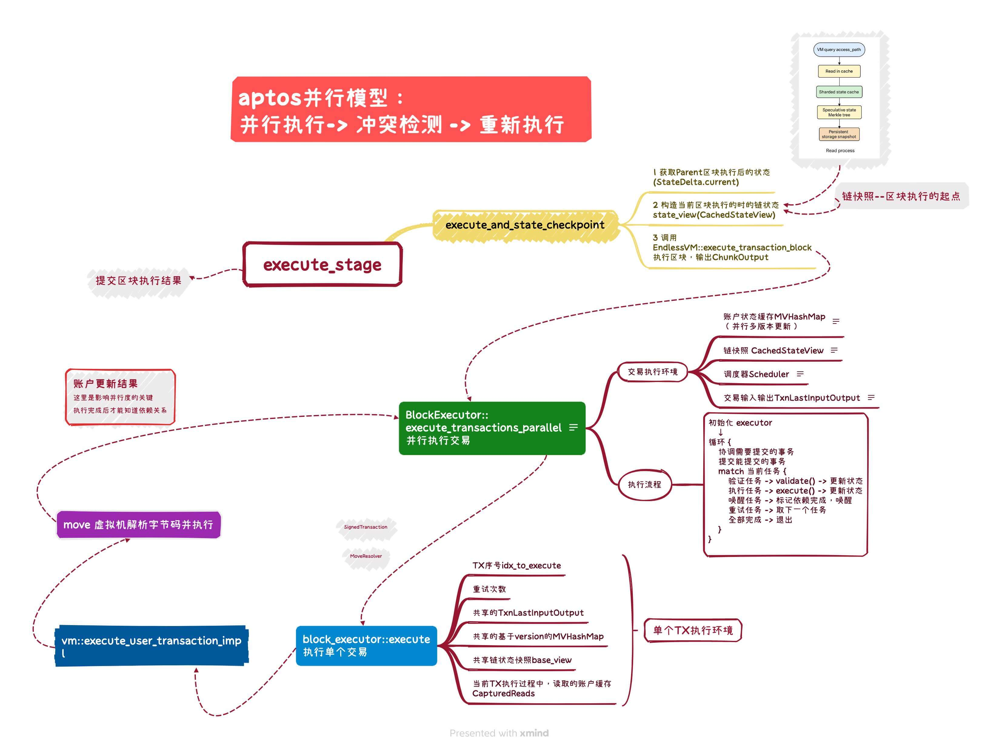

# 深入分析Aptos block-STM
### 核心技术
**乐观并发控制**：交易会在乐观的前提下并行执行，随后再进行验证。若验证失败，则需要重新执行。由于交易在执行前就已设定好顺序，因此各个验证步骤之间并非相互独立，而必须按逻辑顺序依次进行。与以往的研究不同，一个交易验证成功并不意味着它就可以直接提交。相反，如果某个交易验证失败，那么所有排在它之后的交易，只有在随后成功通过验证后，才能被提交。  

**多版本数据结构**：Block-STM 使用多版本数据结构 MVHashMap 来避免写冲突。对同一位置的所有写操作都会与其对应的版本一起存储，而每个版本包含写入该位置的交易 ID，以及交易被乐观重试的次数。当交易 *tx* 读取某个内存位置时，它会从 MVHashMap 中获取在排在它之前且序号最大的那个交易的最新写入的值和版本信息。
**验证**：在执行期间，交易会记录读集（read-set）和写集（write-set）。在验证过程中，会重新获取MVHashMap中读取位置的当前版本，并与读集版本进行比较。
**协同调度**：Block-STM 引入了调度器，用于协调多线程之间的交易验证和执行。交易必须按预定顺序提交，即使某笔交易的执行通过了校验，也不可以被立即提交。如果区块中较早的一笔交易发生回滚并重试，可能会使该交易原有的读集失效，从而需要重新执行。因此，不能将交易与执行线程静态绑定。为了解决这一问题，调度器优先进行序号较小的交易的执行和校验。然而，有序集合和优先队列在多核环境下的扩展性通常存在挑战。Block-STM 通过一种计数的方法绕过了这一问题，这种方法得益于交易的预设顺序和紧凑的索引方式。

**动态依赖估计**：Block-STM 利用预设顺序显著减少交易中止，由于中断执行可能会级联传播，导致大量计算被浪费，因此这是 STM（软件事务内存）系统中性能优化的关键。
当某笔交易未通过验证，调度器会将它所有的写入位置在 MVHashMap 中标记为 ESTIMATION（估算值），用来估算其依赖关系，。当另一笔交易从这个 MVHashMap 中读取到了一个 ESTIMATION 值时，它就会选择等待依赖被正常写入；而如果没有这个估算值机制，它可能会继续执行，但之后很可能（如果写入 ESTIMATION 的交易在重执行时仍写同一位置）校验失败。

与传统方案相比 —— 即从区块初始状态出发，把所有交易“尴尬地”（完全无优化地）并行预执行以生成写入估算 —— Block-STM 的做法有两个优势：
1.	只在需要时才生成估算，而不是为每笔交易都预生成；
2.	这些估算值通常是比区块初始状态新得多的系统状态，因此更加准确。

以下是aptos-stm相关代码脑图：

