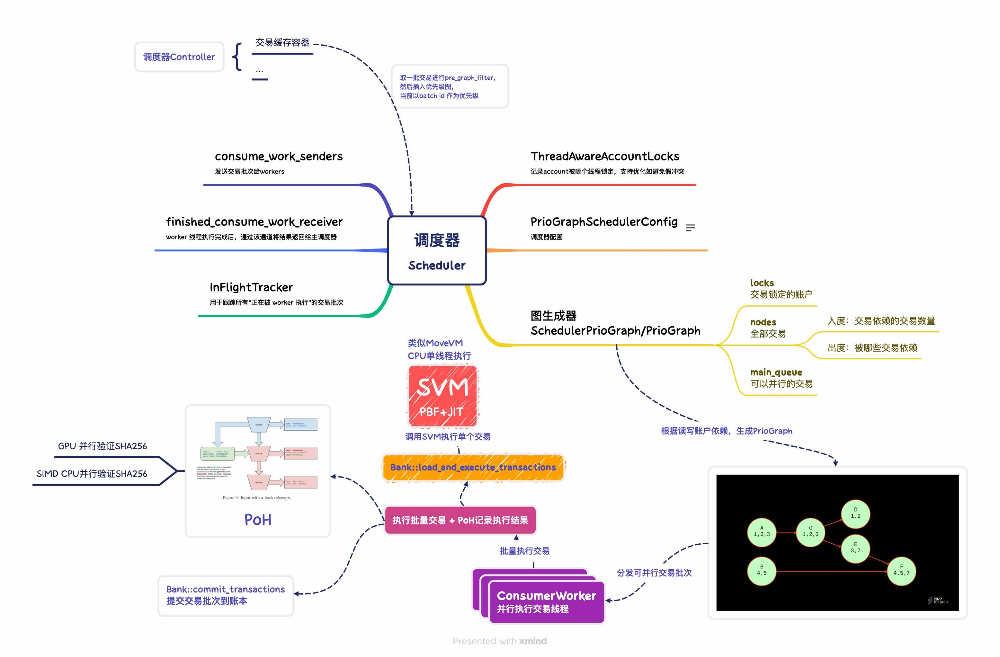

#### TPU 核心数据结构

```rust
pub struct Tpu {
    fetch_stage: FetchStage, // 监听 UDP、QUIC 等 socket 端口， 从网络中接收交易数据包，源自其他节点发送来的交易。
    sigverify_stage: SigVerifyStage, // 对接收到的非投票交易进行签名验证。
    vote_sigverify_stage: SigVerifyStage, // 对投票交易进行单独的签名验证（分流处理）。
    banking_stage: BankingStage, // 接收签名验证后的交易，实现了优先级排序、交易冲突检测、工作线程分配等
    forwarding_stage: JoinHandle<()>, // 异步线程，通过 gossip 机制或 QUIC交易转发，将收到的交易转发给其他邻居节点
    cluster_info_vote_listener: ClusterInfoVoteListener, // 监听来自 gossip 网络的投票交易，保证快速进入共识阶段。
    broadcast_stage: BroadcastStage, // 通常在 slot 尾部被触发，将区块或 block entries广播出去。
    tpu_quic_t: thread::JoinHandle<()>,// 监听并处理来自 QUIC 网络的交易（通常是高优先级流量，如 Bundle 或 Relayer 发送的）。
    tpu_forwards_quic_t: thread::JoinHandle<()>, // 类似于forwarding_stage，但基于 QUIC，处理“转发”类型的 QUIC 流量，来自其他转发节点。
    tpu_entry_notifier: Option<TpuEntryNotifier>,	// 可选项，取决于是否启用了日志监听或 replay 机制。在交易被处理并生成 ledger entry（区块）后通知其它组件，如共识、snapshot。
    staked_nodes_updater_service: StakedNodesUpdaterService, // 定期更新网络中 stake 权重。
    tracer_thread_hdl: TracerThread, // 追踪交易流入、执行、转发、出块的路径，供 Jito 等 MEV 工具使用。
    tpu_vote_quic_t: thread::JoinHandle<()>,// 专门处理投票交易的 QUIC 流量。
    relayer_stage: RelayerStage,// Jito 特有的组件，接收来自 Relayer 的交易，按优先级投喂到 banking_stage。
    block_engine_stage: BlockEngineStage,// 支持从 Block Engine 收集和执行高价值交易（bundle），按 bundle 序列安排执行。
    fetch_stage_manager: FetchStageManager, // 动态管理 fetch_stage 的线程和 socket
    bundle_stage: BundleStage, // 专门用于接收、验证、排序 Bundle 交易，可能还包含拍卖逻辑（Auctioneer）
}
```

Tpu 代表的是一整套 **交易处理流水线**（类似 CPU 的流水线），包括：

1. 交易的接收（fetch）；
2. 签名验证（sigverify）；
3. 投票与非投票的拆分；
4. 优先级排序调度；
5. 并发执行；
6. 对外广播（broadcast）；
7. 处理 Bundle 和 Block Engine（Jito 特有）；
8. 处理 Relayer 与 Forward 流量。

##### 调度器类型

| **模式**               | **冲突控制精度** | **吞吐性能** | **场景适用**               |
| ---------------------- | ---------------- | ------------ | -------------------------- |
| CentralScheduler       | 高               | 中           | 审慎型验证者、高安全性场景 |
| CentralSchedulerGreedy | 中               | 高           | Jito 节点、高频交易场景    |

**默认**使用贪婪调度（greedy scheduling）：

- 避免构建完整图结构，而是用窗口+并发冲突检查；
- 尽可能快速地将高优交易调度出去；
- 牺牲部分调度精度换取更高吞吐。

#### TPU 脑图


