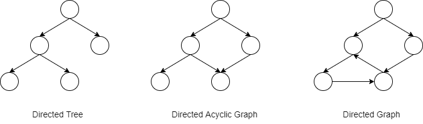
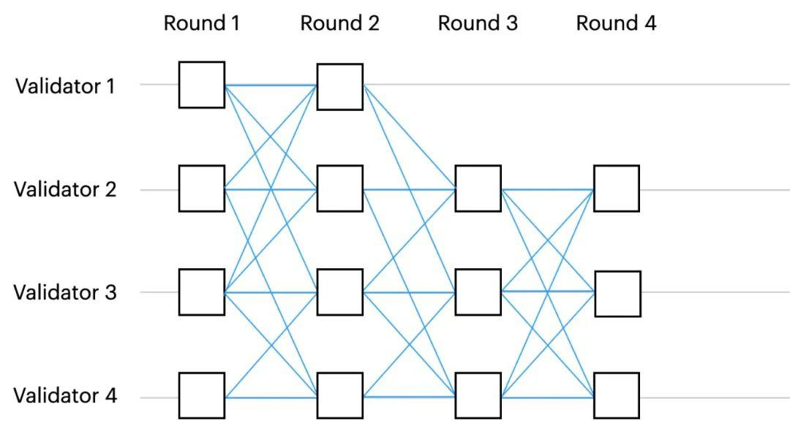
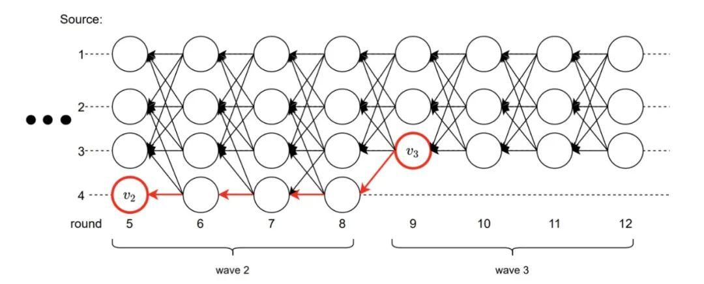
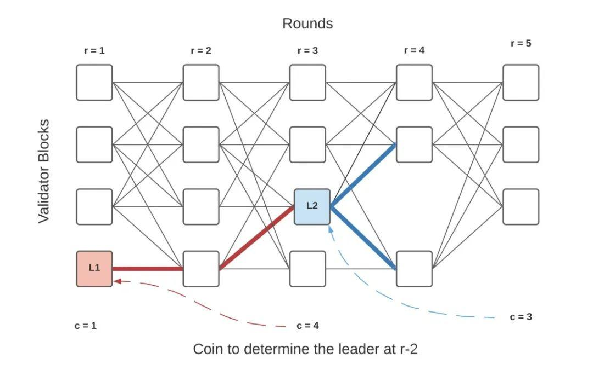
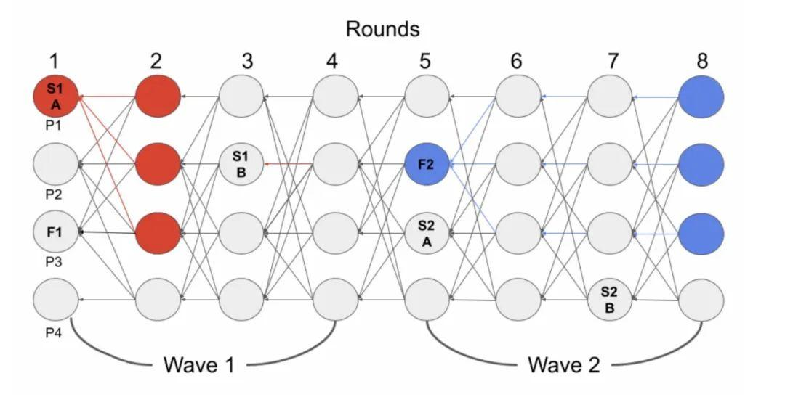
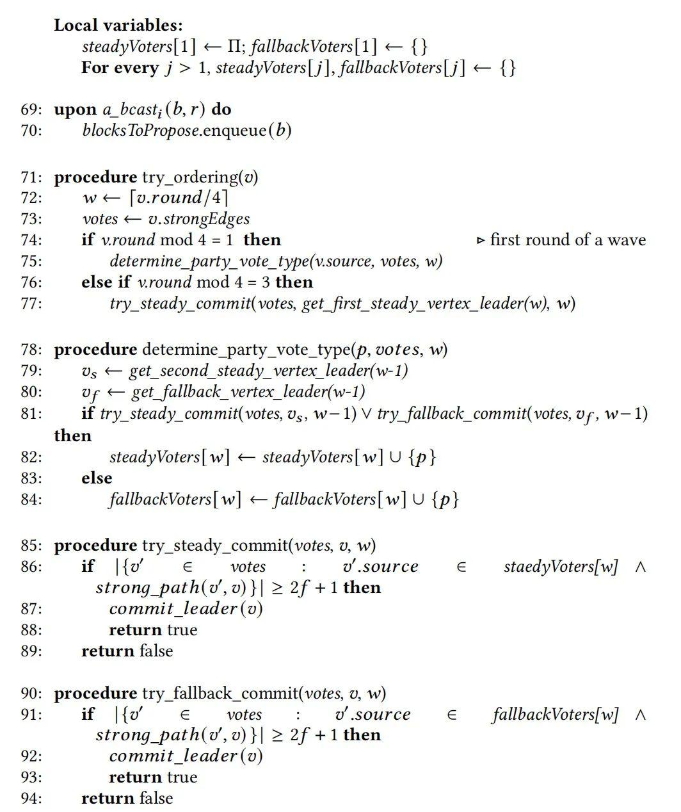
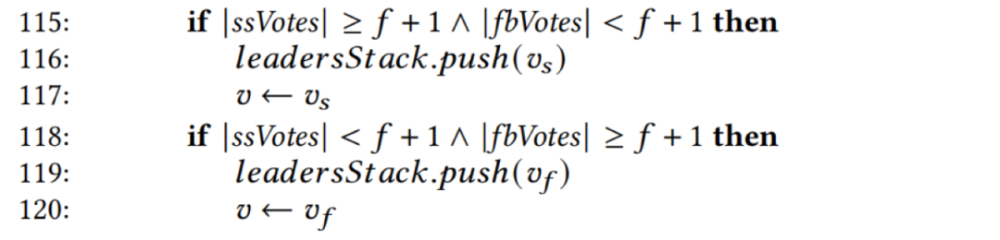
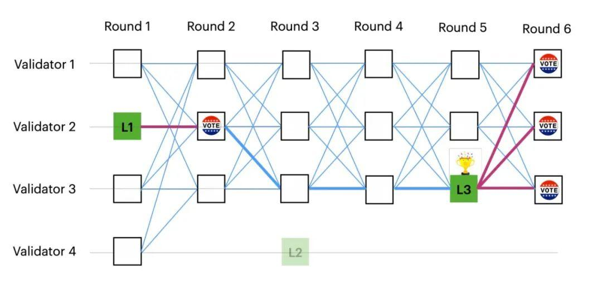
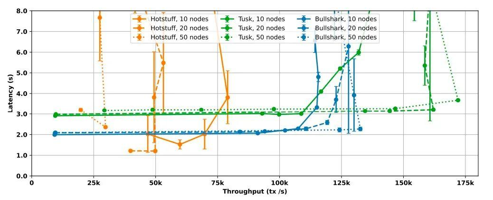

在区块链的语义里，[BFT 共识](https://zhida.zhihu.com/search?content_id=219680327&content_type=Article&match_order=1&q=BFT+共识&zhida_source=entity)是试图让 N 个验证节点（其中最多存在 f 个拜占庭节点）就一个无限增长的提案（区块或者交易集合）序列达成一致的机制。

众所周知，经典的基于 BFT 的共识算法，无论是 PBFT 还是改进的 [HotStuff](https://zhida.zhihu.com/search?content_id=219680327&content_type=Article&match_order=1&q=HotStuff&zhida_source=entity) 通信复杂度都比较高，可扩展性差，且在网络不稳定的情况下延迟很高。

最近几年，随着 DAG 技术在区块链上的广泛应用，一种基于 DAG 的 BFT 共识被提出并不断完善，利用 DAG 的高效实现和其天然的异步通信机制在提升共识的可扩展性、缩短确认时间和提高交易吞吐量方面优势明显。但 DAG 作为异步操作，它不存在一个全局的排序机制，这就很可能出现节点间所存储的数据在运行一段时间以后出现偏差，在这种偏差下，如何就序列最终达成一致是 DAG 共识的关键。

本文将先介绍基础理论：基于 DAG 的 BFT 共识和基于轮的 BFT 共识，然后详细解读 DAGRider 、[Tusk](https://zhida.zhihu.com/search?content_id=219680327&content_type=Article&match_order=1&q=Tusk&zhida_source=entity) 以及 [Bullshark](https://zhida.zhihu.com/search?content_id=219680327&content_type=Article&match_order=1&q=Bullshark&zhida_source=entity) 协议。

## 基于DAG的BFT共识

DAG，英文全称 Directed Acyclic Graph，中文意为有向无环图。

图（graph）由两部分组成：点（vertex）和边（edge），所谓有向无环图，其实就是：有方向的边，这些边在一个图中不会构成一个闭合的环路。

上面是有向树、DAG 图和有向图的示意图，从中可以看出三者之间的区别：

- 有向树：每个顶点只能指向一个之前的顶点，整个数据有个明显流动方向
- DAG 图：每个顶点可以指向多个之前的顶点，整个数据流也有一个明显的方向
- 有向图：与 DAG 不同的是有向图允许有数据回流，整个结构的数据流向不明显

DAG在共识中的应用

在基于 DAG 的共识中，每个共识消息都包含一个提案（一个区块或者一组交易集合）和一组对以前消息的引用，这里的引用可以理解为：每一条新消息都必须明确地指向若干之前的消息，引用某一条消息即表明对该消息的认可和投票。

对应在 DAG 图中，一个消息是一个顶点，它的引用是一条边，因此，所有共识消息一起形成了一个不断增长的 DAG 图。

基于 DAG 的共识可分为两层：

- 网络通信层：负责可靠地传播和接收提案、投票消息，并将消息绘制成 DAG 图
- 零通信开销的定序层：各验证节点在不发送额外消息的前提下，仅通过解析其本地的 DAG 副本独立提取提案的公共顺序，并能保证所有验证节点就提案的串行提交顺序最终达成一致

从消息的产生到消息的最终提交，由于网络的异步特性，不同验证节点上的 DAG 视图在任何时候都可能略有不同，所以如何保证所有验证节点就提交顺序最终达成一致是所有基于 DAG 共识算法的关键和难点。

与传统BFT的比较

经典的基于 BFT 的共识算法，无论是 PBFT 还是改进的 HotStuff 都需要一个 Leader 节点收集交易生成区块，广播并接收来自其他节点的投票，经过三个阶段的交互后（pre-prepare、prepare、commit）最终对区块提交达成一致性共识，协议比较依赖各节点间共识消息的可靠传递。

而基于 DAG 的共识，利用 DAG 图抽象出网络通信层，将消息传播与共识逻辑（提案定序）分离。这种分离带来的好处是，每个节点都可以异步地计算共识状态与提交序列，从而降低延迟与减少通信过程中的网络开销，再加上 DAG 的高效实现，使得基于 DAG 的共识拥有较好的可扩展性和高吞吐量。

## 基于轮的BFT共识

在基于轮（round）的 DAG 中，每个顶点都与一个整数（round number）相关联。每个验证节点每一轮只广播一条消息，且每条消息至少引用上一轮的 `N−f`个消息。也就是说，为了推进到第 r 轮，验证节点首先需要在第 r-1 轮中获得 `N−f` 条来自不同的验证节点的消息。

上图是一个基于轮的 BFT 的示例，图中有4个验证节点，每一轮的每一条消息都引用了上一轮至少3个消息，如果某一轮无法收齐3个消息则无法推进到下一轮。

这里有点类似 HotStuff 算法中，每一个区块投票消息都必须携带上一个区块的 parent quorum，因为这样才能保证网络中的大部分节点有序、平衡地推进至下一轮，这也是基于法定人数的 BFT 容错共识的基础。

**三个特性**

在基于轮的 DAG 共识协议中，当一条消息被确认插入到 DAG 时，它有以下保证：

- 可靠性（Reliability）: 消息的副本存储在足够多的验证节点上，这样最终所有诚实的参与节点都可以下载它
- 非模糊性（Non-equivocation）: 对于任何验证节点 v 和 轮次 r，如果两个验证节点的本地视图中，r 中有一个来自 v 的顶点，那么这两个验证节点都有完全相同的顶点和完全相同的顶点间的引用关系
- 因果排序（Causal ordering）: 消息携带对上一轮交付消息的显式引用。因此，这能够保证任何提交了某个顶点的验证节点，在他们的局部视图中该顶点的因果历史（引用的前面轮次的消息）也是完全相同的

前文提到，基于 DAG 的 BFT 共识协议允许每个验证节点仅解释其本地 DAG 图，也能够就提交序列最终达成一致，利用以上特性是解决前文提到的一致性难点的关键。

同时，也正是由于这些特性消除了拜占庭节点作恶的能力，相较于传统的 BFT 算法，共识逻辑可以被简化，使得协议的设计变得更简洁。

DAG-Rider、Tusk 和 Bullshark 是目前比较成熟和热门的基于轮的 BFT 共识协议，下面我们将详细介绍这三种协议并进行对比。

## DAG-Rider

在 DAG-Rider 协议中，每个验证节点将本地的 DAG 图以4个连续 rounds 为单位划分成 wave，在每个 wave 的最后一轮从第一轮中随机选出一个 leader 并尝试提交该顶点。

下图中，每条水平横线分别代表4个不同的验证节点，每个顶点表示不同验证节点在每个轮次发出的共识消息，顶点 v2 和 v3 分别是随机选出的 wave2 与 wave3 的 leader。

顶点提交过程：

1. 在 wave2 的 第 round8 轮尝试提交顶点 v2，但由于在第 round8 轮中只有两个顶点（少于 `2f+1`）通往 v2 ，因此在 round8 时 v2 不满足提交条件
2. 由于 round12 中有 `2f+1` 个顶点通往 v3 ，因此 v3 符合提交规则
3. 同时由于存在一条从 v3 到 v2 的路径，所以在 wave3 中先提交 v2 -> v3

### 如何保证提交的最终一致性

由于网络的异步特性，不同验证节点的本地 DAG 图在任何时候都可能略有不同。也就是说，一些顶点可能在某一个 wave 结束时被部分节点（这里假设为 M1）提交，而部分节点（M2）没有提交直接进入了下一个 wave，那么会不会存在 M2 节点在下一个 wave 提交时仍然无法提交前一个 wave 选出的顶点，从而导致各节点状态出现不一致的情况？

其实这是不可能发生的，M1 之所以能提交顶点，说明 round8 中至少有 `2f+1` 个顶点通往 v2，而 round9 中的 v3 又必须引用上一轮中至少 `2f+1` 个不同顶点，所以 v3 至少存在 `f+1` 条通往 v2 的路径。

## Tusk

Tusk 的设计思想基于 DAG-Rider 进行了改进。在 Tusk 中每个 wave 包含3轮，且每个 wave 的最后一轮是下一个 wave 的第一轮。

下图中，r1~r3 表示 wave1，r3~r5 表示 wave2，顶点 L1 和 L2 分别是随机选出的两个 wave 的 leader。

顶点提交过程：

1. 在 round1 中，各验证节点生成区块并广播
2. 在 round2 中，各验证节点对上一轮的顶点进行投票（也就是引用 round1 的顶点）
3. 在 round3 会选出一个 random coin（也就是在 round1 中随机选择一个 leader，图中为 L1）
4. 如果在 round2 中有 `f+1` 个顶点引用了 L1，那么就提交它，否则直接进入到下一个 wave

图中，L1 并不能立即提交，因为在 round2 中只有一个顶点引用了 L1。当选举出 L2 时，L2 被 round4 超过 `f+1` 个顶点引用，L2 符合提交规则，且 L2 存在一条路径通往 L1，因此在 wave2 中先提交 L1 -> L2。

同理，如果有部分节点在 wave1 提交了 L1，说明 round2 中至少有 `f+1` 个顶点通往 L1，而 round3 中的 L2 必须引用上一轮中至少 `2f+1` 个不同顶点，所以 L2 至少存在一条通往 L1 的路径。这也就能保证所有验证节点就提交顺序最终达成一致。

### 和 DAG-Rider 的对比

在常规情况下，DAG-Rider 需要4轮才能提交一个顶点，而 Tusk 只需要3轮就能提交，降低了提交延迟。

但 DAG-Rider 通过4轮投票，可以保证每一个 wave 中能够提交顶点的概率至少是 2/3，而 Tusk 因为少了一轮投票，所以在它的每一个 wave 中能够提交顶点的概率是 1/3。

也就是说，在异步情况下，DAG-Rider 仅需要 3/2 个wave（6轮）就能够提交一个顶点，而 Tusk 则需要经过3个 wave 才能提交一个顶点，已知每个 wave 包含3轮，且每个 wave 的最后一轮是下一个 wave 的第一轮，所以 Tusk 需要7轮才能提交一个顶点。

## Bullshark

Bullshark 的论文提出了该协议的两个版本。

- 异步版本：在常规情况下，只需要2轮就能提交一个顶点。相比 DAG-Rider 和 Tusk，进一步降低了提交延迟
- 部分同步版本：在 Tusk 的基础上进行改进，只需要2轮就能提交顶点，降低了出块轮次的延迟

异步版本

与 DAG-Rider 类似，在异步协议版本中每个 wave 也包含4轮。但是 BullShark 每个 wave 中有3个 leader，分别是从第一轮上随机选出的 fallback leader 和在第一轮和第三轮上预先定义的 steady-state leader。

下图中，S1A 与 S1B 为 steady-state leader，F1 为 fallback leader（在每个 wave 的最后一轮随机产生）。

顶点提交过程：

1. 在 round2 中，节点发现有 `2f+1` 个节点都投票给了 S1A，则可以提交 S1A
2. 在 round4 中，节点发现只有一票投给了 S1B，不能提交 S1B，且该验证节点在 wave2 中的投票类型变为 fallback 类型
3. 在 round5 中，节点观察 round4 中其他 `2f+1` 个节点，发现他们也都没法提交 S1B，所以当前节点能够确定其他节点在 wave2 都是 fallback 投票类型，同时 wave2 中的 steady-state leader（S2A 和 S2B）都失去了提交机会
4. 在 round8 中，节点发现有 `2f+1` 个节点投票给了 F2，可以提交 F2，在提交F2之前尝试去提交 S1B，但是由于 S1B 不满足提交规则（在当前节点的局部视角中 S1B 少于 `f+1` 个引用），所以此时只提交 F2

可以看到，在常规情况下，每隔两轮就能提交一个 steady-state leader，相较于 Tusk 协议做了进一步优化，同时 fallback leader 的设计也保证了即使在最坏的异步条件下，共识依然具有活跃性。

### 代码分析

提交流程伪代码：

从 `try_ordering` 函数我们可以看出：

- 在 round%4==1 轮：尝试提交上一个 wave 中第3轮的 steady leader 或者是 fallback leader，并确认自己和其余验证节点在当前 wave 中的投票状态
- 在 round%4==3 轮：仅需要提交当前 wave 中第1轮的 steady state leader

从 `try_steady_commit` 和 `try_fallback_commit` 发现，这里使用 `2f+1` 作为顶点提交投票的数量，区别于Tusk 的 `f+1`，是因为 Bullshark 不光需要确定该顶点是否可以提交，同时还要确定大多数（不少于 `2f+1`）节点在下一个 wave 中都处于同一种投票状态。

Commit Leader

从前文所知，在提交某个顶点时，我们已经能够确定在当前 wave下，至少有 `2f+1` 个节点和我们处在同一种投票类型。

commit 的作用是在已经确定能够提交某个顶点的情况下，向前递归地提交上一轮暂时未能提交的顶点。

当上一轮 leader 已经能够被其他节点提交时，它满足的条件是至少有 `2f+1` 个投票，且至少 `2f+1` 个节点处在同一种投票状态，所以对于当前验证着来说，它的局部视角至少存在 `f+1` 个投票。

部分同步版本

该版本对 Tusk 共识协议进行了简化，更易于代码实现，是目前在 [Sui 共识机制](https://zhida.zhihu.com/search?content_id=219680327&content_type=Article&match_order=1&q=Sui+共识机制&zhida_source=entity)中的实现版本。

不同于 Tusk 中所有 leader 顶点都是随机产生，Bullshark 部分同步版本 DAG 中的每个奇数轮都有一个预定义的leader 顶点（下图用纯绿色突出显示）。顶点的提交规则很简单：如果 leader 获得下一轮中至少 `f+1` 个投票，则提交该 leader。图中，L3 以3票提交，而 L1 和 L2 的票数少于 f+1 票，没有提交。

但由于网络的异步特性，DAG 的本地视图对于不同的验证节点可能不同，有些节点可能在前面几轮成功提交了 L1 和 L2 顶点，所以在提交 L3 顶点的时候，需要从 L3 出发观察是否存在一条到 L2 和 L1 的路径，如果存在则需要先提交之前轮的顶点。图中 L3 到 L2 没有路径，所有可以跳过 L2，但 L3 到 L1 有路径，所以先提交 L1 -> L3。

## 性能对比

参考 Bullshark paper 论文，下面是 HotStuff，Tusk 和 BullShark 三种协议在常规情况时，对于不同数量的验证节点的延迟和吞吐量对比

- HotStuff：在10节点、20节点和50节点共识下，吞吐量分别是70,000 tx/s、50,000 tx/s和30,000 tx/s，实验证明 HotStuff 在增加节点规模的时候扩展性不好，但是它的延迟很低，大约2秒
- Tusk：Tusk 的吞吐量明显高于 HotStuff，对于10节点共识，其峰值为110,000 tx/s，对于20或50节点其峰值约为160,000 tx/s，吞吐量随着节点规模的增加而增加（这要得益于 DAG 的高效实现）。尽管 Tusk 的吞吐量很高，但它的延迟比 HotStuff 要高，大约为3秒
- BullShark：BullShark 在 Tusk 的高吞吐量和 HotStuff 的低延迟之间取得了平衡。它的吞吐量也明显高于HotStuff，在10节点和50节点共识下分别达到110,000 tx/s和130,000 tx/s，同时从图中可以观察到，无论节点规模如何，它的延迟都在2秒左右

## 总结

- Tusk 协议的理论起点是 DAG-Rider，是基于 DAG-Rider 的改进版本，在常规情况下降低了出块轮次的延迟
- Bullshark 的同步版本在 Tusk 的基础上继续优化，进一步降低了延迟，同时实现起来更为简单。但它和 HotStuff 一样，在最终同步假设不成立时，没有活性（liveness ）保证
- Bullshark 的异步版本在 steady 模式基础上加入 fallback 投票模式，使它在常规情况下拥有和同步版本一样的低延迟，并且在异步情况下依旧可以保证活跃性

本文我们主要探讨了三种基于轮的 BFT 共识，其实基于 DAG 的 BFT 共识还有很多，比如 Fantom 的 [lachesis](https://zhida.zhihu.com/search?content_id=219680327&content_type=Article&match_order=1&q=lachesis&zhida_source=entity)，它并不是严格遵循基于轮次的算法，这种共识开辟了一种新的思路。相信随着更多的项目加入到其中，DAG 共识将会更加完善和多样化，为提升区块链的可扩展性提供更多的想象空间。

## 参考来源：

1. DAG-Rider paper: [PODC 2021]All You Need Is DAG
2. Narwhal and Tusk paper：[2105.11827] Narwhal and Tusk: A DAG-based Mempool and Efficient BFT Consensus
3. Bullshark paper: [To appear at CCS 2022] Bullshark: DAG BFT Protocols Made Practical
4. DAG Meets BFT - The Next Generation of BFT Consensus
5. Narwhal, Bullshark, and Tusk, Sui's Consensus Engine | Sui Docs
