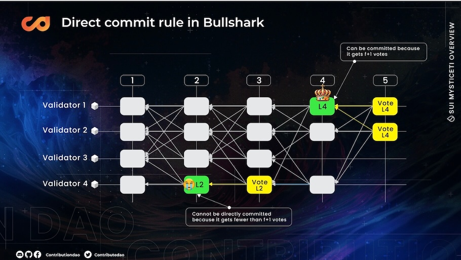
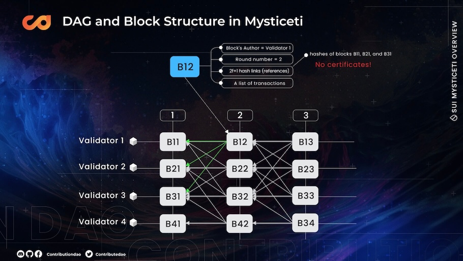
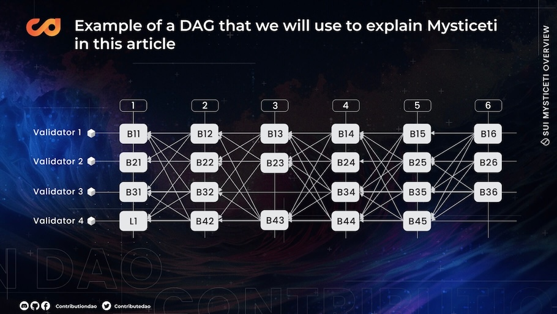
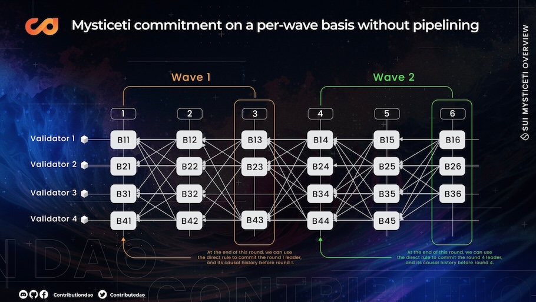
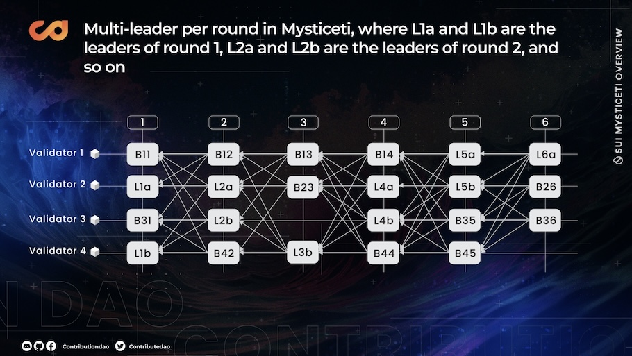
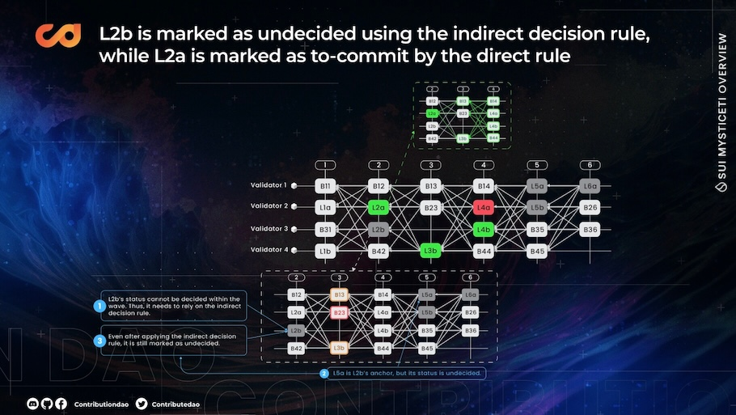
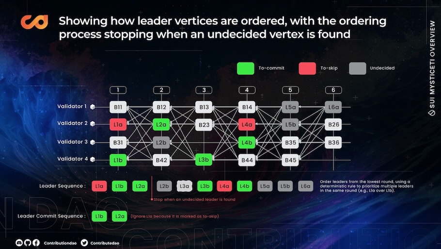
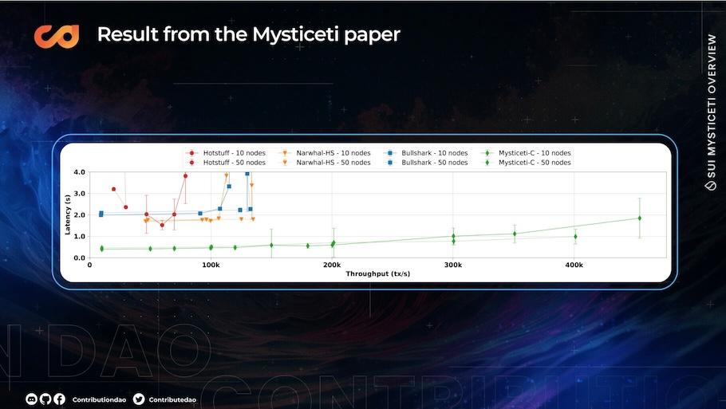

## 深入理解Sui Mysticeti共识

### **Narwhal 和 Bullshark 回顾**

Narwhal 和 Bullshark 是基于 **已认证 DAG（Certified DAG）** 的共识协议，旨在通过将数据传播与共识逻辑分离来提升系统吞吐量。Narwhal 充当内存池层（mempool layer），负责数据流的管理，而 Bullshark 则负责共识处理。验证者只需根据 Narwhal 构建的本地 DAG 进行解释，无需额外通信，从而实现通信**零开销**共识，提升了效率。

从高层次看，Narwhal 的功能类似一个内存池，它允许每个验证者广播消息并构建本地 DAG 视图。在第 r 轮期间，每个验证者会向其他验证者广播自己的区块（即 DAG 中的一个顶点）。每个区块的主要内容如下：

- 一组交易；
- 来自第 $r-1$ 轮的 $2f + 1$ 个证书；
- 验证者的签名。

当一个验证者接收到其他验证者的区块后，会验证该区块的有效性，签名后将签名返回给发送者。当一个验证者收集到来自 $2f + 1$  个不同验证者的签名后，它就可以为该区块创建一个证书，并将该证书分享给其他人。

一旦验证者收到证书，他们会将相应的区块（顶点）添加到本地 DAG 中。当一个验证者收集到 $2f + 1$  个证书后，就可以进入第 $r+1$ 轮。

最终形成的结构是一个 DAG，因为每个区块都会引用来自上一轮的 $2f + 1$  个区块，这些引用在各轮之间建立起因果连接。

现在我们已经有了一张 DAG，我们可以使用 Bullshark 对其进行解释。在 Bullshark 中，每隔两轮验证者就尝试提交一次区块。借用参考文献 [4] 中的示例，每个偶数轮会选出一个**领导者区块**（leader block），进行区块提交。例如，在第 2 轮和第 4 轮中，分别选择了验证者 4（L2）和验证者 1（L4）的区块作为领导者区块。

在接下来的**奇数轮**中，各个区块会通过引用的方式为上一轮的领导者区块（leader block）**投票**。例如，第 2 轮的领导者区块 L2 仅收到一票，因为第 3 轮中只有一个区块引用了它。根据**直接提交规则**（direct commit rule），如果一个领导者区块获得了超过 *f + 1* 张投票，那么它及其**因果历史**（causal history）就可以被提交。因此，L4 可以被直接提交，因为它收到了 2 张投票，而 L2 无法被提交。

幸运的是，如果从未来**已提交**的领导者区块到过去**未提交**领导者区块之间**存在一条路径**，那么这个未提交的领导者区块也可以被间接提交。由于在图 4 中，L2 和 L4 之间存在一条路径（用黄色线标出），因此 L2 也可以被提交。

因此，L2、L4 以及它们的因果历史可以被提交并进行全序排列。其中，L4 的因果历史以橙色高亮显示，L2 的因果历史以绿色高亮显示。

### Narwhal 和 Bullshark 的问题

1. 高延迟

2. 大量的签名验证开销

**高延迟**

根据 Bullshark 的提交规则，验证者**每两轮**尝试提交一个领导者区块及其因果历史。然而，某些来自前一轮的顶点（即区块）可能运气不好，没有包含在当前领导者的因果历史中。例如，在图 6（顶部）中，L2 区块由于获得了 $f+1$ 张投票而可以被提交。但它没有引用橙色顶点，因此该橙色顶点在这一轮中无法被提交。

这对橙色区块来说非常不利，因为在同一轮（第 1 轮）中，其他区块在 L2 被提交的同时也被提交了，它们只等待了一轮。相比之下，橙色顶点则必须等待三轮，直到它被包含在 L4 的因果历史中，并随 L4 一起被提交。

此外，由于 Narwhal 是一个带有证明的 DAG（Certified DAG），一个顶点需要经历 **1.5 个 RTT（往返时延）或三条消息** 才能被添加到 DAG 中：

1. 第一条消息：验证者**提议区块并广播**给其他验证者；
2. 第二条消息：其他验证者对区块进行**签名并回复**提议者；
3. 第三条消息：提议者收集到 $2f+1$ 个签名后生成证书，并广**播证书**给所有验证者。

因此，一些“幸运”的区块可能只需等待两轮（即 **6 条消息的延迟**）就能被提交。然而像图 6（顶部）中的橙色区块，可能需要等待 3–4 轮甚至更久才能被提交。

**需要大量的签名验证和聚合**

在 Narwhal 中，每个验证者在每一轮都要执行以下步骤：

1. 检查每个顶点（区块），确保它包含了正确的证书，才将其添加到 DAG 中；
2. 从收集到的 $2f + 1$  个签名中聚合出自己的区块证书；
3. 一旦收到 $2f + 1$  个顶点（即证书），就推进到下一轮。

因此，Narwhal 需要执行大量的签名验证和签名聚合操作。而且这些操作的数量会随着系统中验证者数量的增加而增长，进而消耗大量的计算资源。

### 开始了解Mysticeti

**为什么是 Mysticeti**

Mysticeti 是专门为了解决 Narwhal 和 Bullshark 中存在的问题而设计的。它的主要目标包括：

**降低延迟：**Mysticeti 尝试<u>每轮都提交</u>区块，而不是每两轮提交一次，并允许每轮有<u>多个领导者</u>，这带来了两方面的好处：

- 将提交延迟从两轮缩短为一轮。
- 适当数量的多领导者可提升非领导者区块被包含在其因果历史中的概率，从而减少高延迟部分中提到的“不幸情况”。

**使用非认证 DAG：**在 Mysticeti 中，证书被隐式嵌入在 DAG 结构中，并可通过 DAG 模式来解释。这种方法有以下几个优势：

- 降低签名生成与验证的开销，每个区块只需进行一次签名与一次验证；

- 将 Narwhal 中每轮需要约 1.5 个TTR（1 个用于生成证书，0.5 个用于广播证书）减少到 Mysticeti 中仅需 0.5 个TTR；

- 简化工程复杂性，每个验证者仅需广播一种消息类型 —— 区块（block）。

#### Mysticeti 中的 DAG 结构

Mysticeti 中的 DAG 结构（有向无环图）与 Narwhal 相比要简单得多。Mysticeti 的 DAG 中每个顶点（即区块）包含以下内容：

1. 区块的作者，
2. 区块的轮次（round number），
3. 一组交易，
4. 来自前一轮的 *2f+1*个不同区块的哈希（作为引用）。

主要的区别体现在第 4 点：

与 Narwhal 需要引用 *2f+1*个 **带有聚合签名的证书（certificates）** 不同，Mysticeti 只要求区块直接引用前一轮中 *2f+1*个区块的哈希即可，而不需要这些区块的证书。

这种设计显著简化了：

- DAG 的结构，
- 工程实现的复杂度，
- 签名验证的开销。

### 解析Mysticeti DAG 模式

在 **Mysticeti** 中，有两个主要规则用于判断 leader 区块的状态：**直接决策规则（direct decision rule）** 和 **间接决策规则（indirect decision rule）**。请注意，以下示例直接引自文献 [5] 和 [6]。

**直接决策规则（Direct Decision Rule）**

由于 Mysticeti 不像 Narwhal 和 Bullshark 那样使用证书（certificates），验证者缺乏一种直接方式来验证见证了相同的 DAG 因果历史的验证者数量，并确认提交 leader 序列（以及它们的因果历史）是否安全的。因此，Mysticeti 提出了一种替代方法。

Mysticeti 的做法是允许验证者**间接投票**，以承认前一轮的某个区块。当验证者在当前轮次创建新区块时，如果该新区块引用了前一轮的某个区块（即在新区块中包含了该区块的哈希），就等同于对该区块进行了间接投票。

通过这种设计，Mysticeti 中的验证者只需观察 DAG 并寻找特定的模式，这些模式隐含了“足够多的验证者已认可某个区块”的信息，从而确保该区块可以安全提交（即，**证书被隐式嵌入在 DAG 中**）。主要有两种模式：

**证书模式（Certificate Pattern）**：如果某个处于轮次 *r* 的区块 *B* 满足以下条件，则认为它获得了一个“证书”：

- 在下一轮 $r+1$ 中，有 $2f+1$个区块引用了 *B*；
- 在再下一轮 $r+2$ 中，有一个区块引用了这 $2f+1$ 个引用 *B* 的区块。

**责难模式**（Blame Pattern）： $r+1$ 轮存在至少一个区块 **没有** 引用 B，那么就说该区块收到了一个责难（blame）。

让我们讨论一下用于判断何时安全提交一个 leader 区块以及何时应跳过。直接提交规则（Direct Commit Rule）非常简单：

- 如果一个验证者观察到某个 leader 区块收到了 $2f+1$ 个证书模式（certificate patterns），那么该验证者可以将该区块标记为 “待提交（to-commit）”。
- 如果一个验证者观察到某个 leader 区块收到了 $2f+1$ 个责难模式（blame patterns），那么该验证者可以将该区块标记为 “跳过（to-skip）”。
- 否则，该验证者将该区块标记为 “未决（undecided）”，并使用 间接决策规则（indirect decision rule） 来进一步决定它的状态。

假设我们正在查看图 9 中的 DAG，且区块 **B34** 是一个 leader 区块，我们正在尝试判断它的状态。

由于 **B34** 收到了三个证书模式（certificate patterns），它可以被标记为 **“待提交（to-commit）”**（见图 10）。

接下来，假设 B41 是一个 leader 区块。我们可以看到它有一个责难模式（B12）和一个证书模式（图 11 中绿色高亮部分）。因此，我们尚无法确定它的状态，只能将其标记为 **“未决（undecided）”**。

作为一个跳过模式（skip pattern）的示例，假设 B24 是一个 leader 区块。我们观察到有三个责难（blame），因为下一轮中有三个区块没有引用 B24。因此，B24 可以被标记为 **“跳过（to-skip）”**。

#### 间接决策规则

使用直接决策规则，我们可以在两轮内确定第 `r` 轮 leader 顶点的状态。具体来说，我们可以在第 `r+2` 轮决定提交该 leader 区块，或在第 `r+1` 轮跳过它（如果它收到了三个责难）。然而，如果某个区块在直接规则下仍处于未决状态，我们就必须依赖间接规则，该规则会引入额外的延迟。间接决策规则的运作如下：

1. **查找锚点（Finding an Anchor）**：如果第 `r` 轮的 leader 区块 L 无法通过直接决策规则决定，我们将查找第 `> r+2` 轮中第一个被标记为 **to-commit** 或 **undecided** 的 leader，并将其指定为 L 的 **锚点（anchor）**。

2. **未决状态（Undecided State）**：如果锚点被标记为 **undecided**，我们无法继续判断，必须将 L 标记为 **未决（undecided）**。

3. **待提交（To-Commit）**：如果锚点被标记为 **to-commit**，我们检查 DAG 中是否满足以下条件：

   (a) 顶点 L 是否具有一个 **证书模式（certificate pattern）**。

   (b) 该证书模式是否存在一条路径指向锚点。

   (c) 如果上述两个条件 (a 和 b) 都满足，我们可以将 L 标记为 **to-commit**。

​	简而言之，如果<u>存在连接 L 和锚点</u>的证书模式路径，则可以将 L 标记为 **to-commit**。

4. **跳过（To-Skip）**：否则，如果不满足条件 (3a) 和 (3b)，该顶点可以被标记为 **to-skip**。这意味着如果不存在将 L 与锚点连接起来的证书模式路径，它就可以被标记为跳过。

**下方提供了图示来帮助理解间接决策规则：**

从间接提交（to-commit indirect rule）的例子开始，并参考前一节中的示例，假设 **B14 是第 1 轮的 leader 区块**，而 **B34 是第 4 轮的 leader 区块**。

根据图 11，我们知道 B14 处于未决状态，因此我们应用间接决策规则。

首先，我们识别一个锚点。由于 B14 是第 1 轮的区块，那么它的锚点必须是 **第 >3 轮中状态为 to-commit 或 undecided 的区块**。从图 10 可以看出，B34 可以作为一个锚点，因为它属于第 4 轮，且被标记为 **to-commit**。

B14 拥有一个以 B43 为终点的证书模式（绿色高亮部分），并且存在一条路径连接到 B43（橙色高亮部分）。因此，我们可以将 **B14 标记为 to-commit**。

接下来是用于 **to-skip** 的间接决策规则。假设 **B21 是第 1 轮的 leader**，而 **B34 是第 4 轮的 leader**，与前面的例子相同；因此，**B34 同样作为 B21 的锚点（anchor）**。起初，在第 2 轮和第 3 轮内，**无法判断 B21 的状态**，所以它首先被标记为 **未决（undecided）**。然后，在第 4 轮，我们观察到 B21 的锚点出现。此时我们回溯第 2 轮和第 3 轮，检查是否存在任何 **to-commit 的证书模式（certificate patterns）**。不幸的是，**并没有找到**，因此条件 **3a、3b 和 3c 都不成立**。因此，我们可以将 **B21 标记为 to-skip（跳过）**。

#### PiPeline

直接决策规则可以每隔 3 轮（即 1 个*Wave*）确定一个 leader 的状态，并将其及其因果历史一并提交。如果我们按*Wave*（每 3 轮）提交一个 leader，协议的延迟仍然较高。例如，在图 15 中，我们看到 **第 1 个*Wave*从第 1 轮开始，到第 3 轮结束**，这意味着 **第 1 轮的 leader 最早只能在第 3 轮（即*Wave*结束时）被提交**。**第二个 leader 则要等到第 6 轮才能被提交**，以此类推。

然而，实际上我们在每个*Wave*中只需要应用直接提交规则即可。这意味着：
**我们只需要第一轮引入一个 leader，接下来的两轮用来决定其状态**（即 *to-commit*、*to-skip* 或 *undecided*）。

因此，**第 2 到第 4 轮** 也可以被视为一个*Wave*，**第 3 到第 5 轮**、**第 5 到第 7 轮**、**第 6 到第 8 轮** 等同样如此。这种方式使我们可以在每一轮都引入一个 leader，并将这些*Wave*流水线化处理。

图 16 展示了 Mysticeti 中*Wave*流水线（wave pipelining）的概念，每个*Wave* 跨多个轮次推进。**每个*Wave*的 leader 用不同颜色高亮显示**，颜色与上方时间轴标注的*Wave*编号一致。例如，*Wave* 1（黄色）跨越第 1 到第 3 轮，其 leader（B41）标为黄色**；类似地，*Wave* 2（蓝色）跨越第 2 到第 4 轮，其 leader（B22）标为蓝色**，以此类推。

#### Multi-Leader

如在“**Narwhal 和 Bullshark 的问题**”一节中所讨论的，某些顶点在下一轮中可能不幸未被包含在 leader 的因果历史中。 这种延迟意味着这些顶点必须等待<u>未来某个 leader</u> 将它们纳入其因果历史后才能被提交，从而带来额外的延迟。相比之下，**Mysticeti 允许每轮中存在多个 leader**，这提升了更多顶点被纳入 leader 因果历史的机会，从而降低了延迟。

为了保持全序一致性，Mysticeti 在**同一轮内的多个 leader 之间强制执行明确的顺序或优先级**。每轮的 leader 数量可以从一个扩展到所有验证者的数量。不过需要注意的是：**增加 leader 数量本身也可能带来提交延迟**，因为一旦遇到状态为 *undecided* 的 leader，排序就会停止——这一点将在下一节中进一步讨论。

### 将所有内容整合在一起

我们用上一个 DAG 作为示例，现在每一轮有两个领导者，如图 17 所示。在第一轮中，领导者是 L1a 和 L1b（分别为 B21 和 B41）。“a” 和 “b” 表示领导者的优先级。这意味着当我们同时提交 L1a 和 L1b 时，会在全序中将 L1a 排在 L1b 之前。

第三轮中缺失的领导者（L3a 或 B33）可能会出现在以下情况：某个验证者在该轮经历了异步状态，无法及时将其区块广播给其他验证者，而此时其他验证者已经进入了下一轮。

现在，让我们从**最高**轮次开始一步步分析这个示例。目前，第 5 波（wave 5）和第 6 波（wave 6）分别只包含 2 轮和 1 轮，因此它们的领导者状态尚无法确定。因此，我们将它们标记为*undecided*（在图 18 中以灰色表示）。

我们之前已经处理过 L4a 和 L4b（图 12 和图 10 中的 B24 和 B34），并确定它们可以分别标记为“跳过（to-skip）”和“提交（to-commit）”。

接下来是 L3b。L3b 拥有 4 个证书模式，因此可以被标记为“提交（to-commit）”，如图 20 所示。

L2a 很简单，可以被标记为“提交（to-commit）”。然而，L2b 收到了一次指责（blame），并且在第 2 到第 4 轮中找不到任何证书模式。因此，我们需要依赖间接决策规则。首先，我们为 L2b 寻找一个“锚点”（anchor），即第二*wave*之后的一个领导者顶点（第 5 轮或更高轮次的领导者顶点），其状态为“未决（undecided）”或“提交（to-commit）”。我们找到了 L5a 和 L5b，并优先选择了 L5a，因为它的优先级高于 L5b。不幸的是，L5a 处于未决状态，因此 L2b 只能被标记为“未决（undecided）”（见图 21）。

至于第 1 轮，我们已经在图 13 和图 14 中分析过它们。由于无法使用直接决策规则确定 L1a 和 L1b 的状态，因此需要依赖间接决策规则。最终，L1a 被标记为“跳过（to-skip）”，L1b 被标记为“提交（to-commit）”。

我们刚刚完成了对每个领导块（leader block）状态的判定。现在可以像在 Narwhal 和 Bullshark 中那样，对它们进行全序排序。我们从第 1 轮的领导块开始排序，在同一轮中，“a” 的优先级高于 “b”。然后我们按顺序依次检查领导块序列：跳过所有被标记为“跳过（to-skip）”的领导块，提交所有被标记为“提交（to-commit）”的领导块，一旦遇到状态为“未决（undecided）”的领导块则立即停止。图 23 显示，我们只能提交 L1b 和 L2a，并且必须在遇到状态为未决的 L2b 时停止。

一旦已提交领导块的顺序确定下来，我们就可以对它们各自的因果历史（causal history）进行排序。一个领导块的因果历史包括所有能从该领导块追溯到的前轮中的节点，也就是那些存在于当前轮次之前、且与该领导块有路径连接的所有顶点。由于我们的示例从第 1 轮开始，L1b 没有因果历史。至于 L2a，它的因果历史包括 B11、L1a 和 L1b（路径在图 24 中以蓝色高亮显示）。但由于我们已经提交了 L1b，就无需再次对其排序了，因为我们已经知道它应位于 L2a（及其因果历史）之前。接下来我们只需在 L1b 和 L2a 之间对 L2a 的因果历史（B11 和 L1a）进行排序。我们可以采用任何确定性的规则，例如按 gas 费对 L2a 的因果历史排序。需要注意的是，即便 L1a 没有作为领导块被提交（因为它被标记为 “跳过”），我们仍然需要对它排序，因为：

- 它被包含在 L2a 的因果历史中；
- L2a 是被提交的，且其他诚实的验证者最终也会看到 L2a，观察到相同的因果历史，并将 L2a 连同其因果历史一起提交。

**我们可以将每轮的领导者数量设置为验证者的数量吗？**

答案是**可以**。不过，正如前一节所讨论的，我们已经了解到，一旦验证者遇到状态未定的顶点，就必须立即停止提交。因此，增加每轮的领导者数量会提高遇到未定领导者的几率，从而延迟提交过程，导致更高的延迟。该论文基于测试结果建议每轮设置两个领导者是较为合适的。不过，在实际部署 Mysticeti 作为区块链共识协议时，也可以根据需要选择任何合适的领导者数量。

**关于 Mysticeti 提交规则的直觉解释**

这里我们来直观地解释一下 Mysticeti 提交规则的安全性。如果你想要更形式化的证明，可以参考论文。在类似 Hotstuff 和 Tendermint 这样的部分同步线性链共识协议中，需要两轮投票来确保诚实的验证者提交的是同一条区块链。类似地，在 Mysticeti 中，每个领导块需要经过两轮投票，并通过直接决策规则（direct decision rule）进行提交。在这两轮投票中，每轮都需要至少 2f+1 个验证者参与投票。

如果你还不太明白，我们可以进一步解释：在第 r 轮中，某个验证者 V 广播了它的区块 B。其他验证者在第 r+1 轮中通过在自己的区块中包含 B 的哈希值来隐式地为 B 投票（在 DAG 中表现为路径或引用）。第二轮投票发生在第 r+2 轮中，此时验证者在其区块中包含了那些在第 r+1 轮为 B 投票的区块的哈希。这一行为与 Hotstuff 中的流水线过程类似，在第 r+2 轮中，相当于验证者们确认了第 r+1 轮的投票，从而隐式地表达了他们提交 B 的意图。

一旦第 r+2 轮完成，如果 B 是一个领导块，且存在 2f+1 个 B 的证明模式（certificate patterns），那么诚实的验证者就会认为 B 是可以安全提交的。因为一个区块 B 拥有 2f+1 个证明模式，只有在它在第 r+1 轮获得了 2f+1 个投票（第一阶段），并且在第 r+2 轮再次获得了 2f+1 个投票（第二阶段）时才可能发生。

**结果**

从理论上看，Mysticeti 在延迟方面相较于 Narwhal 和 Bullshark 有显著改进。这种改进主要得益于流水线机制和多领导者机制的引入，使得验证者几乎在每一轮都有提交的机会。此外，Mysticeti 采用的非认证 DAG 结构减少了对签名聚合和验证的需求，而这些过程通常会带来很大的计算负担。通过取消证书（签名聚合），Mysticeti 还减少了轮次之间的通信需求，简化了工程实现的复杂性。

上图摘自 Mysticeti 论文，展示了上述结果。如图所示，当吞吐量低于 300,000 笔交易每秒（tx/s）时，Mysticeti 实现了低于 1 秒的延迟。相比之下，Narwhal 和 Bullshark 在约 140,000 tx/s 时就已达到最大吞吐量限制，延迟则接近 2 秒。
