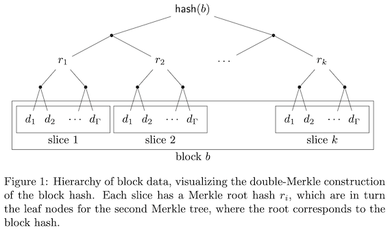

<head>
    
    
</head>

# Alpenglow共识白皮书（翻译）

​	在本文中，我们描述并分析了 Alpenglow —— 一个专为全球高性能权益证明（Proof-of-Stake, PoS）区块链量身打造的共识协议。

​	投票组件 Votor 能在如下条件下完成区块的最终确认：若 80% 的权益参与投票，则可在一轮投票中完成确认；若仅 60% 的权益在线并响应，则需 两轮投票 完成确认。这两种投票模式是并行执行的，因此区块在被传播后，其最终确认时间为$min(δ_{80\%},2δ_{60\%})$，即取两者中较小者作为延迟。

​	其快速区块分发组件 Rotor 基于 纠删码（Erasure Coding）。*Rotor* 根据节点所持权益，按比例分配带宽使用权，从而缓解了领导者（leader）在高吞吐场景下的带宽瓶颈问题。因此，系统的 总带宽利用率在渐近意义上是最优的。

​	Alpenglow 的一个显著特点是其 “20+20” 弹性（resilience），协议能在 20% 的权益被 敌手 控制 的情况下继续运行。若网络假设更强，还能允许 额外 20% 的权益节点处于离线状态。

## 简介

​	在本文中，我们提出了 Alpenglow，这是一种新的区块链协议。Alpenglow 使用了 Rotor 协议，它是对 Solana 数据分发协议 Turbine 的一种优化与简化版本 [Yak18]。Turbine 最早将纠删编码的信息扩散技术 [CT05; Yan+22] 引入到了无需许可的区块链系统中。Rotor 利用的是网络节点所能提供的总带宽资源。因此，Rotor 能够实现渐近最优的吞吐量（asymptotically optimal throughput）。相比之下，那些没有解决“领导者带宽瓶颈”的共识协议，在吞吐能力上往往受到严重限制。

​	在 Alpenglow 的核心部分，我们引入了 Votor 共识机制，其逻辑继承了 Simplex 协议系列 [CP23; Sho24] 的简洁性，并将其扩展到了 权益证明（PoS） 场景中。这一设计天然支持领导者轮换（rotating leaders），无需复杂的视图变更机制（view changes）。在常见情况下，我们可以在一轮投票中实现区块终结性（finality），同时系统还并行运行着一套保守的两轮备份流程 [SSV25; Von+24] 以确保安全。

### Alpenglow概览

​	首先，我们提供对 Alpenglow 的高层次描述。我们将在第 2 节详细介绍所有组成部分。

​	Alpenglow 运行于 n 台计算机之上，我们称这些计算机为节点（nodes），其中 n 可以达到数千到上万台。这些节点在被称为“*epoch*（纪元）”的时间段内是已知且固定的。任何一个节点都可以通过发送消息与集合中的其他任意节点直接通信。

​	Alpenglow 是一个权益证明（*Proof-of-Stake*）区块链，每个节点都质押数量已知的加密货币（stake）。节点的质押量表明它对区块链的贡献度。例如，如果节点 *v2* 的质押量是 *v1* 的两倍，那么它将获得两倍的交易手续费，同时提供两倍的网络带宽。

​	时间被划分为若干 slot（时间槽）。每个 slot 都有一个编号和一个指定的领导者节点（leader）。每位领导者会连续负责若干个 slot，这被称为leader window（领导窗口）。领导者的选举基于一个可验证随机函数（VRF）来决定。

​	当前 slot 的领导者节点接收所有新交易，可能是直接来自用户，也可能是由其他节点中继而来。领导者会使用这些交易构建一个新区块。区块被划分为多个切片（slices）以便于流水线处理。每个 slice 再被划分为多个shreds（分片），以增强容错能力并实现均衡扩散（详见第 2.1 节）。领导者会使用一种名为 Rotor 的算法（见第 2.2 节）来扩散这些分片。Rotor 基于纠删编码（Erasure Coding），其核心目标是让所有节点按质押比例使用其带宽（stake-fair bandwidth），并且避免领导者成为网络瓶颈的问题。领导者会不断将其生成的分片发送给中继节点（relay nodes），由中继节点继续转发给网络中的其他所有节点。

​	一旦一个区块构建完成，（下一个）领导者将开始构建并广播下一个区块。与此同时，每个节点都会逐步接收到这个新构建的区块。所有收到的 shreds 和 slices 都会被存储在一个叫做 Blokstor 的结构中（详见第 2.3 节）。

​	接着，节点会对这个区块进行投票表决。我们将在第 2.4 节中介绍不同类型的投票方式和聚合投票证书（certificates）。这些投票和证书会被存储在一个叫做 Pool 的本地数据结构中（见第 2.5 节）。

​	有了这些数据结构之后，我们可以进入投票算法 Votor（见第 2.6 节）,如果区块构建正确且按时到达，节点就会为其投票；如果区块到达过晚，节点可能会建议跳过此区块（因为可能是领导者不可信，或者网络不稳定）；如果总质押量中的超级多数（super-majority）为区块投票，那么就会生成证书（notarization certificate），这个区块可以被立即最终确认（finalize）。然而，如果过程中出现问题，我们将进入回退模式（fallback mode），在该模式下节点可以选择再次尝试认证/最终确认，或者直接跳过该区块。

​	第 2.7 节将讨论领导者如何创建新区块以及如何决定将区块附加到链中的哪个位置。

​	最后，第 2.8 节介绍 Repair（修复机制） —— 当一个节点缺失了某些 shreds、slices 或区块时，如何从其他节点获取这些数据。Repair 机制用于帮助节点恢复先前错过的、现在已被最终确认的区块的内容。至此，我们完成了 Alpenglow 共识算法的主要组成部分的讨论。

​	我们接下来将证明 Alpenglow 的正确性。首先在第 2.9 节中我们将证明其安全性（即使网络不可靠，协议也不会做出致命错误）。然后在第 2.10 节中我们证明其活性（如果网络可靠，协议能够持续推进）。最后，我们还会在第 2.11 节中考虑高崩溃故障率的情形。

​	尽管以下内容对于 Alpenglow 的正确性不是直接必需的，第 3 章仍会探讨若干对于理解 Alpenglow 至关重要的概念。我们会在第 3.1 节介绍我们新颖的 Rotor 中继抽样算法。第 3.2 节探讨的是激励机制，即如何鼓励节点正确参与协议。接着，在第 3.3 节我们讨论交易是如何被执行的。

​	随后我们转向高级故障处理机制，第 3.4 节研究一个节点在失联后如何重新连接 Alpenglow 网络，以及当系统经历严重网络中断时，如何重新同步（re-sync），第 3.5 节引入动态 slot 时间机制，以应对共识危机，第 3.6 节则讨论在带宽不足的场景下的应对策略。

​	最后一部分，我们展示一些协议参数的潜在选择（第 3.7 节）。基于这些参数，我们展示了一些测量结果。为更好地理解潜在的效率提升，第 3.8 节模拟了 Alpenglow 在 Solana 当前节点和质押分布下的带宽表现，第 3.9 节模拟了其延迟表现。

​	在本节的余下部分，我们会介绍理解本论文所必需的一些基础知识。我们首先在第 1.2 节简要讨论 安全性设计目标，在第 1.3 节介绍 性能指标。随后在第 1.4 节中提出我们采用的系统模型假设，第 1.5 节介绍我们使用的密码学工具。

### 容错机制

​	安全性和稳健性是任何共识协议最重要的目标。通常，这意味着要具备抵抗控制高达 33% 质押份额的对手的能力 [PSL80]。 33% 的容错界限（又称 “$3f + 1$”） 是现代容错分布式系统中的通用标准。

​	当 Pease 等人在 1980 年首次提出这个基础结论时，他们考虑的是节点数量较少的系统。然而，今天的区块链系统往往包含数千个节点！虽然 [PSL80] 的 33% 理论在大规模系统中依然成立，但攻击一两个节点，与攻击上千个节点，性质截然不同。在一个大规模的权益证明（Proof-of-Stake）区块链系统中，要运营上千个恶意（拜占庭）节点，可能需要数十亿美元的质押资本。更重要的是，恶意行为往往是可以被惩罚的，因此攻击者有可能失去所有质押资本。

​	因此，在实际的大规模区块链系统中，我们很可能不会看到接近 33% 的拜占庭行为者。取而代之的，是一些更为常见的问题：如机器配置错误、软件 bug、网络或电力故障等。换句话说，大规模的系统故障往往是“意外”而非“有组织的攻击”。

这种攻击模型的转变，使我们有机会重新思考传统的 $3f + 1$ 容错界限。Alpenglow 采用的是 Martin 和 Alvisi 提出的 $5f + 1$ 容错界限 [MA06]。尽管它对传统拜占庭攻击的容忍度更低，但它在实际场景中拥有其他优势 [Von+24]：

- 如果攻击者很强，那么需要两轮投票才能完成区块最终确定；
- 但如果攻击者质押份额少，或不是一直作恶，那么$5f + 1$ 协议甚至可以在一轮投票内完成区块最终确定。

​	在第 2.9 和 2.10 节中，我们会基于以下假设来证明 Alpenglow 协议的正确性：

**假设 1（容错假设）**拜占庭节点控制不到 20% 的质押份额，其余控制超过 80% 质押份额的节点是正确的。

​	如后文所述，Alpenglow 是部分同步（partially synchronous）系统，在该模型下，即使攻击者完全控制网络（可以任意检查、延迟或调度正确节点之间的通信），也无法破坏协议的安全性。在这种情况下，网络中断或分区只会导致协议暂停执行，一旦通信恢复，协议便会继续执行且不会产生错误结果。

​	然而，如果网络并未受到攻击，或者攻击者未利用其网络优势，那么 Alpenglow 甚至可以容忍更多节点崩溃。在第 2.11 节中，我们会通过直观方式解释 假设 1 与 假设 2 的区别，并概述 Alpenglow 在假设 2 下的正确性。

**假设 2（增强的崩溃容忍）**拜占庭节点控制不到 20% 的质押份额，另有最多 20% 的质押份额对应的节点可能崩溃。其余控制 超过 60% 的质押份额的节点是正确的。

### 性能度量

​	Alpenglow 实现了理论上最快的共识速度。具体而言，在一个区块完成分发之后，我们的协议能够在$min(δ_{80\%},2δ_{60\%})$的时间内完成区块最终确认（finalization）。我们将在 第 1.4 节 更详细地解释这个公式。简要来说，δθ 表示网络中质押加权占比为 θ 的节点之间的通信延迟。为了实现上述的最终确定时间，Alpenglow 同时运行两个共识机制：基于 80% 多数派 的快速路径（只需等待  $δ_{80\%}$）和基于 60% 多数派 的备用路径（需要两轮，即$2δ_{60\%}$）。这样可以充分利用不同网络条件下的优势：如果低延迟的 60% 节点群体更快完成两轮投票，则使用  $2δ_{60\%}$；如果更远程但稳定的 80% 节点在一轮内完成投票，则使用  $δ_{80\%}$；最终取两者中的最小值，即 $min(δ_{80\%},2δ_{60\%})$。低延迟是影响区块链可用性的关键因素之一。提升延迟性能意味着可以更快地完成交易确认（finality），并为用户提供更快的交易结果反馈。

​	除了延迟，区块链的另一个常见痛点是系统的吞吐量（throughput），可用每秒交易字节数或每秒交易数来衡量。在吞吐方面，Alpenglow 的协议设计能够渐近最优地使用系统的总可用带宽。在实现以上主要性能指标最优的同时，Alpenglow 也十分注重减少协议开销，包括计算资源与其他系统资源的需求。

此外，Alpenglow 还尽可能追求协议的简洁性。虽然简洁性难以量化，但它始终是一项高度期望的属性，协议越简洁，越容易推理其正确性与实现逻辑，简洁的协议也更容易进行升级与优化。

### 模型和预备知识

**名称（Names）**我们引入了多种形式为 $Name(x, y)$ 的对象。这表示对象类型为 “Name”，并以参数 x 和 y 进行某种确定性编码。

**Epoch（纪元）**为了支持参与者变更及其它配置动态调整，协议会定期进行“自我更新”。两次更新之间的时间称为一个 纪元（epoch）。纪元编号为 $e = 1, 2, 3$，依此类推。参与者的注册/注销会提前两个纪元决定。例如，第 $e+1$ 个纪元的参与者（及其质押）会在第 $e − 1$ 个纪元结束时确定。这确保了在新纪元 $e + 1$ 开始时，所有节点都对当前参与者集合及其质押数量达成一致。

**节点（Node）**我们运行的是 n 个独立的计算机，称为 节点（nodes），记作 $v₁、v₂、…、vₙ$。这些节点的主要职责是发送/转发消息和验证区块。因此在其他文献中，这些节点有时也被称为验证者（validators）。虽然每个epoch的节点集合会变化，但在一个纪元内，节点集合是静态且固定的。节点集合是公开已知的：每个节点都知道如何联系其他节点（IP 地址和端口）。每个节点还有一个 公钥，所有节点都知道所有节点的公钥。节点的相关信息（公钥、质押、IP 地址、端口等）都会通过链上的交易发布和更新，这保证了所有节点拥有一致的信息。当前 Solana 大约有 $n ≈ 1,500$ 个节点，而 Alpenglow 协议可扩展至更大的规模，例如 $n \approx 10,000$。

**消息（Message）**节点通过交换经过认证的消息进行通信。协议不使用大负载消息，所有消息都小于 1,500 字节 [Pos84]。因此，通信采用 UDP，并带有认证机制，使用 QUIC-UDP 或 带有认证码（MAC）的普通 UDP。用于消息认证的对称密钥，是通过节点公钥之间的密钥交换协议派生出来的。

**广播（Broadcast）**有时，节点需要向所有其他节点（$n − 1$ 个）广播一条相同的消息。发送节点只需依次向每个节点单独发送即可。虽然是按顺序发送，但总体延迟仍由网络延迟决定。举例：在 $1Gb/s$ 的带宽下，发送 $n = 1500$ 个分片（shreds）只需 18ms，而平均网络延迟大约是 80 毫秒。为了覆盖 80% 的质押，我们通常只需联系大约 n ≈ 150 个节点，这仅需约 2 毫秒。投票类的消息体积更小，所需时间更短。此外，也可以使用某些多播（multicast）来加速广播过程，例如使用第三方网络服务提供商的网络，如 DoubleZero [FMW24] 或 SCION [Zha+11]。

**质押（Stake）**每个节点 $v_i$ 质押一定数量的加密货币。我们用 $\rho_i > 0$ 表示节点 $v_i$ 在总质押中的占比，即$\sum_{i=1}^n \rho_i = 1$。每个节点的质押占比 $\rho_i$ 在整个纪元内是固定的。节点的质押份额反映了它对区块链的贡献程度。例如，如果节点 $v_2$ 的质押是节点 $v_1$ 的两倍，那么节点 $v_2$ 通常也会获得大约两倍的交易手续费收入，节点 $v_2$ 的出站网络带宽也会是节点 $v_1$ 的两倍。然而，所有节点都必须具备足够的入站带宽来接收区块，同时也需要一定的最低出站带宽，以便在担任领导者时广播区块。

**时间（Time）**我们假设每个节点都配备有本地系统时钟，并且相对准确，例如每百万分之五十（50 ppm）的时钟漂移。尽管本文分析中不考虑时钟漂移，但可以轻松通过将该漂移量纳入超时时间的设定中来处理。各节点之间不需要时钟同步，因为每个节点仅依赖本地时钟进行判断。

**Slot（时隙）**每个纪元被划分为若干个 时隙（slots）。 slot 是与生成区块相关联的自然数编号，不需要节点之间对具体时间达成共识。在不同节点的本地时钟中，一个 slot 的开始和结束时间可能不同。尽管如此，在正常网络条件下，slot 的进度会自然趋于同步。在一个纪元中，协议会依次遍历 slot：$s = 1, 2, \dots, L$。Solana 当前的参数为 $L = 432,000$，但也可以使用更短的纪元，例如 $L \approx 18,000$，这在某些情况下（如快速更新质押状态）可能更有利。每个 slot $s$ 会分配一个领导者节点，其通过一个确定性函数 $leader(s)$ 计算得出，该函数在纪元开始前就已确定。

**Leader（领导者）**每个 slot 有一个从节点集合中选出的领导者。每个领导者负责连续若干个slot，这段时间称为 领导窗口（leader window）。在每个epoch开始前，系统运行可验证随机函数（Threshold VRF） [Dod02; MRV99]，生成公开可验证的领导者计划表，明确每个slot对应的领导者节点。

**超时机制（Timeout）**协议使用超时机制，确保不会因等待消息而无限期地阻塞。超时时间基于全局协议参数 $\Delta$，该参数表示在网络同步状态下，任意两个正确节点之间的最大网络延迟。为简单起见，我们保守地将 $\Delta$ 视为常数，例如 $\Delta \approx 400$ 毫秒。当然也可以对这个参数进行精细调节，例如针对不同领导者节点进行单独估计、通过测量实时延迟进行动态调整。如果网络状况变差，协议可以适当增加 $\Delta$；一旦网络恢复，可以减少 $\Delta$，从而提升性能。

以下是该段内容的中文翻译：

**敌手（Adversary）**一些节点可能是拜占庭式的，它们可以以任意方式作恶。例如，拜占庭节点可能会故意不发送消息，或者相互勾结，有组织地攻击区块链系统。某些恶意行为（例如签署相互矛盾的信息）是可以被证明并惩罚的；但也有些行为无法明确惩罚，例如延迟发送消息，可能只是由于异常的网络延迟所致。正如 <u>假设1</u> 中所述，我们假设所有拜占庭节点拥有的质押小于总质押的 20%。此外，在 第2.11节 所述条件下，最多还允许有额外 20% 的质押节点发生崩溃故障（crashed）。剩余的节点是正确的节点，它们遵循协议执行。为了简化分析，在 第2.9到2.11节 中，我们假设敌手在一个epoch间是静态的，即不变化的。

**异步性（Asynchrony）**我们采用的是部分同步网络模型，即全局稳定时间模型（Global Stabilization Time, GST） [Con+24; DLS88]。在这种模型中，正确节点之间发送的消息最终会被接收，但可能无限延迟，我们始终保障安全性（safety），也就是说，即使出现任意程度的网络延迟（即完全异步），所有正确节点仍会对同样的区块按相同顺序达成一致。

**同步性（Synchrony）**然而，活性（liveness） 只在网络处于同步状态时才能保证，也就是所有消息都能被及时传达。换句话说，只有在正确节点之间的消息“按时”送达期间，系统才能持续推进并输出交易结果。在 GST 模型中，同步意味着存在一个全局最坏的消息延迟上限 $\Delta$。该模型描述了同步和异步交替出现的现实网络环境，在某个未知且任意的时间点 GST 之前，消息可能被无限延迟，但在 GST 之后，任何在时间 $t_m$ 发送的消息 m，最迟将在时间 $\max(\text{GST}, t_m) + \Delta$ 到达接收方。

**网络延迟（Network Delay）**在同步状态下，协议很少超时。我们用 $\delta$ 来建模**实际的消息延迟**（correct 节点之间），其中$\delta \ll \Delta$这个 $\delta$ 是变动的、未知的，它不是协议的一部分，仅用于分析协议的延迟性能。换句话说，像 Alpenglow 这样的“<u>乐观响应式协议</u>”在常规情形下的性能依赖于 $\delta$，而非上限 $\Delta$ 。正如 第1.3节 所讨论的，我们用 $\delta_\theta$ 表示质押权重为 $\theta$ 的节点集合相互传递消息所需的时间。更具体地说，设 S 是节点集合，其总质押至少为 $\theta$，那么在 $\delta_\theta$ 网络延迟周期内，集合 S 中的每个节点都会向 S 中所有其他节点发送一条消息。例如：如果有 60% 的节点地理位置相近，那么 $2\delta_{60\%}$（两轮本地通信）可能比 $\delta_{80\%}$（一轮但需跨区域传播到80%节点）耗时更少。

正确性（Correctness）区块链的目标是生成一系列最终确定（finalized）的区块，这些区块中包含交易，从而所有节点都能按相同的顺序输出这些交易。每个区块都有父区块（parent），最早的起点是创世区块（genesis block）。所有区块构成唯一的父子链（parent-child links）。一旦某个区块被最终确定，它的所有祖先区块也会随之被最终确定。本协议通过为每个区块分配一个自然数编号的 slot（时隙） 来对区块排序。其中，子区块的 slot 编号必须大于其父区块的编号。对于每一个 slot，有两种可能的结果，对应的领导者（leader）生产的某个区块被最终确定，或者该 slot 被跳过（skip）。被最终确定的区块按照顺序传递给协议栈的执行层（execution layer）。定义14 给出了区块最终确定的具体条件。我们的协议提供如下两个基本保障：

- **安全性（Safety）：**假设某个正确节点在 slot $s$ 上最终确定了区块 b，那么如果任何正确节点在 slot $s’ \geq s$ 上最终确定了另一个区块 b’，那么 b’ 必然是 b 的后代区块。（详见 定理1。）
- **活性（Liveness）：**在任何足够长时间的网络同步期内，正确节点将会最终确定由其他正确节点生成的新区块。（详见 定理2。）

### 密码学知识

**哈希函数（Hash Function）**我们使用一个抗碰撞的哈希函数，例如 SHA256。

**数字签名（Digital Signature）**我们使用安全（不可伪造）的数字签名机制。如前所述，每个节点都知道其他所有节点的公钥。

**聚合签名（Aggregate Signature）**来自不同签名者的签名可以非交互式地聚合成一个聚合签名。技术上我们只需要非交互式多重签名（non-interactive multi-signature），也就是说，只允许对相同消息的多个签名进行聚合。这可以用多种方式实现，例如基于 BLS 签名 [Bon+03]。聚合签名的优点是能让认证信息（certificates）打包成一个简短的消息。

**纠删码（Erasure Code）**对于整数参数 $Γ ≥ γ ≥ 1$，  $(Γ, γ)$ 纠删码会将大小为 $m$ 的比特串 $M$ 编码为由 $Γ$ 个数据片段 $d_1, \dots, d_Γ$ 组成的向量，每个片段大小为 $m/γ + O(\log Γ)$。这里的 $O(\log Γ)$ 开销是用于给每个数据片段添加索引信息。该编码方案保证：只要获得任意 $γ$ 个片段，就可以高效重构出原始消息 $M$。重构算法还需要输入 $M$ 的原始长度 $m$，这可以通过对较小负载进行填充来保证恒定长度。在本协议中，每个分片的载荷将使用 $(Γ, γ)$ Reed-Solomon 纠删码 [RS60] 进行编码。这意味着任何 $γ$ 个 $d_i$ 片段都足以重构出原始载荷 $M$。数据扩展率定义为：$\kappa = \frac{Γ}{γ}$

**Merkle 树（Merkle Tree）**Merkle 树 [Mer79] 允许一方使用抗碰撞哈希函数对一个数据向量 $(d_1, \dots, d_Γ)$ 进行承（commitment）。构建方式是生成一棵 完整的二叉树，叶子为每个数据片段的哈希值。每个叶子哈希值还会附加一个标签以表明它是叶子；每个中间节点的哈希由其两个子节点计算得到。树根 r 就是该 Merkle 树的承诺值（commitment root）。某个位置 $i \in \{1, \dots, Γ\}$ 的验证路径 $π_i$ 是从 $d_i$ 对应的叶子节点到根节点路径上所有兄弟节点的哈希值集合。验证路径的验证过程是：重新计算这条路径上的哈希值，并验证最终得到的根是否与给定的 $r$ 相等。如果验证成功，我们称 $d_i$ 是 根为 $r$ 的 Merkle 树中 位置 $i$ 上的数据。由于哈希函数的抗碰撞性，保证没有不同的数据 $d’_i \ne d_i$ 能通过对 $r$ 和 $π_i$ 的验证。

**编码与解码（Encoding and Decoding） [CT05]**

encode 函数，输入大小为 $m$ 的载荷 $M$。用纠删码将 $M$ 编码为 $(d_1, \dots, d_Γ)$，并构建 $Merkle$ 树，叶子为各 $d_i$ 的哈希值，得到树根 $r$。输出$\left( r, \{(d_i, π_i)\}_{i \in \{1, \dots, Γ\}} \right)$ 即根节点 $r$ 及每个数据片段的位置和验证路径。

decode 函数：输入Merkle 根 $r$和大小为 $γ$ 的数据子集 $\{(d_i, π_i)\}_{i \in I}$，其中 $I \subseteq \{1, \dots, Γ\}$。

1. 对于每个 $(d_i, π_i)$，验证其在 Merkle 树中的位置是否正确，即是否属于根为 $r$ 的树。
2. 用这些片段重建消息 $M’$。
3. 将 $M’$ 重新编码为 $(d’_1, \dots, d’_Γ)$，再构建 Merkle 树，得到新根 $r’$。
4. 若 $r’ = r$，则返回 $M’$；否则解码失败。

若解码失败，表明没有任何 $γ$ 个与 $r$ 匹配的数据片段可以解码出合法消息，说明 $r$ 是被恶意构造的。

## Alpenglow协议

本节将详细描述Alpenglow协议的各个部分。

### Shred, Slice, Block

**定义 1（Shred）：** Shred（片段）可以被完整装入一个 UDP 数据报中。它的格式如下：
$$
(s, t, i, z_t, r_t, (d_i, \pi_i), \sigma_t)
$$
其中

- $s, t, i \in \mathbb{N}$：分别表示 slot 编号、slice 索引、shred 索引；
- $z_t \in \{0, 1\}$：一个标志位（详见下文定义 2）；
- $d_i$：索引位置为 i 的数据，$\pi_i$ 是其在 Merkle 树中对应的验证路径，根为 $r_t$（参见第 1.5 节）；
- $\sigma_t$：由 slot 的领导者节点对对象 $Slice(s, t, z_t, r_t)$ 签名所得的签名。

**定义 2（Slice）：**Slice 是 Rotor 的输入（见第 2.2 节）。给定 $\Gamma$ 个 shred 中的任意 $\gamma$ 个，就可以解码出一个 slice（参见第 1.5 节）。

Slice 的结构如下：
$$
(s, t, z_t, r_t, M_t, \sigma_t)
$$
其中：

- $s, t \in \mathbb{N}$：分别表示 slot 编号和 slice 索引；
- $z_t \in \{0, 1\}$：一个标志位，表示是否为最后一个 slice；
- $M_t$：通过对具有 Merkle 根 $r_t$ 的 shred 数据集合 $\{d_i\}_{i \in I}$ 解码得到的原始数据；
- $\sigma_t$：由 slot 的领导者节点对对象 $Slice(s, t, z_t, r_t)$ 签名所得的签名。

**定义 3（Block）：**区块 b 是某一 slot 中所有 slice 的集合，用于投票和达成共识。其结构为：
$$
b = \{(s, t, z_t, r_t, M_t, \sigma_t)\}_{t \in \{1,\dots,k\}}
$$
其中：对于 $t < k$，均有$z_k = 1，z_t = 0$。区块的数据 $M$ 是所有 slice 数据的拼接结果，即$M = (M_1, M_2, \dots, M_k)$定义 $\text{slot}(b) = s$，即该区块所属的 slot 编号为 $s$。区块数据 $M$ 包含其父区块的 slot 编号 $\text{slot}(\text{parent}(b))$ 和哈希值 $\text{hash}(\text{parent}(b))$。一个区块的数据量和执行时间都会被限定在某个上限范围内。

**定义 4（Block Hash）：**区块 $b = \{(s, t, z_t, r_t, M_t, \sigma_t)\}_{t \in \{1,\dots,k\}}$ 的哈希值 $\text{hash}(b)$ 定义为一棵 Merkle 树 T 的根节点值，其中：

- T 是一棵**完全**且**满**的二叉树，其叶子数量 m 是最小的 2 的幂，且满足 $m \ge k$；
- T 的前 k 个叶子节点为 $r_1, \dots, r_k$（每个哈希值与标记该节点为“叶子”的标签拼接后哈希）；
- 剩余的叶子节点为占位符 $\perp$。

**定义 5（祖先与后代）：**区块 $b’$ 是区块 $b$ 的祖先，当且仅当 $b$ 能够通过其父区块的链接回溯至 $b’$，也就是说，$b$、$b$的父区块、$b$的父区块的父区块，依此类推。如果 $b’$ 是 b 的祖先，则称 $b$ 是 b’ 的后代。注意：每个区块既是自己的祖先，也是自己的后代。

### Rotor

Rotor 是 Alpenglow 协议中的区块传播协议。领导者节点（发送者）希望将某些数据（区块）广播给所有其他节点。这一过程应满足延迟低，能够均衡利用网络带宽，对传输失败具有鲁棒性（抗性）。区块应以流式方式生成和传输——也就是说，领导者不需要等待整个区块构建完成后才开始发送。

