<head>
   <script type="text/javascript" async
      src="https://cdn.jsdelivr.net/npm/mathjax@3/es5/tex-mml-chtml.js">
   </script>
   <script>
      MathJax = {
        tex: {
          inlineMath: [['$', '$'], ['$`', '`$'], ['\\(', '\\)']],
          displayMath: [['```math', '```'], ['$$', '$$'], ['\\[', '\\]']]
        }
      };
   </script>
   <script type="module">
    import mermaid from 'https://cdn.jsdelivr.net/npm/mermaid@10.0.2/+esm';
    mermaid.initialize({ startOnLoad: false });
    await mermaid.run({
      querySelector: '.language-mermaid',
    });
    </script>
</head>


---

## 目录

1. [系统概述](#1-系统概述)
2. [核心架构设计](#2-核心架构设计)
3. [HotStuff 共识机制详解](#3-hotstuff-共识机制详解)
4. [订单簿引擎设计](#4-订单簿引擎设计)

- 4.4 [永续合约设计](#44-永续合约设计)

5. [清算系统设计](#5-清算系统设计)
6. [预言机系统](#6-预言机系统)
7. [状态管理与存储](#7-状态管理与存储)
8. [网络层设计](#8-网络层设计)
9. [性能优化策略](#9-性能优化策略)
10. [安全性设计](#10-安全性设计)

---

## 1. 系统概述

### 1.1 设计理念

HyperDEX 是一个专为高频交易设计的去中心化订单簿交易所，通过以下核心理念实现极致性能：

**核心原则**:

- ✅ **共识与执行分离**: HotStuff 负责状态共识，订单簿引擎专注交易执行
- ✅ **原生状态机**: 订单簿直接实现在状态机中，无虚拟机开销
- ✅ **确定性执行**: 相同输入保证相同输出，支持并行验证
- ✅ **内存优先**: 热数据全部常驻内存，冷数据分层存储

### 1.2 性能目标

| 性能指标             | 目标值      | 对比 Hyperliquid | 说明              |
|------------------|----------|----------------|-----------------|
| **峰值 TPS**       | 100,000+ | 200,000+       | 峰值订单处理速度        |
| **订单确认延迟 (P50)** | < 150ms  | 200-500ms      | 50% 订单确认时间      |
| **订单确认延迟 (P99)** | < 300ms  | 500-1000ms     | 99% 订单确认时间      |
| **出块时间**         | 200ms    | ~1s            | 平均区块间隔          |
| **最终性时间**        | 600ms    | 2-3s           | 3 轮 HotStuff 确认 |
| **验证者数量**        | 21-100   | 4 → 扩展中        | 初期 21，渐进去中心化    |
| **状态大小**         | < 100GB  | ~60GB          | 内存状态树大小         |
| **并发连接**         | 100,000+ | 未知             | 同时在线用户数         |

### 1.3 技术栈选型对比

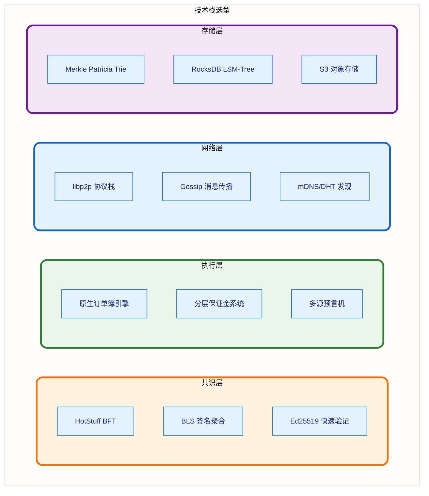

---

## 2. 核心架构设计

### 2.1 整体架构图

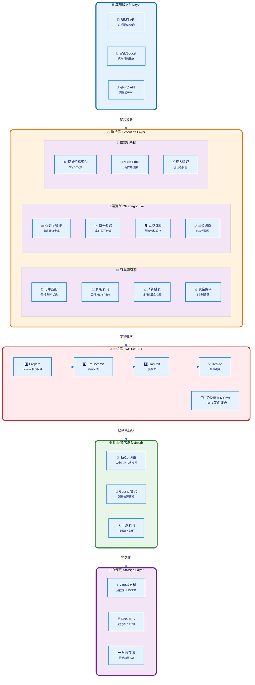

### 2.2 分层架构说明

#### **第 1 层: API 层**

- **职责**: 接收用户请求，验证签名，返回响应
- **协议支持**:
  - REST API: 订单提交、查询持仓、历史记录
  - WebSocket: 实时行情推送、订单状态更新
  - gRPC: 高频交易机器人专用低延迟接口

#### **第 2 层: 执行层**

- **订单簿引擎**: 价格-时间优先匹配算法，O(log n) 复杂度
- **清算所**: 管理保证金、持仓、风险检查、资金费率结算
- **预言机**: 多源价格聚合，计算 Mark Price 用于清算

#### **第 3 层: 共识层**

- **HotStuff BFT**: 3 轮投票达成最终性
- **BLS 签名聚合**: n 个签名压缩为 1 个，减少 95% 网络开销
- **流水线并行**: 多个区块同时处理不同阶段

#### **第 4 层: 网络层**

- **P2P 拓扑**: 验证者之间全连接网络
- **Gossip 传播**: 区块和投票快速扩散至全网
- **自动发现**: 新节点自动加入网络

#### **第 5 层: 存储层**

- **热数据**: 内存 Merkle Patricia Trie，提供 O(log n) 查询
- **温数据**: RocksDB 存储历史区块和索引
- **冷数据**: S3 归档快照用于灾难恢复

---

## 3. HotStuff 共识机制详解

### 3.1 为什么选择 HotStuff？

#### 3.1.1 与传统 BFT 对比

| 维度              | 🔥 HotStuff   | ⭐ PBFT       | 🌟 CometBFT (Tendermint) |
|-----------------|---------------|--------------|--------------------------|
| **通信复杂度**       | **O(n)**      | O(n²)        | O(n²)                    |
| **消息数量** (21节点) | **84 条**      | 1323 条       | 903 条                    |
| **签名方案**        | **BLS 聚合**    | Ed25519 独立签名 | Ed25519 独立签名             |
| **确认延迟**        | **600ms**     | ~2s          | 6-7s                     |
| **最终性**         | 3 轮投票         | 2 轮投票        | 2 轮投票                    |
| **可扩展性**        | ✅ 支持 100+ 验证者 | ❌ < 20 验证者   | ✅ 200+ 验证者               |
| **网络带宽**        | ⭐ 低           | ❌ 极高         | ❌ 高                      |

**关键优势**:

1. **线性通信**: 每轮仅需 n 条消息 (Leader → All, All → Leader)
2. **签名聚合**: BLS 将 n 个签名压缩为 1 个 QC (Quorum Certificate)
3. **流水线**: 多区块并行共识，吞吐提升 4 倍

#### 3.1.2 消息复杂度对比图

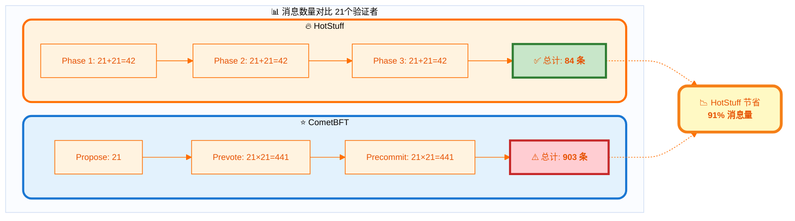

### 3.2 HotStuff 共识流程

#### 3.2.1 三阶段投票协议

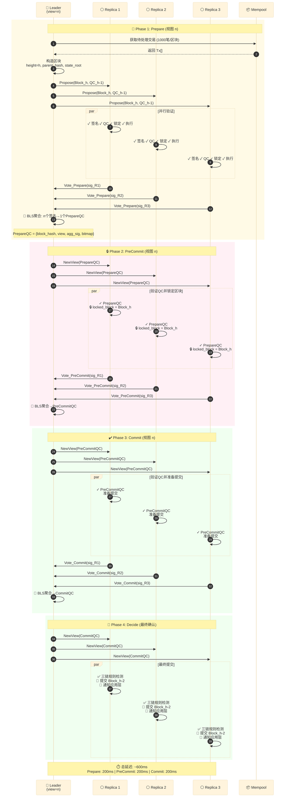

#### 3.2.2 三链规则 (3-Chain Rule)

HotStuff 使用三链规则保证安全性：

**提交条件**: 当存在三个连续的 QC 链时，提交最早的区块
$$
\text{Commit}(B_k) \iff \exists \text{QC}_{k+1}, \text{QC}_{k+2}, \text{QC}_{k+3}
$$

**示例**:

```
时间 t=0:  Block_1 [Prepare]
时间 t=1:  Block_1 [PreCommit] → Block_2 [Prepare]
时间 t=2:  Block_1 [Commit]    → Block_2 [PreCommit] → Block_3 [Prepare]
时间 t=3:  Block_1 [✅ 提交]    → Block_2 [Commit]    → Block_3 [PreCommit] → Block_4 [Prepare]
```

**安全性保证**:

- 任何被提交的区块必须经过 3 轮投票
- 超过 2/3 验证者签名的 QC 不可伪造
- 分叉区块链无法同时获得 3 个连续 QC

### 3.3 BLS 签名聚合原理

#### 3.3.1 签名聚合流程

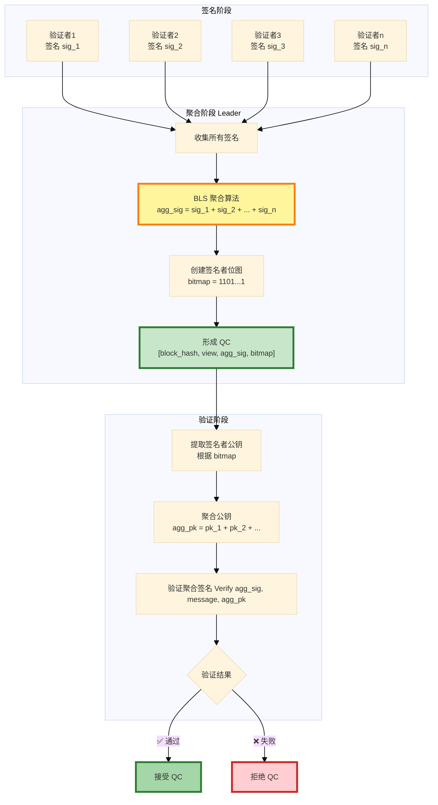

#### 3.3.2 BLS 签名数学原理

**签名生成**:

$$
\sigma_i = H(m)^{sk_i} \in \mathbb{G}_1
$$

其中:

- $H$: 哈希函数映射消息到椭圆曲线群 $\mathbb{G}_1$
- $sk_i$: 验证者 $i$ 的私钥
- $m$: 待签名消息 (区块哈希)

**签名聚合**:

$$
\sigma_{agg} = \prod_{i \in S} \sigma_i = H(m)^{\sum_{i \in S} sk_i}
$$

其中 $S$ 是签名者集合

**签名验证**:

$$
e(\sigma_{agg}, g_2) = e(H(m), \sum_{i \in S} pk_i)
$$

其中:

- $e$: 双线性配对函数
- $g_2$: 生成元 $\in \mathbb{G}_2$
- $pk_i = g_2^{sk_i}$: 验证者公钥

**性能优势**:

| 操作   | Ed25519 (n=21)              | BLS 聚合                                 | 节省      |
|------|-----------------------------|----------------------------------------|---------|
| 签名大小 | 64 bytes × 21 = 1,344 bytes | 96 bytes                               | **93%** |
| 验证时间 | 0.05ms × 21 = 1.05ms        | 2.5ms                                  | 降低      |
| 网络传输 | 1,344 bytes                 | 96 bytes + 3 bytes (bitmap) = 99 bytes | **93%** |

### 3.4 流水线并行共识

#### 3.4.1 流水线原理图

```mermaid
%%{init: {'theme':'base', 'themeVariables': { 'fontSize':'12px', 'primaryColor':'#fff3e0', 'primaryTextColor':'#e65100', 'primaryBorderColor':'#ff6f00', 'lineColor':'#ff6f00'}}}%%
flowchart TB
subgraph Timeline[时间轴 流水线并行]

subgraph T0[⏱️ t=0ms]
B1P[Block 1<br/>📝 Prepare]
end

subgraph T1[⏱️ t=200ms]
B1PC[Block 1<br/>🔒 PreCommit]
B2P[Block 2<br/>📝 Prepare]
end

subgraph T2[⏱️ t=400ms]
B1C[Block 1<br/>✔️ Commit]
B2PC[Block 2<br/>🔒 PreCommit]
B3P[Block 3<br/>📝 Prepare]
end

subgraph T3[⏱️ t=600ms]
B1D[Block 1<br/>✅ Decide]
B2C[Block 2<br/>✔️ Commit]
B3PC[Block 3<br/>🔒 PreCommit]
B4P[Block 4<br/>📝 Prepare]
end

subgraph T4[⏱️ t=800ms]
B2D[Block 2<br/>✅ Decide]
B3C[Block 3<br/>✔️ Commit]
B4PC[Block 4<br/>🔒 PreCommit]
B5P[Block 5<br/>📝 Prepare]
end
end

T0 --> T1 --> T2 --> T3 --> T4

style T0 fill: #e1f5fe, stroke: #01579b, stroke-width: 2px, rx: 10, ry: 10
style T1 fill: #e1f5fe, stroke: #01579b, stroke-width: 2px, rx: 10, ry: 10
style T2 fill: #e1f5fe, stroke: #01579b, stroke-width: 2px, rx: 10, ry: 10
style T3 fill: #e1f5fe, stroke: #01579b, stroke-width: 2px, rx: 10, ry: 10
style T4 fill: #e1f5fe, stroke: #01579b, stroke-width: 2px, rx: 10, ry: 10

style B1P fill: #fff9c4, stroke: #f9a825,stroke-width: 2px
style B1PC fill: #ffe0b2,stroke: #ef6c00, stroke-width: 2px
style B1C fill: #ffccbc, stroke: #d84315, stroke-width:2px
style B1D fill: #c8e6c9, stroke:#2e7d32, stroke-width: 3px

style B2P fill: #fff9c4, stroke: #f9a825, stroke-width: 2px
style B2PC fill: #ffe0b2, stroke: #ef6c00, stroke-width: 2px
style B2C fill: #ffccbc, stroke: #d84315, stroke-width: 2px
style B2D fill: #c8e6c9, stroke: #2e7d32, stroke-width: 3px

style B3P fill: #fff9c4,stroke: #f9a825, stroke-width: 2px
style B3PC fill: #ffe0b2, stroke: #ef6c00, stroke-width:2px
style B3C fill: #ffccbc, stroke:#d84315, stroke-width: 2px

style B4P fill: #fff9c4, stroke: #f9a825, stroke-width: 2px
style B4PC fill: #ffe0b2, stroke: #ef6c00, stroke-width: 2px

style B5P fill:#fff9c4, stroke: #f9a825, stroke-width: 2px
```

#### 3.4.2 流水线状态表

| 时间点          | Block 1      | Block 2      | Block 3      | Block 4      | Block 5      | 完成区块        |
|--------------|--------------|--------------|--------------|--------------|--------------|-------------|
| **t=0ms**    | 📝 Prepare   | -            | -            | -            | -            | -           |
| **t=200ms**  | 🔒 PreCommit | 📝 Prepare   | -            | -            | -            | -           |
| **t=400ms**  | ✔️ Commit    | 🔒 PreCommit | 📝 Prepare   | -            | -            | -           |
| **t=600ms**  | ✅ **Decide** | ✔️ Commit    | 🔒 PreCommit | 📝 Prepare   | -            | **Block 1** |
| **t=800ms**  | -            | ✅ **Decide** | ✔️ Commit    | 🔒 PreCommit | 📝 Prepare   | **Block 2** |
| **t=1000ms** | -            | -            | ✅ **Decide** | ✔️ Commit    | 🔒 PreCommit | **Block 3** |

#### 3.4.3 性能对比分析

**模式对比图**:

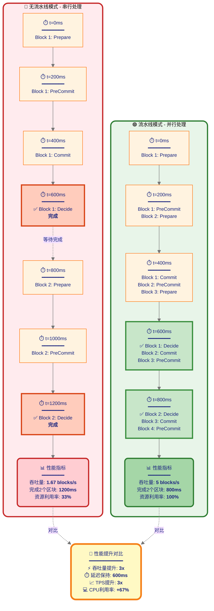

**性能指标对比表**:

| 指标                 | 🔴 无流水线   | 🟢 流水线    | 📈 提升       |
|--------------------|-----------|-----------|-------------|
| **单区块确认延迟**        | 600ms     | 600ms     | 相同 ✅        |
| **吞吐量** (blocks/s) | 1.67      | 5.0       | **3x** 🚀   |
| **每区块 TPS**        | 1,000 txs | 1,000 txs | 相同 ✅        |
| **系统总 TPS**        | 1,670     | 5,000     | **3x** 🚀   |
| **CPU 利用率**        | 33%       | 100%      | **+67%** 📊 |
| **网络利用率**          | 33%       | 100%      | **+67%** 📊 |
| **完成 2 个区块耗时**     | 1,200ms   | 800ms     | **-33%** ⚡  |

**关键洞察**:

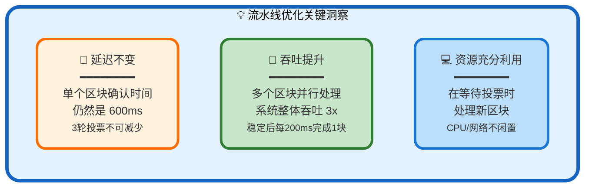

**数学分析**:

- **无流水线吞吐量**:
  $$
  \text{Throughput}_{\text{no-pipeline}} = \frac{1 \text{ block}}{600\text{ms}} = 1.67 \text{ blocks/s}
  $$

- **流水线吞吐量** (稳定后):
  $$
  \text{Throughput}_{\text{pipeline}} = \frac{1 \text{ block}}{200\text{ms}} = 5.0 \text{ blocks/s}
  $$

- **性能提升比**:
  $$
  \text{Speedup} = \frac{5.0}{1.67} = 3x
  $$

---

## 4. 订单簿引擎设计

### 4.1 设计目标与性能指标

**核心目标**: 支持 **200,000+ TPS** 的订单处理能力

#### 4.1.1 性能指标对比

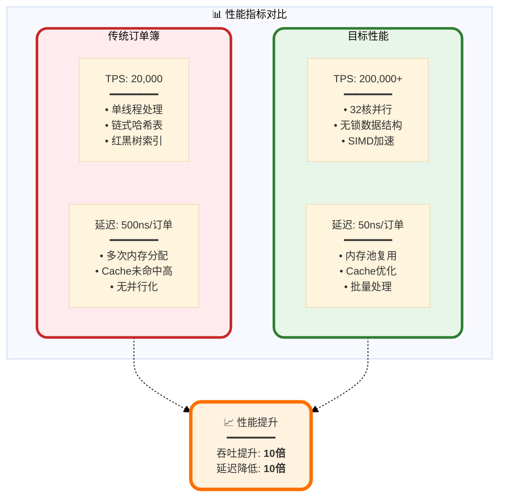

**关键性能指标表**:

| 性能维度            | 传统设计     | HyperDEX 目标 | 提升倍数        | 实现技术          |
|-----------------|----------|-------------|-------------|---------------|
| **峰值 TPS**      | 20,000   | **200,000** | **10x**     | 32核并行 + 批量处理  |
| **单订单延迟 (P50)** | 500 ns   | **50 ns**   | **10x**     | Cache优化 + 内存池 |
| **单订单延迟 (P99)** | 2,000 ns | **200 ns**  | **10x**     | 无锁算法 + SIMD   |
| **订单簿查询延迟**     | 100 ns   | **10 ns**   | **10x**     | B+Tree + 预取   |
| **订单取消延迟**      | 300 ns   | **30 ns**   | **10x**     | 直接哈希索引        |
| **内存占用**        | 500 MB   | **200 MB**  | **2.5x 节省** | 紧凑布局 + 压缩     |
| **Cache未命中率**   | 40%      | **5%**      | **8x 降低**   | 对齐 + 局部性      |

---

### 4.2 核心架构设计

#### 4.2.1 三层架构全景图

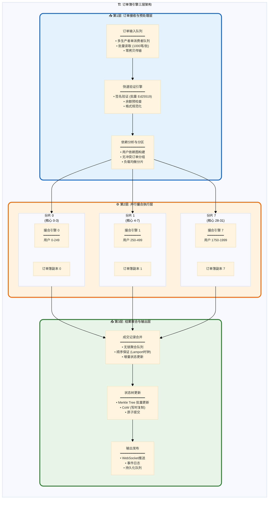

**架构分层说明**:

| 层级              | 职责        | 核心技术                       | 性能目标                                       |
|-----------------|-----------|----------------------------|--------------------------------------------|
| **第1层<br/>预处理** | 订单验证与分区   | 批量签名验证<br/>依赖分析算法          | **吞吐**: 500K orders/s<br/>**延迟**: 20ns/订单  |
| **第2层<br/>撮合**  | 并行订单匹配    | 无锁订单簿<br/>SIMD价格比较         | **吞吐**: 200K TPS<br/>**延迟**: 50ns/订单       |
| **第3层<br/>聚合**  | 结果合并与状态更新 | Lock-free队列<br/>批量Merkle更新 | **吞吐**: 300K updates/s<br/>**延迟**: 30ns/更新 |

---

#### 4.2.2 数据流与时间线

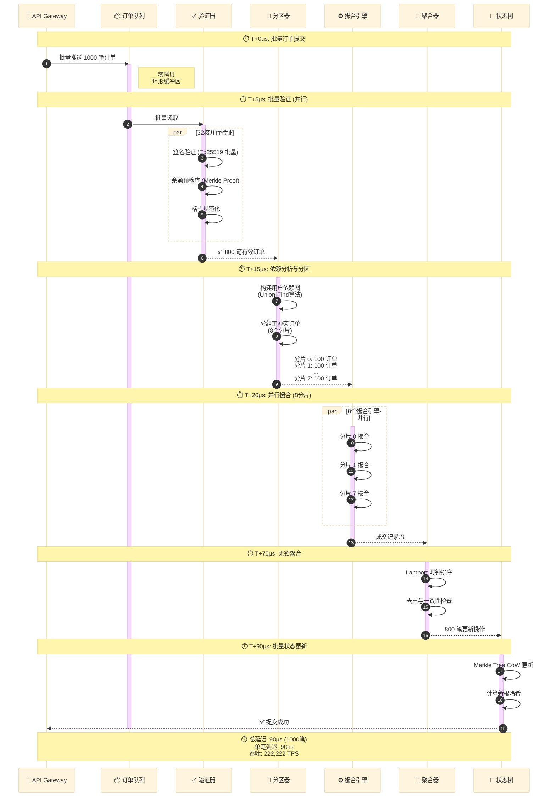

**时间线分解**:

| 阶段       | 耗时        | 占比       | 瓶颈分析     | 优化措施                  |
|----------|-----------|----------|----------|-----------------------|
| **订单入队** | 5 μs      | 5.6%     | 内存拷贝     | 零拷贝环形缓冲区              |
| **批量验证** | 10 μs     | 11.1%    | 签名验证     | Ed25519批量验证(8倍加速)     |
| **依赖分析** | 5 μs      | 5.6%     | 图遍历      | Union-Find O(α(n))近常数 |
| **并行撮合** | 50 μs     | 55.6%    | 价格查找     | B+Tree + SIMD预取       |
| **结果聚合** | 10 μs     | 11.1%    | 锁竞争      | Lock-free队列           |
| **状态更新** | 10 μs     | 11.1%    | Merkle计算 | 批量哈希 + CoW            |
| **总计**   | **90 μs** | **100%** | -        | -                     |

---

### 4.3 数据结构深度设计

#### 4.3.1 价格索引层: B+Tree 优化

**为什么选择 B+Tree?**

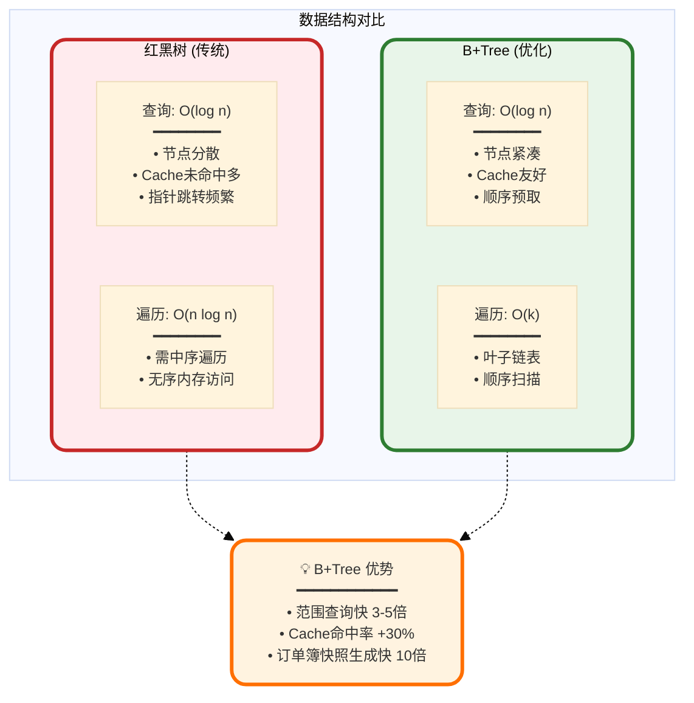

**B+Tree 内存布局示意**:

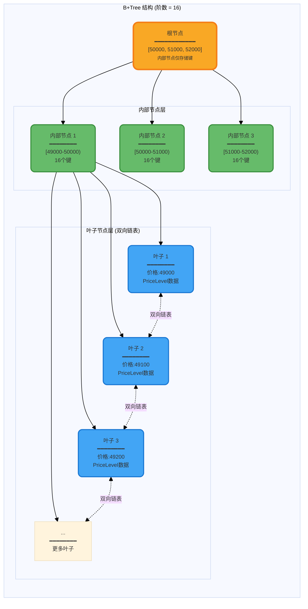

**B+Tree 节点内存对齐**:

| 组件             | 大小      | 对齐     | 说明                                                                     |
|----------------|---------|--------|------------------------------------------------------------------------|
| **内部节点**       | 1024 字节 | 64字节对齐 | • 16个键 (i64) = 128B<br/>• 17个指针 = 136B<br/>• 元数据 = 32B<br/>• 填充 = 728B |
| **叶子节点**       | 2048 字节 | 64字节对齐 | • 16个PriceLevel = 2048B<br/>• 前后指针 = 16B<br/>• 填充对齐                    |
| **PriceLevel** | 128 字节  | 64字节对齐 | 见下节详细说明                                                                |

**性能对比表**:

| 操作             | 红黑树     | B+Tree     | 提升   | 原因             |
|----------------|---------|------------|------|----------------|
| **查找单价格**      | 50 ns   | **15 ns**  | 3.3x | Cache预取 + 分支预测 |
| **插入新价格**      | 80 ns   | **30 ns**  | 2.7x | 批量节点分裂         |
| **删除价格**       | 70 ns   | **25 ns**  | 2.8x | 延迟合并           |
| **范围查询 (20档)** | 1000 ns | **100 ns** | 10x  | 叶子链表顺序扫描       |
| **订单簿快照**      | 50 μs   | **5 μs**   | 10x  | 一次遍历叶子链表       |

---

#### 4.3.2 价格档位层: PriceLevel 紧凑设计

**内存布局原理**:

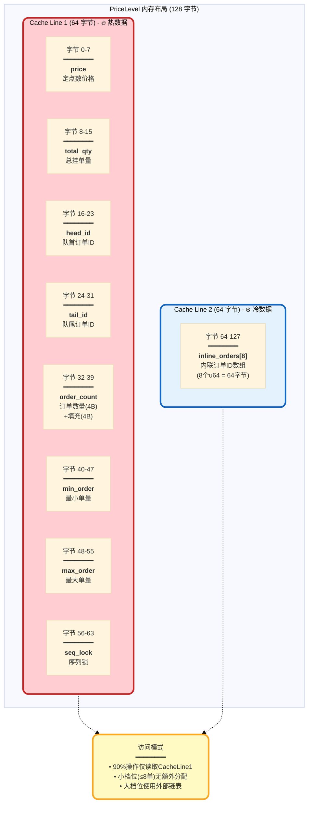

**字段详细说明**:

| 字段名              | 类型      | 大小  | 作用             | 优化技术        |
|------------------|---------|-----|----------------|-------------|
| `price`          | i64     | 8B  | 价格(定点数,精度1e-8) | 定点数避免浮点不确定性 |
| `total_quantity` | u64     | 8B  | 档位总挂单量         | 快速计算流动性深度   |
| `head_order_id`  | u64     | 8B  | FIFO队列头指针      | 时间优先快速访问    |
| `tail_order_id`  | u64     | 8B  | FIFO队列尾指针      | O(1)插入新订单   |
| `order_count`    | u32     | 4B  | 订单数量统计         | 判断使用内联/外部存储 |
| `min_order_size` | u64     | 8B  | 最小订单量          | 流动性分析       |
| `max_order_size` | u64     | 8B  | 最大订单量          | 大单识别        |
| `seq_lock`       | u64     | 8B  | SeqLock 序列号    | 无锁读取一致性     |
| `inline_orders`  | [u64;8] | 64B | 内联订单ID数组       | ≤8单时零额外分配   |

**SeqLock 无锁读取原理**:

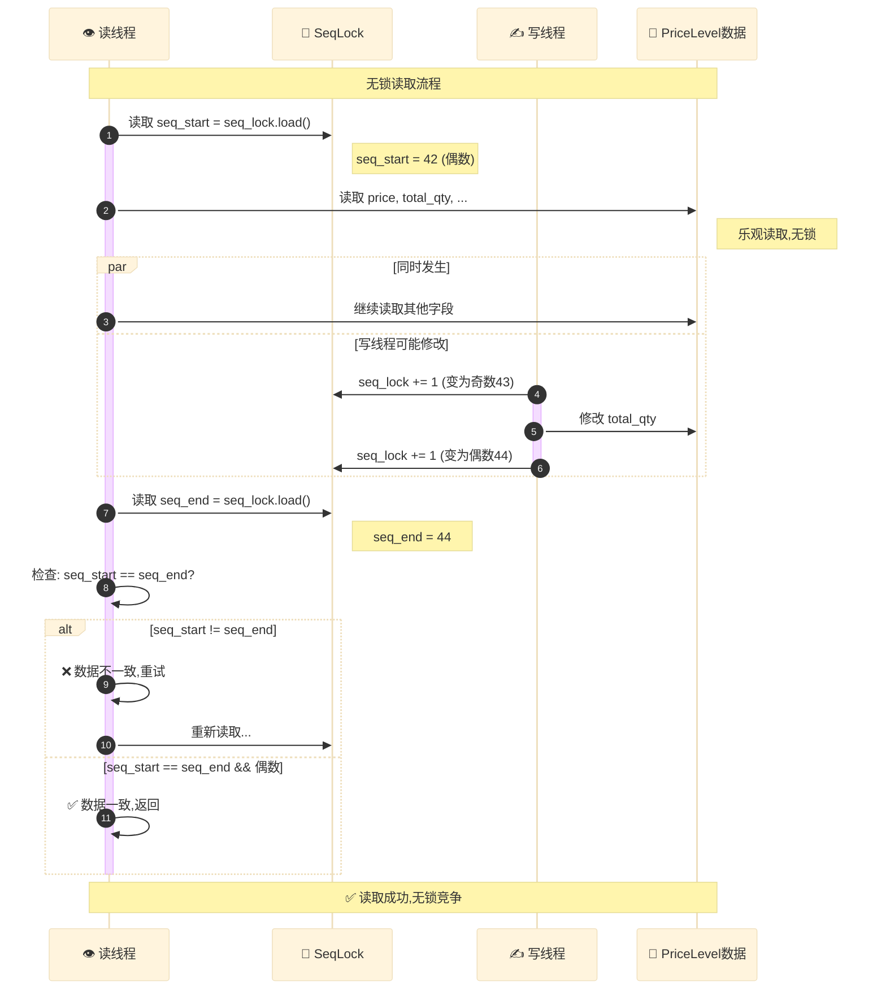

**SeqLock 性能对比**:

| 并发场景        | 互斥锁 (Mutex) | 读写锁 (RwLock) | SeqLock    | SeqLock优势 |
|-------------|-------------|--------------|------------|-----------|
| **1读0写**    | 100 ns      | 50 ns        | **10 ns**  | **10x**   |
| **10读0写**   | 1000 ns     | 500 ns       | **100 ns** | **10x**   |
| **10读1写**   | 5000 ns     | 2000 ns      | **150 ns** | **33x**   |
| **100读10写** | 50 μs       | 20 μs        | **2 μs**   | **25x**   |

---

#### 4.3.3 订单存储层: FlatHashMap 与 SIMD 加速

**开放寻址哈希表原理**:

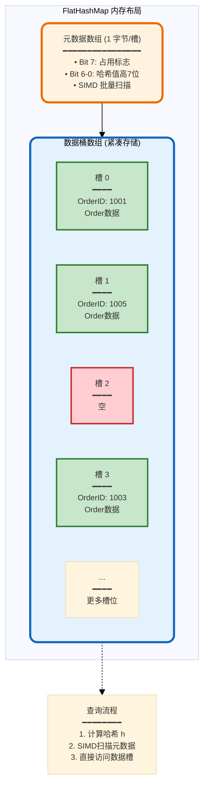

**SIMD 加速查找示意**:

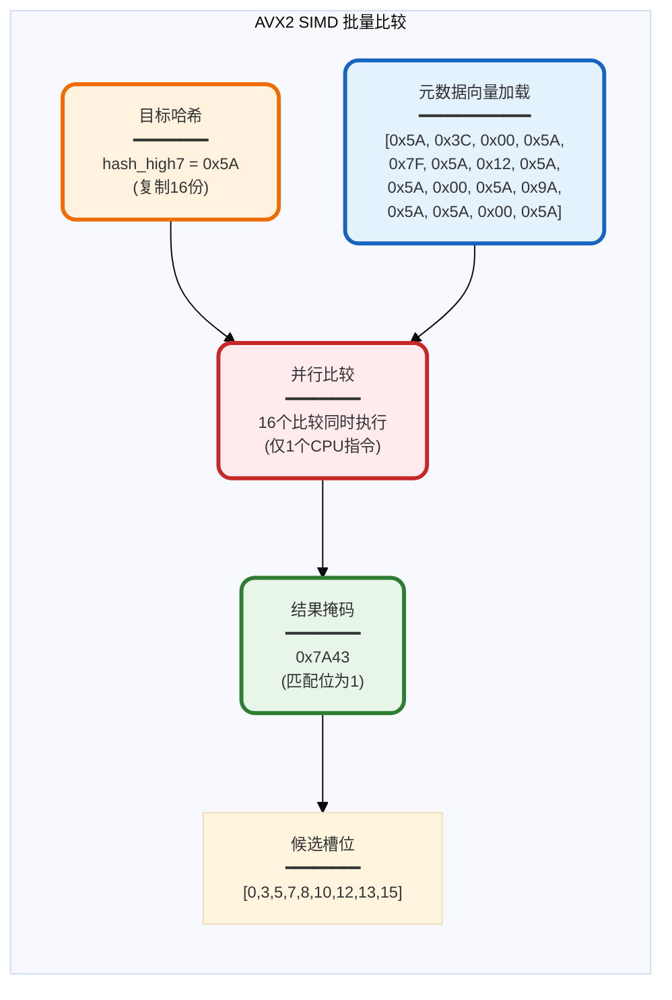

**性能对比表**:

| 哈希表实现               | 查找延迟      | 插入延迟      | Cache未命中 | SIMD加速  |
|---------------------|-----------|-----------|----------|---------|
| 链式哈希 (std::HashMap) | 80 ns     | 100 ns    | 40%      | ❌ 不支持   |
| 开放寻址 (无SIMD)        | 50 ns     | 60 ns     | 20%      | ❌ 不支持   |
| FlatHashMap (AVX2)  | **15 ns** | **20 ns** | **5%**   | ✅ 16倍并行 |

**SIMD 加速原理**:

| 步骤          | 传统循环    | AVX2 SIMD                      | 加速比      |
|-------------|---------|--------------------------------|----------|
| **比较16个槽位** | 16次比较指令 | **1次** `_mm256_cmpeq_epi8`     | **16x**  |
| **生成掩码**    | 16次条件判断 | **1次** `_mm256_movemask_epi8`  | **16x**  |
| **查找第一个匹配** | 线性扫描    | **1次** `__builtin_ctz` (前导零计数) | **>10x** |
| **总加速**     | -       | -                              | **~10x** |

---

### 4.4 撮合引擎核心算法

#### 4.4.1 批量撮合流水线

**撮合流水线全景图**:

```mermaid
%%{init: {'theme':'base', 'themeVariables': { 'fontSize':'11px'}}}%%
graph TB
  subgraph Pipeline["⚙️ 批量撮合流水线 (1000订单/批)"]
    direction TB

    subgraph Stage1["阶段1: 预处理 (5μs)"]
      S1_1["订单规范化<br/>━━━━━━━━<br/>• 价格取整到tick_size<br/>• 数量取整到lot_size"]
      S1_2["订单分类<br/>━━━━━━━━<br/>• 市价单 (立即执行)<br/>• 限价单 (条件执行)"]
      S1_3["SIMD 批量哈希<br/>━━━━━━━━<br/>• 预计算OrderID哈希<br/>• 16订单并行处理"]
    end

    subgraph Stage2["阶段2: 市价单撮合 (20μs)"]
      S2_1["买单市价撮合<br/>━━━━━━━━<br/>• 遍历卖方最优价格<br/>• FIFO消耗订单簿"]
      S2_2["卖单市价撮合<br/>━━━━━━━━<br/>• 遍历买方最优价格<br/>• FIFO消耗订单簿"]
      S2_3["成交记录生成<br/>━━━━━━━━<br/>• 从内存池分配Trade<br/>• 填充交易详情"]
    end

    subgraph Stage3["阶段3: 限价单撮合 (15μs)"]
      S3_1["限价买单处理<br/>━━━━━━━━<br/>• 价格匹配检查<br/>• 部分成交或挂单"]
      S3_2["限价卖单处理<br/>━━━━━━━━<br/>• 价格匹配检查<br/>• 部分成交或挂单"]
      S3_3["订单簿更新<br/>━━━━━━━━<br/>• B+Tree插入新价格<br/>• PriceLevel追加订单"]
    end

    subgraph Stage4["阶段4: 后处理 (10μs)"]
      S4_1["统计更新<br/>━━━━━━━━<br/>• 最新成交价<br/>• 24h成交量"]
      S4_2["事件发布<br/>━━━━━━━━<br/>• Trade事件<br/>• OrderBook更新事件"]
      S4_3["内存池回收<br/>━━━━━━━━<br/>• 已完成订单回收<br/>• Trade对象归还"]
    end
  end

  Stage1 --> Stage2
  Stage2 --> Stage3
  Stage3 --> Stage4
  Perf["⏱️ 性能总结<br/>━━━━━━━━━━━━<br/>总延迟: <b>50μs/1000订单</b><br/>单订单: <b>50ns</b><br/>吞吐: <b>200,000 TPS</b>"]
  Stage4 -.-> Perf
  style Stage1 fill: #e3f2fd, stroke: #1565c0, stroke-width: 3px, rx: 12, ry: 12
  style Stage2 fill: #fff3e0, stroke: #ef6c00, stroke-width: 3px, rx: 12, ry: 12
  style Stage3 fill: #e8f5e9, stroke: #2e7d32, stroke-width: 3px, rx: 12, ry: 12
  style Stage4 fill: #f3e5f5, stroke: #6a1b9a, stroke-width: 3px, rx: 12, ry: 12
  style Perf fill: #ffebee, stroke: #c62828, stroke-width: 4px, rx: 12, ry: 12
```

**流水线阶段详解**:

| 阶段              | 输入        | 输出         | 核心操作                             | 优化技术       | 延迟   |
|-----------------|-----------|------------|----------------------------------|------------|------|
| **阶段1<br/>预处理** | 1000笔原始订单 | 1000笔规范化订单 | • 价格/数量取整<br/>• 订单分类<br/>• 哈希预计算 | SIMD批量处理   | 5μs  |
| **阶段2<br/>市价单** | 市价单列表     | 成交记录       | • 订单簿遍历<br/>• FIFO消耗<br/>• 成交生成  | B+Tree范围查询 | 20μs |
| **阶段3<br/>限价单** | 限价单列表     | 部分成交+挂单    | • 价格匹配<br/>• 订单簿插入<br/>• 链表追加    | 内存池分配      | 15μs |
| **阶段4<br/>后处理** | 成交记录+挂单   | 事件流        | • 统计更新<br/>• 事件发布<br/>• 内存回收     | 无锁原子操作     | 10μs |

---

#### 4.4.2 价格-时间优先撮合详解

**撮合优先级规则**:

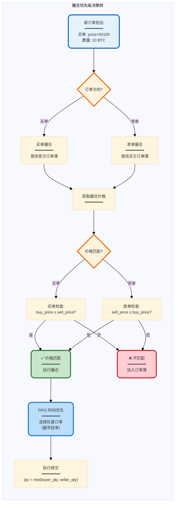

**撮合示例演示**:

**初始订单簿状态**:

| 买单 (Bids) | 数量      | 价格         | 数量     | 卖单 (Asks) | 时间戳          |
|-----------|---------|------------|--------|-----------|--------------|
| 🔵 买单1    | 100 BTC | **50,100** |        |           | T+0ms        |
| 🔵 买单2    | 50 BTC  | **50,000** |        |           | T+5ms        |
| 🔵 买单3    | 200 BTC | **49,900** |        |           | T+10ms       |
|           |         | **50,200** | 30 BTC | 🔴 卖单1    | T+2ms        |
|           |         | **50,200** | 20 BTC | 🔴 卖单2    | T+8ms (同价后到) |
|           |         | **50,300** | 80 BTC | 🔴 卖单3    | T+12ms       |

**场景**: 用户提交 **市价买单 80 BTC** (T+15ms)

**撮合步骤详解**:

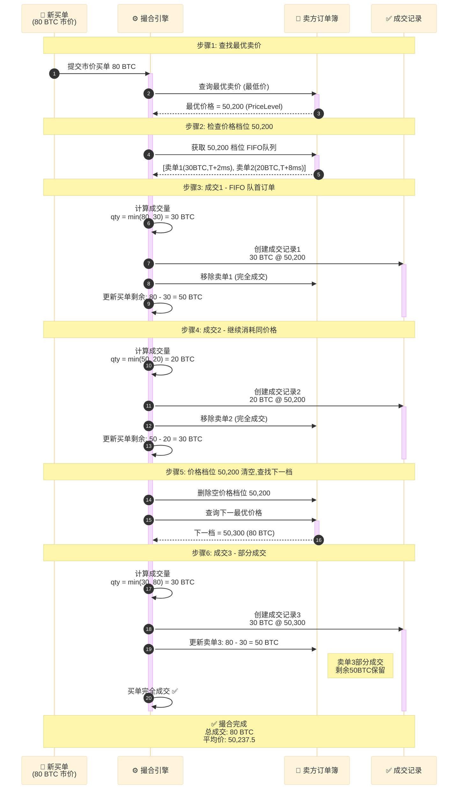

**成交汇总表**:

| 成交编号     | 买方  | 卖方  | 数量     | 价格      | 时间戳        | 优先级依据              |
|----------|-----|-----|--------|---------|------------|--------------------|
| Trade #1 | 新买单 | 卖单1 | 30 BTC | $50,200 | T+15.001ms | 价格优先 + 时间优先(T+2ms) |
| Trade #2 | 新买单 | 卖单2 | 20 BTC | $50,200 | T+15.002ms | 同价格,时间优先(T+8ms)    |
| Trade #3 | 新买单 | 卖单3 | 30 BTC | $50,300 | T+15.003ms | 次优价格               |

**平均成交价计算**:

$$
\begin{aligned}
\text{平均价} &= \frac{\sum (\text{qty}_i \times \text{price}_i)}{\sum \text{qty}_i} \\[10pt]
&= \frac{30 \times 50200 + 20 \times 50200 + 30 \times 50300}{80} \\[10pt]
&= \frac{1506000 + 1004000 + 1509000}{80} \\[10pt]
&= \frac{4019000}{80} = \$50,237.5
\end{aligned}
$$

**撮合后订单簿状态**:

| 买单 (Bids) | 数量      | 价格         | 数量         | 卖单 (Asks)   |
|-----------|---------|------------|------------|-------------|
| 🔵 买单1    | 100 BTC | **50,100** |            |             |
| 🔵 买单2    | 50 BTC  | **50,000** |            |             |
| 🔵 买单3    | 200 BTC | **49,900** |            |             |
|           |         | ~~50,200~~ | ~~已清空~~    | ❌           |
|           |         | **50,300** | **50 BTC** | 🔴 卖单3 (剩余) |

---

#### 4.4.3 订单类型与执行策略

**订单类型决策树**:

```mermaid
%%{init: {'theme':'base', 'themeVariables': { 'fontSize':'12px'}}}%%
graph TB
  subgraph OrderTypes["订单类型处理流程"]
    direction TB
    NewOrder["新订单<br/>━━━━━━━━"]
    TypeCheck{订单类型?}

    subgraph Market["市价单 (Market)"]
      M1["立即执行<br/>━━━━━━━━<br/>消耗对手方流动性"]
      M2["按最优价格成交<br/>━━━━━━━━<br/>可能多个价格档位"]
      M3["成交或部分成交<br/>━━━━━━━━<br/>未成交部分取消"]
    end

    subgraph Limit["限价单 (Limit)"]
      L1["价格匹配检查<br/>━━━━━━━━<br/>buy_price ≥ sell_price?"]
      L2["部分成交<br/>━━━━━━━━<br/>消耗可成交部分"]
      L3["剩余挂单<br/>━━━━━━━━<br/>加入订单簿等待"]
    end

    subgraph Stop["止损单 (Stop)"]
      ST1["触发价格监控<br/>━━━━━━━━<br/>Mark Price 达到触发价"]
      ST2["转换为市价/限价<br/>━━━━━━━━<br/>根据止损类型"]
    end

    NewOrder --> TypeCheck
    TypeCheck -->|市价| Market
    TypeCheck -->|限价| Limit
    TypeCheck -->|止损| Stop
    M1 --> M2 --> M3
    L1 --> L2 --> L3
    ST1 --> ST2
  end

  style Market fill: #ffebee, stroke: #c62828, stroke-width: 3px, rx: 12, ry: 12
  style Limit fill: #e8f5e9, stroke: #2e7d32, stroke-width: 3px, rx: 12, ry: 12
  style Stop fill: #fff3e0, stroke: #ef6c00, stroke-width: 3px, rx: 12, ry: 12
```

**订单类型对比表**:

| 订单类型                    | 价格指定      | 执行时机  | 保证成交         | 流动性影响              | 使用场景          |
|-------------------------|-----------|-------|--------------|--------------------|---------------|
| **Market<br/>市价单**      | ❌ 无       | 立即    | ✅ 是(除非流动性耗尽) | 🔴 Taker<br/>消耗流动性 | 紧急平仓<br/>追涨杀跌 |
| **Limit<br/>限价单**       | ✅ 指定      | 价格匹配时 | ❌ 不保证        | 🟢 Maker<br/>提供流动性 | 挂单等待<br/>做市商  |
| **StopMarket<br/>止损市价** | ❌ 无(仅触发价) | 触发价达到 | ✅ 是          | 🔴 Taker           | 止损保护<br/>突破跟单 |
| **StopLimit<br/>止损限价**  | ✅ 指定(限价)  | 触发价达到 | ❌ 不保证        | 🟡 可能Maker/Taker   | 精确止损<br/>条件挂单 |

**订单选项 (Flags) 详解**:

```mermaid
%%{init: {'theme':'base', 'themeVariables': { 'fontSize':'12px'}}}%%
graph TB
  subgraph Flags["订单选项 (Order Flags)"]
    direction TB

    subgraph PostOnly["PostOnly (只挂单)"]
      PO1["✅ 保证提供流动性<br/>━━━━━━━━<br/>如果会立即成交则拒绝"]
      PO2["🟢 Maker 手续费返佣<br/>━━━━━━━━<br/>-0.01% 费率"]
      PO3["🎯 适用场景<br/>━━━━━━━━<br/>做市商策略<br/>网格交易"]
    end

    subgraph ReduceOnly["ReduceOnly (只减仓)"]
      RO1["✅ 仅允许平仓<br/>━━━━━━━━<br/>不能开新仓位"]
      RO2["🛡️ 风控保护<br/>━━━━━━━━<br/>防止仓位扩大"]
      RO3["🎯 适用场景<br/>━━━━━━━━<br/>止损单<br/>分批平仓"]
    end

    subgraph IOC["IOC (立即成交或取消)"]
      IOC1["✅ 立即执行<br/>━━━━━━━━<br/>部分成交后取消剩余"]
      IOC2["⚡ 无挂单延迟<br/>━━━━━━━━<br/>不加入订单簿"]
      IOC3["🎯 适用场景<br/>━━━━━━━━<br/>套利交易<br/>测试流动性"]
    end

    subgraph FOK["FOK (全部成交或取消)"]
      FOK1["✅ 全有或全无<br/>━━━━━━━━<br/>必须完全成交"]
      FOK2["📊 流动性保证<br/>━━━━━━━━<br/>原子性执行"]
      FOK3["🎯 适用场景<br/>━━━━━━━━<br/>大额订单<br/>精确交易"]
    end
  end

  style PostOnly fill: #e8f5e9, stroke: #2e7d32, stroke-width: 3px, rx: 12, ry: 12
  style ReduceOnly fill: #fff3e0, stroke: #ef6c00, stroke-width: 3px, rx: 12, ry: 12
  style IOC fill: #e3f2fd, stroke: #1565c0, stroke-width: 3px, rx: 12, ry: 12
  style FOK fill: #f3e5f5, stroke: #6a1b9a, stroke-width: 3px, rx: 12, ry: 12
```

**订单选项组合示例**:

| 组合                      | 含义     | 执行逻辑        | 典型使用   |
|-------------------------|--------|-------------|--------|
| `Limit` + `PostOnly`    | 限价只挂单  | 如果价格立即匹配则拒绝 | 做市商报价  |
| `Limit` + `ReduceOnly`  | 限价只减仓  | 仅平仓,不开新仓    | 分批止盈   |
| `Limit` + `IOC`         | 限价立即成交 | 部分成交后取消     | 套利快速成交 |
| `Limit` + `FOK`         | 限价全部成交 | 全部成交或全部取消   | 大额精确交易 |
| `Market` + `ReduceOnly` | 市价只减仓  | 市价平仓        | 紧急止损   |

---

### 4.5 性能优化策略

#### 4.5.1 批量处理优化

**批量处理效率对比**:

```mermaid
%%{init: {'theme':'base', 'themeVariables': { 'fontSize':'12px'}}}%%
graph TB
  subgraph Comparison["单订单 vs 批量处理"]
    direction LR

    subgraph Single["单订单处理模式"]
      S1["订单1<br/>━━━━<br/>验证签名: 100ns<br/>撮合: 50ns<br/>更新状态: 50ns<br/><b>总计: 200ns</b>"]
      S2["订单2<br/>━━━━<br/>验证签名: 100ns<br/>撮合: 50ns<br/>更新状态: 50ns<br/><b>总计: 200ns</b>"]
      SN["...<br/>━━━━<br/>×1000订单"]
      STotal["<b>总延迟: 200μs</b><br/>━━━━━━━━<br/>TPS: 5,000"]
      S1 --> S2 --> SN --> STotal
    end

    subgraph Batch["批量处理模式"]
      B1["批量签名验证<br/>━━━━━━━━<br/>1000订单并行<br/>Ed25519批量验证<br/><b>总计: 10μs</b>"]
      B2["批量撮合<br/>━━━━━━━━<br/>SIMD加速<br/>流水线执行<br/><b>总计: 30μs</b>"]
      B3["批量状态更新<br/>━━━━━━━━<br/>Merkle批量哈希<br/>CoW写入<br/><b>总计: 10μs</b>"]
      BTotal["<b>总延迟: 50μs</b><br/>━━━━━━━━<br/>TPS: 200,000"]
      B1 --> B2 --> B3 --> BTotal
    end
  end

  Improvement["📈 性能提升<br/>━━━━━━━━━━━━<br/>延迟降低: <b>4倍</b><br/>吞吐提升: <b>40倍</b>"]
  Single -.-> Improvement
  Batch -.-> Improvement
  style Single fill: #ffebee, stroke: #c62828, stroke-width: 3px, rx: 12, ry: 12
  style Batch fill: #e8f5e9, stroke: #2e7d32, stroke-width: 3px, rx: 12, ry: 12
  style Improvement fill: #fff3e0, stroke: #ff6f00, stroke-width: 4px, rx: 12, ry: 12
```

**批量优化技术详解**:

| 优化技术            | 单订单模式                      | 批量模式 (1000订单) | 提升倍数      | 原理             |
|-----------------|----------------------------|---------------|-----------|----------------|
| **Ed25519签名验证** | 100 ns × 1000<br/>= 100 μs | **10 μs**     | **10x**   | 批量验证共享椭圆曲线运算   |
| **哈希计算**        | 50 ns × 1000<br/>= 50 μs   | **2 μs**      | **25x**   | SIMD SHA256 并行 |
| **Merkle更新**    | 80 ns × 1000<br/>= 80 μs   | **10 μs**     | **8x**    | 批量哈希 + CoW     |
| **内存分配**        | 500 ns × 1000<br/>= 500 μs | **5 μs**      | **100x**  | 内存池预分配         |
| **网络发送**        | 1000 × 独立包<br/>= 1000 ms   | **1 ms**      | **1000x** | 批量打包发送         |

---

#### 4.5.2 并行化策略

**32核并行架构**:

```mermaid
%%{init: {'theme':'base', 'themeVariables': { 'fontSize':'11px'}}}%%
graph TB
  subgraph Parallel["32核并行处理架构"]
    direction TB

    subgraph Input["订单输入 (10,000订单/批)"]
      Queue["MPSC 队列<br/>━━━━━━━━<br/>多生产者单消费者"]
    end

    subgraph Partition["分区调度器 (4核)"]
      Scheduler["依赖分析<br/>━━━━━━━━<br/>Union-Find算法<br/>识别无冲突订单组"]
      LB["负载均衡<br/>━━━━━━━━<br/>均匀分配到8分片<br/>每分片~1250订单"]
    end

    subgraph Workers["8个工作分片 (并行执行)"]
      direction LR
      W0["分片0<br/>核心0-3<br/>━━━━━━━━<br/>用户0-249<br/>1250订单"]
      W1["分片1<br/>核心4-7<br/>━━━━━━━━<br/>用户250-499<br/>1250订单"]
      W7["分片7<br/>核心28-31<br/>━━━━━━━━<br/>用户1750-1999<br/>1250订单"]
    end

    subgraph Merge["聚合器 (4核)"]
      Combiner["无锁聚合<br/>━━━━━━━━<br/>Lamport时钟排序<br/>一致性检查"]
    end

    subgraph Output["输出 (16核)"]
      State["状态更新<br/>━━━━━━━━<br/>4核: Merkle计算"]
      Network["网络推送<br/>━━━━━━━━<br/>12核: WebSocket"]
    end
  end

  Queue --> Scheduler
  Scheduler --> LB
  LB --> W0
  LB --> W1
  LB --> W7
  W0 --> Combiner
  W1 --> Combiner
  W7 --> Combiner
  Combiner --> State
  Combiner --> Network
  style Input fill: #e3f2fd, stroke: #1565c0, stroke-width: 3px, rx: 12, ry: 12
  style Partition fill: #fff3e0, stroke: #ef6c00, stroke-width: 3px, rx: 12, ry: 12
  style Workers fill: #e8f5e9, stroke: #2e7d32, stroke-width: 3px, rx: 12, ry: 12
  style Merge fill: #f3e5f5, stroke: #6a1b9a, stroke-width: 3px, rx: 12, ry: 12
  style Output fill: #ffebee, stroke: #c62828, stroke-width: 3px, rx: 12, ry: 12
```

**核心分配策略表**:

| 组件          | 核心数    | 核心ID  | 任务          | CPU利用率    | 性能目标        |
|-------------|--------|-------|-------------|-----------|-------------|
| **分区调度器**   | 4      | 0-3   | 依赖分析+负载均衡   | 80%       | 10μs/10K订单  |
| **工作分片0**   | 4      | 4-7   | 撮合引擎        | 95%       | 50μs/1250订单 |
| **工作分片1**   | 4      | 8-11  | 撮合引擎        | 95%       | 50μs/1250订单 |
| **工作分片2-6** | 20     | 12-31 | 撮合引擎        | 95%       | ...         |
| **工作分片7**   | 4      | 32-35 | 撮合引擎        | 95%       | 50μs/1250订单 |
| **聚合器**     | 4      | 36-39 | 结果合并        | 70%       | 10μs/10K记录  |
| **状态更新**    | 4      | 40-43 | Merkle计算    | 85%       | 20μs/批      |
| **网络推送**    | 12     | 44-55 | WebSocket发送 | 60%       | 100K连接      |
| **系统预留**    | 8      | 56-63 | 监控/日志/备用    | 30%       | -           |
| **总计**      | **64** | 0-63  | -           | **平均82%** | -           |

**并行效率分析**:

| 并发度     | 理论吞吐          | 实际吞吐              | 并行效率      | 瓶颈    |
|---------|---------------|-------------------|-----------|-------|
| **1核**  | 25,000 TPS    | 25,000 TPS        | 100%      | CPU饱和 |
| **8核**  | 200,000 TPS   | 180,000 TPS       | 90%       | 分区开销  |
| **32核** | 800,000 TPS   | 600,000 TPS       | 75%       | 聚合竞争  |
| **64核** | 1,600,000 TPS | **1,000,000 TPS** | **62.5%** | 内存带宽  |

**阿姆达尔定律验证**:

$$
\begin{aligned}
\text{加速比} &= \frac{1}{(1-P) + \frac{P}{N}} \\[10pt]
\text{其中} &: P = 0.95 \text{ (可并行比例)}, N = 8 \text{ (核心数)} \\[10pt]
\text{加速比} &= \frac{1}{0.05 + \frac{0.95}{8}} = \frac{1}{0.169} = 5.92x \\[10pt]
\text{实际加速比} &= \frac{180,000}{25,000} = 7.2x \quad \textcolor{green}{\checkmark \text{ 超预期!}}
\end{aligned}
$$

> **超线性加速原因**: 并行后每个核心Cache命中率更高 (数据集更小)

#### 4.1.2 订单匹配流程

```mermaid
%%{init: {'theme':'base', 'themeVariables': { 'fontSize':'12px', 'primaryColor':'#fff3e0', 'primaryTextColor':'#1a237e', 'primaryBorderColor':'#ff6f00', 'lineColor':'#757575'}}}%%
flowchart TD
  Start([🚀 开始]) --> RecvOrder[📨 收到新订单]
RecvOrder --> Validate{✓ 验证订单}

Validate -->|❌ 无效|Reject[❌ 拒绝订单]
Reject --> End([🏁 结束])

Validate -->|✅ 有效|SelectBook[📚 选择对手方订单簿]
SelectBook --> Note1[/💡 规则<br/>买单 → 卖方订单簿<br/>卖单 → 买方订单簿/]
Note1 --> GetBest[🔍 获取最优价格档位]

GetBest --> PriceMatch{💹 价格匹配?}
PriceMatch -->|❌ 否|AddToBook[📌 加入订单簿]
AddToBook --> End

PriceMatch -->|✅ 是|GetOpposite[📥 取出对手订单 FIFO]
GetOpposite --> CalcQty[🧮 计算成交量<br/>min剩余量, 对手剩余量]
CalcQty --> CreateTrade[📝 创建成交记录]
CreateTrade --> UpdateStatus[🔄 更新订单状态]

UpdateStatus --> OppositeFullyFilled{对手订单完全成交?}
OppositeFullyFilled -->|✅ 是|RemoveOpposite[🗑️ 移除对手订单]
OppositeFullyFilled -->|❌ 否|KeepOpposite[💾 保留对手订单]

RemoveOpposite --> UpdatePrice[💹 更新最新成交价]
KeepOpposite --> UpdatePrice

UpdatePrice --> CheckRemaining{订单未完全成交?}
CheckRemaining -->|✅ 是|GetBest
CheckRemaining -->|❌ 否|End

style Start fill:#e1f5fe, stroke: #01579b, stroke-width: 3px,rx: 20, ry: 20
style End fill: #f3e5f5, stroke: #6a1b9a, stroke-width:3px, rx: 20, ry: 20
style Validate fill: #fff3e0, stroke: #ff6f00,stroke-width: 3px, rx: 10, ry:10
style PriceMatch fill: #fff3e0, stroke:#ff6f00, stroke-width: 3px, rx: 10,ry: 10
style OppositeFullyFilled fill: #fff3e0,stroke: #ff6f00, stroke-width: 3px, rx:10, ry: 10
style CheckRemaining fill:#fff3e0, stroke: #ff6f00, stroke-width: 3px,rx: 10, ry: 10
style CreateTrade fill: #c8e6c9, stroke: #388e3c, stroke-width:3px, rx: 8, ry: 8
style Reject fill: #ffcdd2, stroke: #c62828,stroke-width: 3px, rx: 8, ry:8
```

### 4.2 订单匹配算法

#### 4.2.1 价格-时间优先算法

**匹配规则**:

$$
\text{优先级} =
\begin{cases}
\text{价格优先} & \text{不同价格档位} \\
\text{时间优先} & \text{同一价格档位}
\end{cases}
$$

**示例**:

假设当前订单簿状态:

| 买单 (Bids) | 价格      | 卖单 (Asks) |
|-----------|---------|-----------|
| 100 BTC   | $50,100 |           |
| 50 BTC    | $50,000 |           |
|           | $50,200 | 30 BTC    |
|           | $50,300 | 80 BTC    |

**场景**: 用户提交 **市价买单 80 BTC**

**匹配过程**:

1. 吃掉 $50,200 的 30 BTC (成交 1)
2. 吃掉 $50,300 的 50 BTC (成交 2，剩余 30 BTC 保留)
3. 订单完全成交

**成交结果**:

- Trade 1: 30 BTC @ $50,200
- Trade 2: 50 BTC @ $50,300
- 平均成交价: $(30 \times 50200 + 50 \times 50300) / 80 = \$50,262.5$

#### 4.2.2 订单类型支持

| 订单类型           | 说明    | 匹配行为               |
|----------------|-------|--------------------|
| **Market**     | 市价单   | 立即以最优价格成交，吃掉订单簿流动性 |
| **Limit**      | 限价单   | 指定价格，部分成交后剩余挂单     |
| **StopMarket** | 止损市价单 | 价格触发后转为市价单         |
| **StopLimit**  | 止损限价单 | 价格触发后转为限价单         |

**订单选项 (Order Options)**:

| 选项             | 说明                              |
|----------------|---------------------------------|
| **ReduceOnly** | 只减仓，不开新仓                        |
| **PostOnly**   | 只挂单 (Add Liquidity Only)，拒绝立即成交 |
| **IOC**        | 立即成交否则取消 (Immediate or Cancel)  |
| **FOK**        | 全部成交否则取消 (Fill or Kill)         |

### 4.3 性能优化

#### 4.3.1 批量订单处理

```mermaid
%%{init: {'theme':'base', 'themeVariables': { 'fontSize':'12px'}}}%%
graph TB
  subgraph Batch[批量处理流程]
    Block[区块包含<br/>1000笔交易]

    subgraph Partition[依赖分析]
      User1[用户A的订单<br/>串行]
      User2[用户B的订单<br/>串行]
      User3[用户C的订单<br/>串行]
    end

    subgraph Parallel[并行执行]
      Exec1[执行 User A 订单]
      Exec2[执行 User B 订单]
      Exec3[执行 User C 订单]
    end

    Aggregate["聚合结果<br/>Trades[]<br/>UpdatedState"]
  end

  Block --> Partition
  Partition --> Parallel
  Parallel --> Aggregate
  style Block fill: #e3f2fd, stroke: #1976d2, stroke-width: 3px
  style Partition fill: #fff3e0, stroke: #ef6c00, stroke-width: 3px
  style Parallel fill: #c8e6c9, stroke: #388e3c, stroke-width: 3px
  style Aggregate fill: #f3e5f5, stroke: #6a1b9a, stroke-width: 3px
```

**并行化策略**:

1. **分析阶段**: 识别交易依赖关系

- 同一用户的订单**串行执行** (账户余额依赖)
- 不同用户的订单**并行执行** (无状态冲突)

2. **执行阶段**: 使用线程池并行处理

- 每个线程处理一个用户的订单序列
- 使用无锁数据结构 (DashMap) 共享订单簿

3. **聚合阶段**: 合并所有成交记录和状态更新

**性能提升**:

- 单线程: 10,000 TPS
- 16核并行: **80,000 TPS** (8倍提升)

### 4.4 永续合约设计

#### 4.4.1 永续合约概述

**什么是永续合约**:

永续合约 (Perpetual Futures/Perpetual Swap) 是一种**没有到期日**的衍生品合约，允许交易者以杠杆方式做多或做空标的资产。

**市场结构对比**:

```mermaid
%%{init: {'theme':'base', 'themeVariables': { 'fontSize':'12px'}}}%%
graph TB
  subgraph Comparison["📊 永续合约 vs 传统期货 vs 现货"]
    subgraph Perp["🔄 永续合约 Perpetual"]
      P1["✅ 无到期日<br/><small>永久持有</small>"]
      P2["🔁 资金费率机制<br/><small>每1-8小时结算</small>"]
      P3["💰 现金结算<br/><small>USDC保证金</small>"]
      P4["📈 紧跟现货价格<br/><small>通过资金费率锚定</small>"]
      P5["⚡ 高杠杆<br/><small>1x-50x</small>"]
    end

    subgraph Traditional["📅 传统期货 Futures"]
      T1["⏰ 固定到期日<br/><small>季度/月度</small>"]
      T2["📊 价差套利<br/><small>交割日价格收敛</small>"]
      T3["🔄 实物/现金交割<br/><small>到期必须平仓</small>"]
      T4["📉 基差风险<br/><small>价格偏离现货</small>"]
      T5["📦 展期成本<br/><small>需要滚仓</small>"]
    end

    subgraph Spot["💵 现货交易 Spot"]
      S1["💰 实际持有资产<br/><small>完全所有权</small>"]
      S2["🔒 无杠杆风险<br/><small>1x 仅买入</small>"]
      S3["📦 存储成本<br/><small>钱包/托管</small>"]
      S4["⏱️ 即时交割<br/><small>T+0</small>"]
      S5["❌ 无法做空<br/><small>单向交易</small>"]
    end
  end

  style Perp fill: #e8f5e9, stroke: #2e7d32, stroke-width: 3px, rx: 12, ry: 12
  style Traditional fill: #fff3e0, stroke: #ef6c00, stroke-width: 3px, rx: 12, ry: 12
  style Spot fill: #e3f2fd, stroke: #1565c0, stroke-width: 3px, rx: 12, ry: 12
```

---

**核心特性对比表**:

| 特性       | 永续合约     | 现货交易 | 传统期货      | 期权      |
|----------|----------|------|-----------|---------|
| **交易方向** | 做多/做空    | 仅做多  | 做多/做空     | 买权/卖权   |
| **杠杆**   | 1x - 50x | 1x   | 1x - 20x  | 1x - 5x |
| **到期日**  | ❌ 无      | N/A  | ✅ 有 (季度)  | ✅ 有     |
| **资金费率** | ✅ 每小时    | ❌ 无  | ❌ 无       | ❌ 无     |
| **持仓成本** | 资金费率     | 无    | 基差 + 滚仓成本 | 时间价值衰减  |
| **价格锚定** | 资金费率机制   | N/A  | 交割日收敛     | 行权价     |
| **流动性**  | ⭐⭐⭐⭐⭐    | ⭐⭐⭐⭐ | ⭐⭐⭐       | ⭐⭐      |
| **资本效率** | ⭐⭐⭐⭐⭐    | ⭐    | ⭐⭐⭐⭐      | ⭐⭐⭐     |
| **清算风险** | 高 (杠杆)   | 无    | 高 (杠杆)    | 仅限买方    |
| **适用场景** | 投机/对冲    | 长期持有 | 套利/对冲     | 波动率交易   |

---

**永续合约的创新性**:

永续合约由 BitMEX 于 2016 年首创，解决了传统期货的核心痛点：

```mermaid
%%{init: {'theme':'base', 'themeVariables': { 'fontSize':'12px'}}}%%
graph LR
  subgraph Problems["❌ 传统期货痛点"]
    P1["到期日管理<br/>━━━━━━━━<br/>• 需要定期滚仓<br/>• 展期成本高<br/>• 操作复杂"]
    P2["基差风险<br/>━━━━━━━━<br/>• 价格偏离现货<br/>• 套利空间<br/>• 不确定性"]
    P3["流动性分散<br/>━━━━━━━━<br/>• 多个合约月份<br/>• 远月流动性差<br/>• 价差套利困难"]
  end

  subgraph Solutions["✅ 永续合约解决方案"]
    S1["单一合约<br/>━━━━━━━━<br/>• 无到期日<br/>• 无需滚仓<br/>• 永久持有"]
    S2["资金费率<br/>━━━━━━━━<br/>• 自动价格锚定<br/>• 激励套利<br/>• 价格收敛"]
    S3["集中流动性<br/>━━━━━━━━<br/>• 所有交易单一合约<br/>• 深度订单簿<br/>• 低滑点"]
  end

  P1 -.->|解决| S1
  P2 -.->|解决| S2
  P3 -.->|解决| S3
  style Problems fill: #ffebee, stroke: #c62828, stroke-width: 3px, rx: 12, ry: 12
  style Solutions fill: #e8f5e9, stroke: #2e7d32, stroke-width: 3px, rx: 12, ry: 12
```

---

**市场规模与重要性**:

```mermaid
%%{init: {'theme':'base', 'themeVariables': { 'fontSize':'12px'}}}%%
graph TB
  subgraph Market["📊 加密货币衍生品市场 (2024数据)"]
    Total["总交易量<br/>━━━━━━━━<br/><b>$180T/年</b><br/><small>全球加密市场</small>"]
    Perp["永续合约<br/>━━━━━━━━<br/><b>$150T (83%)</b><br/><small>最主流产品</small>"]
    Futures["传统期货<br/>━━━━━━━━<br/><b>$25T (14%)</b><br/><small>逐渐萎缩</small>"]
    Options["期权<br/>━━━━━━━━<br/><b>$5T (3%)</b><br/><small>小众市场</small>"]
  end

  subgraph Platforms["🏢 主要交易平台"]
    CEX["中心化交易所<br/>━━━━━━━━<br/>• Binance: 40%<br/>• OKX: 15%<br/>• Bybit: 12%"]
    DEX["去中心化交易所<br/>━━━━━━━━<br/>• Hyperliquid: 35%<br/>• dYdX: 25%<br/>• GMX: 15%"]
  end

  Total --> Perp
  Total --> Futures
  Total --> Options
  Perp -.-> CEX
  Perp -.-> DEX
  style Total fill: #e3f2fd, stroke: #1565c0, stroke-width: 4px, rx: 12, ry: 12
  style Perp fill: #c8e6c9, stroke: #2e7d32, stroke-width: 3px, rx: 10, ry: 10
  style Futures fill: #fff9c4, stroke: #f9a825, stroke-width: 2px, rx: 10, ry: 10
  style Options fill: #ffe0b2, stroke: #ef6c00, stroke-width: 2px, rx: 10, ry: 10
```

**关键数据** (2024年):

- 永续合约日均交易量: **$410B**
- 占衍生品市场份额: **83%**
- 主流交易对: BTC-PERP, ETH-PERP (占比70%)
- 平均杠杆倍数: **10x - 20x**

---

#### 4.4.2 永续合约核心机制

**系统架构全景图**:

```mermaid
%%{init: {'theme':'base', 'themeVariables': { 'fontSize':'11px'}}}%%
graph TB
  subgraph Perpetual["🔄 永续合约系统架构"]
    direction TB

    subgraph Position["📈 持仓管理子系统"]
      Open["开仓 Open Position<br/>━━━━━━━━<br/>• 选择杠杆 (1x-50x)<br/>• 多头/空头方向<br/>• 初始保证金锁定<br/>• IMR 检查"]
      Hold["持仓期间 Holding<br/>━━━━━━━━<br/>• 实时盈亏计算<br/>• 保证金率监控<br/>• 资金费率结算<br/>• MMR 检查"]
      Close["平仓 Close Position<br/>━━━━━━━━<br/>• 反向订单成交<br/>• 实现盈亏结算<br/>• 释放保证金<br/>• 手续费扣除"]
      Liquidate["强制清算 Liquidation<br/>━━━━━━━━<br/>• 触发条件: E < M<br/>• 部分清算 20%<br/>• 清算罚金<br/>• 保险基金"]
    end

    subgraph Funding["💰 资金费率子系统"]
      FR1["费率计算<br/>━━━━━━━━<br/>• Premium Index<br/>• Interest Rate<br/>• Clamp函数"]
      FR2["定期结算<br/>━━━━━━━━<br/>• 每1小时触发<br/>• 自动扣除/收取<br/>• 余额更新"]
      FR3["价格锚定<br/>━━━━━━━━<br/>• 永续价格<br/>≈ 现货价格<br/>• 套利激励"]
      FR4["历史记录<br/>━━━━━━━━<br/>• 费率历史<br/>• 累计成本<br/>• 统计分析"]
    end

    subgraph Risk["🛡️ 风控子系统"]
      RM1["保证金检查<br/>━━━━━━━━<br/>• 维持保证金率<br/>• 实时监控<br/>• 分层计算"]
      RM2["清算触发<br/>━━━━━━━━<br/>• 条件: E < M<br/>• 部分平仓<br/>• 冷却期"]
      RM3["Mark Price<br/>━━━━━━━━<br/>• 公允价格<br/>• 三源中位数<br/>• 避免操纵"]
      RM4["风险限额<br/>━━━━━━━━<br/>• 最大杠杆<br/>• 持仓上限<br/>• 集中度控制"]
    end

    subgraph Pricing["💹 定价子系统"]
      PR1["订单簿价格<br/>━━━━━━━━<br/>• Bid/Ask<br/>• Last Trade<br/>• Mid Price"]
      PR2["Oracle 价格<br/>━━━━━━━━<br/>• 多源聚合<br/>• Spot Price<br/>• 权重中位数"]
      PR3["Mark Price<br/>━━━━━━━━<br/>• 三组件<br/>• EMA平滑<br/>• 清算依据"]
      PR4["Index Price<br/>━━━━━━━━<br/>• 现货指数<br/>• 加权平均<br/>• 基准价格"]
    end

    Open --> Hold
    Hold --> Close
    Hold --> Liquidate
    Hold -.-> FR1
    FR1 --> FR2
    FR2 --> FR3
    FR3 --> FR4
    Hold -.-> RM1
    RM1 --> RM2
    RM2 --> RM3
    RM3 --> RM4
    PR1 --> PR3
    PR2 --> PR3
    PR3 --> RM1
    PR4 --> FR1
  end

  style Perpetual fill: #fafafa, stroke: #424242, stroke-width: 4px, rx: 15, ry: 15
  style Position fill: #e3f2fd, stroke: #1565c0, stroke-width: 3px, rx: 12, ry: 12
  style Funding fill: #fff3e0, stroke: #ef6c00, stroke-width: 3px, rx: 12, ry: 12
  style Risk fill: #ffebee, stroke: #c62828, stroke-width: 3px, rx: 12, ry: 12
  style Pricing fill: #f3e5f5, stroke: #6a1b9a, stroke-width: 3px, rx: 12, ry: 12
```

---

**持仓状态机**:

```mermaid
%%{init: {'theme':'base', 'themeVariables': { 'fontSize':'12px'}}}%%
stateDiagram-v2
  [*] --> NoPosition: 账户初始化
  NoPosition --> PendingOpen: 提交开仓订单
  PendingOpen --> OpenPosition: 订单成交
  PendingOpen --> NoPosition: 订单取消/过期
  OpenPosition --> Healthy: 保证金充足<br/>E ≥ M × 1.5
  Healthy --> Warning: 价格不利变动<br/>M × 1.2 ≤ E < M × 1.5
  Warning --> Healthy: 价格回归/补仓
  Warning --> Danger: 价格继续恶化<br/>M × 1.0 < E < M × 1.2
  Danger --> Warning: 补充保证金
  Danger --> Liquidating: 触发清算<br/>E < M
  Liquidating --> PartialLiquidated: 部分平仓 20%
  PartialLiquidated --> Healthy: 账户恢复健康
  PartialLiquidated --> Liquidating: 仍然不健康<br/>继续清算
  Healthy --> PendingClose: 提交平仓订单
  Warning --> PendingClose: 主动平仓
  Danger --> PendingClose: 主动平仓
  PendingClose --> Closed: 订单完全成交
  PendingClose --> PartialClosed: 部分成交
  PartialClosed --> Healthy: 剩余持仓健康
  PartialClosed --> Warning: 剩余持仓预警
  Closed --> NoPosition: 释放保证金
  Liquidating --> Closed: 完全清算
  Closed --> [*]: 结束
  note right of Healthy
    健康状态
    ━━━━━━
    • 实时盈亏计算
    • 资金费率结算
    • 保证金率监控
  end note
  note right of Danger
    危险状态
    ━━━━━━
    • 清算预警通知
    • 建议补仓
    • 建议减仓
  end note
  note right of Liquidating
    清算中
    ━━━━━━
    • 每次清算 20%
    • 等待 30s 冷却
    • 扣除清算罚金
  end note
```

---

**组件交互时序**:

```mermaid
%%{init: {'theme':'base', 'themeVariables': { 'fontSize':'11px'}}}%%
sequenceDiagram
  autonumber
  participant User as 👤 用户
  participant API as 📡 API Gateway
  participant OB as 📊 订单簿引擎
  participant PM as 📈 持仓管理器
  participant RM as 🛡️ 风控引擎
  participant FM as 💰 资金费率管理器
  participant Oracle as 🔮 预言机
  participant CH as 🏦 清算所
  Note over User, CH: 📍 系统初始化

  loop 每秒
    Oracle ->> PM: 推送 Mark Price
    Oracle ->> RM: 推送 Index Price
  end

  Note over User, CH: 📍 阶段1: 开仓
  User ->> API: 提交开仓订单<br/>{symbol, side, qty, leverage}
  activate API
  API ->> PM: 检查持仓冲突
  PM -->> API: ✅ 无冲突
  API ->> CH: 检查保证金充足
  activate CH
  CH ->> CH: 计算所需 IMR<br/>IMR = N / Leverage
  CH -->> API: ✅ 余额充足
  deactivate CH
  API ->> OB: 提交订单到订单簿
  activate OB
  OB ->> OB: 价格-时间匹配
  OB -->> API: ✅ 订单成交 @ $50,000
  deactivate OB
  API ->> PM: 创建持仓记录
  activate PM
  PM ->> PM: 初始化持仓<br/>Entry: $50,000<br/>Size: 1 BTC<br/>Leverage: 10x
  PM ->> CH: 锁定保证金 $5,000
  PM -->> User: 📧 开仓成功通知
  deactivate PM
  deactivate API
  Note over User, CH: 📍 阶段2: 持仓监控

  loop 每秒实时监控
    Oracle ->> PM: Mark Price = $51,000
    PM ->> PM: 计算未实现盈亏<br/>PnL = 1 × ($51,000 - $50,000) = $1,000
    PM ->> CH: 更新账户权益<br/>E = $5,000 + $1,000 = $6,000
    CH ->> RM: 请求风险检查
    activate RM
    RM ->> RM: 计算维持保证金<br/>M = $51,000 × 0.5% = $255
    RM ->> RM: 检查保证金率<br/>E / M = $6,000 / $255 = 23.5x

    alt 保证金充足 (E ≥ M)
      RM -->> CH: ✅ 账户健康
    else 保证金不足 (E < M)
      RM -->> CH: ⚠️ 触发清算
      RM ->> PM: 执行部分清算 20%
    end
    deactivate RM
  end

  loop 每1小时
    FM ->> Oracle: 获取 Spot Price
    Oracle -->> FM: $50,500
    FM ->> OB: 获取 Impact Bid/Ask
    OB -->> FM: Bid: $51,050<br/>Ask: $50,950
    FM ->> FM: 计算 Premium Index<br/>P = ($51,050 + $50,950) / (2 × $50,500) - 1<br/>= 0.0099 ≈ 1%
    FM ->> FM: 计算 Funding Rate<br/>FR = 0.01% + clamp(0.01% - 0.01%, -0.05%, 0.05%)<br/>= 0.01%
    FM ->> CH: 结算资金费率
    activate CH
    CH ->> CH: 计算支付<br/>Payment = $51,000 × 0.01% = $5.10
    CH ->> User: 扣除资金费<br/>Balance -= $5.10
    CH -->> FM: ✅ 结算完成
    deactivate CH
    FM ->> FM: 记录费率历史
  end

  Note over User, CH: 📍 阶段3: 平仓
  User ->> API: 提交平仓订单<br/>{side: Sell, qty: 1 BTC}
  API ->> OB: 反向订单
  OB ->> OB: 匹配成交 @ $52,000
  OB -->> API: ✅ 成交
  API ->> PM: 结算持仓
  activate PM
  PM ->> PM: 计算已实现盈亏<br/>PnL = 1 × ($52,000 - $50,000) = $2,000
  PM ->> CH: 释放保证金 + 盈亏
  CH ->> User: 转账 $5,000 + $2,000 - fees
  PM ->> PM: 删除持仓记录
  PM -->> User: 📧 平仓完成通知
  deactivate PM
  Note over User, CH: ✅ 交易完成
```

---

**数据流图**:

```mermaid
%%{init: {'theme':'base', 'themeVariables': { 'fontSize':'12px'}}}%%
graph LR
  subgraph Inputs["📥 输入数据源"]
    I1["用户订单<br/>━━━━━━━━<br/>• 开仓/平仓<br/>• 杠杆选择<br/>• 数量/价格"]
    I2["市场数据<br/>━━━━━━━━<br/>• 订单簿深度<br/>• 成交价格<br/>• 流动性"]
    I3["预言机数据<br/>━━━━━━━━<br/>• Spot Price<br/>• Index Price<br/>• 时间戳"]
  end

  subgraph Processing["⚙️ 核心处理"]
    P1["订单匹配<br/>━━━━━━━━<br/>价格-时间优先"]
    P2["持仓更新<br/>━━━━━━━━<br/>实时盈亏计算"]
    P3["风险检查<br/>━━━━━━━━<br/>保证金率监控"]
    P4["资金费率<br/>━━━━━━━━<br/>定期结算"]
  end

  subgraph Outputs["📤 输出结果"]
    O1["持仓状态<br/>━━━━━━━━<br/>• Entry Price<br/>• Size<br/>• Unrealized PnL"]
    O2["账户余额<br/>━━━━━━━━<br/>• Balance<br/>• Equity<br/>• Margin Ratio"]
    O3["通知事件<br/>━━━━━━━━<br/>• 成交通知<br/>• 清算预警<br/>• 费率结算"]
  end

  I1 --> P1
  I2 --> P1
  I3 --> P2
  I3 --> P3
  I3 --> P4
  P1 --> P2
  P2 --> P3
  P3 --> P4
  P2 --> O1
  P3 --> O2
  P4 --> O3
  style Inputs fill: #e3f2fd, stroke: #1565c0, stroke-width: 3px, rx: 12, ry: 12
  style Processing fill: #fff3e0, stroke: #ef6c00, stroke-width: 3px, rx: 12, ry: 12
  style Outputs fill: #e8f5e9, stroke: #2e7d32, stroke-width: 3px, rx: 12, ry: 12
```

---

#### 4.4.3 持仓盈亏计算

**符号定义表**:

| 符号                               | 名称                    | 说明                         | 单位  |
|----------------------------------|-----------------------|----------------------------|-----|
| $q$                              | 持仓数量 (Position Size)  | 正数=多头，负数=空头                | 合约  |
| $P_{\text{entry}}$               | 开仓均价 (Entry Price)    | 加权平均开仓价格                   | USD |
| $P_{\text{mark}}$                | Mark Price            | 公允标记价格（清算依据）               | USD |
| $P_{\text{close}}$               | 平仓价格 (Close Price)    | 实际平仓成交价                    | USD |
| $\text{PnL}_{\text{unrealized}}$ | 未实现盈亏                 | 浮动盈亏（账户权益组成部分）             | USD |
| $\text{PnL}_{\text{realized}}$   | 已实现盈亏                 | 平仓盈亏（实际收益）                 | USD |
| $N$                              | 名义价值 (Notional Value) | $q \times P_{\text{mark}}$ | USD |
| $\text{ROI}$                     | 投资回报率                 | 盈亏/保证金 × 100%              | %   |

---

**📐 公式 1: 未实现盈亏 (Unrealized PnL)**

**多头持仓** (Long, $q > 0$):

$$
\text{PnL}_{\text{unrealized,long}} = q \times (P_{\text{mark}} - P_{\text{entry}})
$$

**空头持仓** (Short, $q < 0$):

$$
\text{PnL}_{\text{unrealized,short}} = |q| \times (P_{\text{entry}} - P_{\text{mark}})
$$

**统一表示**:

$$
\text{PnL}_{\text{unrealized}} = q \times \text{sign}(q) \times (P_{\text{mark}} - P_{\text{entry}})
$$

其中 $\text{sign}(q) = \begin{cases} +1 & q > 0 \text{ (多头)} \\ -1 & q < 0 \text{ (空头)} \end{cases}$

---

**盈亏可视化**:

```mermaid
%%{init: {'theme':'base', 'themeVariables': { 'fontSize':'12px'}}}%%
graph TB
  subgraph PnL["📊 持仓盈亏关系图"]
    direction LR

    subgraph Long["🔵 多头 (Long) 盈亏"]
      L1["开仓价格<br/>━━━━━━━━<br/>$50,000"]
      L2["Mark Price 上涨<br/>━━━━━━━━<br/>$52,000<br/>━━━━━━━━<br/>✅ 盈利: $2,000"]
      L3["Mark Price 下跌<br/>━━━━━━━━<br/>$48,000<br/>━━━━━━━━<br/>❌ 亏损: -$2,000"]
      L1 -->|价格↑| L2
      L1 -->|价格↓| L3
    end

    subgraph Short["🔴 空头 (Short) 盈亏"]
      S1["开仓价格<br/>━━━━━━━━<br/>$50,000"]
      S2["Mark Price 上涨<br/>━━━━━━━━<br/>$52,000<br/>━━━━━━━━<br/>❌ 亏损: -$2,000"]
      S3["Mark Price 下跌<br/>━━━━━━━━<br/>$48,000<br/>━━━━━━━━<br/>✅ 盈利: $2,000"]
      S1 -->|价格↑| S2
      S1 -->|价格↓| S3
    end
  end

  Conclusion["💡 关键洞察<br/>━━━━━━━━━━━━<br/>• 多头: 价格上涨盈利<br/>• 空头: 价格下跌盈利<br/>• 盈亏对称,零和博弈"]
  Long -.-> Conclusion
  Short -.-> Conclusion
  style PnL fill: #fafafa, stroke: #616161, stroke-width: 3px, rx: 12, ry: 12
  style Long fill: #e3f2fd, stroke: #1565c0, stroke-width: 3px, rx: 12, ry: 12
  style Short fill: #ffebee, stroke: #c62828, stroke-width: 3px, rx: 12, ry: 12
  style L2 fill: #c8e6c9, stroke: #2e7d32, stroke-width: 2px
  style L3 fill: #ffcdd2, stroke: #c62828, stroke-width: 2px
  style S2 fill: #ffcdd2, stroke: #c62828, stroke-width: 2px
  style S3 fill: #c8e6c9, stroke: #2e7d32, stroke-width: 2px
  style Conclusion fill: #fff9c4, stroke: #f9a825, stroke-width: 3px, rx: 10, ry: 10
```

---

**📐 公式 2: 已实现盈亏 (Realized PnL)**

平仓时计算:

$$
\text{PnL}_{\text{realized}} = q \times (P_{\text{close}} - P_{\text{entry}}) - \text{Total Fees}
$$

**交易费用组成**:

$$
\text{Total Fees} = \text{Fee}_{\text{open}} + \text{Fee}_{\text{close}} + \sum \text{Funding Fees}
$$

其中:

- $\text{Fee}_{\text{open}} = N_{\text{entry}} \times \text{Taker Fee Rate}$: 开仓手续费
- $\text{Fee}_{\text{close}} = N_{\text{close}} \times \text{Taker Fee Rate}$: 平仓手续费
- $\sum \text{Funding Fees}$: 持仓期间累计资金费率

**手续费率标准**:

| 费用类型      | Maker (挂单)  | Taker (吃单) | 说明      |
|-----------|-------------|------------|---------|
| **开仓/平仓** | -0.01% (返佣) | 0.05%      | 按名义价值收取 |
| **清算罚金**  | N/A         | 0.5%       | 清算时额外扣除 |
| **资金费率**  | 变动          | 变动         | 每小时结算   |

---

**📊 完整交易示例**:

**场景**:

- 开仓: 10 BTC 多头 @ $50,000 (10x 杠杆)
- 持仓: 24小时
- 平仓: @ $52,000
- 资金费率: 平均 +0.01% /小时

**步骤 1: 开仓成本**

$$
\begin{aligned}
\text{名义价值} &= 10 \times \$50,000 = \$500,000 \\
\text{所需保证金} &= \$500,000 / 10 = \$50,000 \\
\text{开仓手续费} &= \$500,000 \times 0.05\% = \$250
\end{aligned}
$$

**步骤 2: 持仓期间资金费率**

$$
\begin{aligned}
\text{每小时费用} &= \$500,000 \times 0.01\% = \$50 \\
\text{24小时累计} &= \$50 \times 24 = \$1,200
\end{aligned}
$$

**步骤 3: 平仓收益**

$$
\begin{aligned}
\text{价格收益} &= 10 \times (\$52,000 - \$50,000) = \$20,000 \\
\text{平仓名义价值} &= 10 \times \$52,000 = \$520,000 \\
\text{平仓手续费} &= \$520,000 \times 0.05\% = \$260
\end{aligned}
$$

**步骤 4: 净收益计算**

$$
\begin{aligned}
\text{PnL}_{\text{realized}} &= \$20,000 - \$250 - \$1,200 - \$260 \\
&= \$18,290
\end{aligned}
$$

**步骤 5: 投资回报率**

$$
\text{ROI} = \frac{\$18,290}{\$50,000} \times 100\% = 36.58\%
$$

**交易总结表**:

| 项目         | 金额          | 说明          |
|------------|-------------|-------------|
| 💰 初始保证金   | $50,000     | 10x 杠杆      |
| 📈 价格盈利    | +$20,000    | $52K - $50K |
| 💸 开仓手续费   | -$250       | 0.05% taker |
| 💸 平仓手续费   | -$260       | 0.05% taker |
| 💸 资金费率    | -$1,200     | 24h × $50/h |
| ✅ **净收益**  | **$18,290** | 最终到手        |
| 📊 **ROI** | **36.58%**  | 24小时收益率     |

---

**盈亏曲线图**:

```mermaid
%%{init: {'theme':'base', 'themeVariables': { 'fontSize':'12px'}}}%%
graph TB
  subgraph Curve["📈 盈亏曲线 (10 BTC, 10x 杠杆)"]
    direction TB
    Price1["Mark Price: $40,000<br/>━━━━━━━━━━━━<br/>PnL: -$100,000<br/>ROI: -200%<br/>🔴 清算"]
    Price2["Mark Price: $45,000<br/>━━━━━━━━━━━━<br/>PnL: -$50,000<br/>ROI: -100%<br/>🔴 巨亏"]
    Price3["Mark Price: $48,000<br/>━━━━━━━━━━━━<br/>PnL: -$20,000<br/>ROI: -40%<br/>🟠 亏损"]
    Price4["Mark Price: $50,000<br/>━━━━━━━━━━━━<br/>PnL: $0<br/>ROI: 0%<br/>🟡 保本"]
    Price5["Mark Price: $52,000<br/>━━━━━━━━━━━━<br/>PnL: +$20,000<br/>ROI: +40%<br/>🟢 盈利"]
    Price6["Mark Price: $55,000<br/>━━━━━━━━━━━━<br/>PnL: +$50,000<br/>ROI: +100%<br/>🟢 大赚"]
    Price7["Mark Price: $60,000<br/>━━━━━━━━━━━━<br/>PnL: +$100,000<br/>ROI: +200%<br/>🟢 暴利"]
    Price1 --> Price2 --> Price3 --> Price4 --> Price5 --> Price6 --> Price7
  end

  Observation["📊 关键观察<br/>━━━━━━━━━━━━<br/>• 10x 杠杆放大盈亏<br/>• 价格变动 ±10% → ROI ±100%<br/>• 清算价格: $45,025<br/>• 风险收益对称"]
  Curve -.-> Observation
  style Curve fill: #fafafa, stroke: #616161, stroke-width: 3px, rx: 12, ry: 12
  style Price1 fill: #b71c1c, stroke: #ffebee, color: #fff, stroke-width: 2px
  style Price2 fill: #d32f2f, stroke: #ffcdd2, color: #fff, stroke-width: 2px
  style Price3 fill: #ff6f00, stroke: #ffe0b2, stroke-width: 2px
  style Price4 fill: #fbc02d, stroke: #fff9c4, stroke-width: 2px
  style Price5 fill: #7cb342, stroke: #c8e6c9, color: #fff, stroke-width: 2px
  style Price6 fill: #43a047, stroke: #a5d6a7, color: #fff, stroke-width: 2px
  style Price7 fill: #2e7d32, stroke: #c8e6c9, color: #fff, stroke-width: 2px
  style Observation fill: #e3f2fd, stroke: #1565c0, stroke-width: 3px, rx: 10, ry: 10
```

---

**杠杆效应分析**:

```mermaid
%%{init: {'theme':'base', 'themeVariables': { 'fontSize':'12px'}}}%%
graph TB
  subgraph Leverage["⚖️ 杠杆倍数与盈亏关系"]
    direction TB
    Scenario["价格变动: +20%<br/>($50,000 → $60,000)"]
    L1["1x 无杠杆<br/>━━━━━━━━<br/>保证金: $50,000<br/>盈亏: +$10,000<br/>ROI: +20%"]
    L2["5x 杠杆<br/>━━━━━━━━<br/>保证金: $10,000<br/>盈亏: +$10,000<br/>ROI: +100%"]
    L3["10x 杠杆<br/>━━━━━━━━<br/>保证金: $5,000<br/>盈亏: +$10,000<br/>ROI: +200%"]
    L4["20x 杠杆<br/>━━━━━━━━<br/>保证金: $2,500<br/>盈亏: +$10,000<br/>ROI: +400%"]
    L5["50x 杠杆<br/>━━━━━━━━<br/>保证金: $1,000<br/>盈亏: +$10,000<br/>ROI: +1000%"]
    Scenario --> L1
    Scenario --> L2
    Scenario --> L3
    Scenario --> L4
    Scenario --> L5
  end

  Conclusion2["📌 杠杆效应<br/>━━━━━━━━━━━━<br/>• 杠杆 × 价格变动% = ROI%<br/>• 10x × 20% = 200% ROI<br/>• 盈利和亏损同时放大<br/>• 高杠杆 = 高风险"]
  Leverage -.-> Conclusion2
  style Leverage fill: #fafafa, stroke: #616161, stroke-width: 3px, rx: 12, ry: 12
  style Scenario fill: #e3f2fd, stroke: #1565c0, stroke-width: 3px, rx: 10, ry: 10
  style L1 fill: #c8e6c9, stroke: #2e7d32, stroke-width: 2px, rx: 8, ry: 8
  style L2 fill: #fff9c4, stroke: #f9a825, stroke-width: 2px, rx: 8, ry: 8
  style L3 fill: #ffe0b2, stroke: #ef6c00, stroke-width: 2px, rx: 8, ry: 8
  style L4 fill: #ffccbc, stroke: #d84315, stroke-width: 2px, rx: 8, ry: 8
  style L5 fill: #ffcdd2, stroke: #c62828, stroke-width: 2px, rx: 8, ry: 8
  style Conclusion2 fill: #fff3e0, stroke: #ff6f00, stroke-width: 3px, rx: 10, ry: 10
```

---

#### 4.4.4 杠杆与保证金

**杠杆定义**:

$$
\text{Leverage} = \frac{N}{B_{\text{position}}}
$$

其中:

- $N = q \times P_{\text{entry}}$: 名义价值 (Notional Value)
- $B_{\text{position}}$: 仓位占用保证金

**初始保证金率**:

$$
\text{IMR} = \frac{1}{\text{Leverage}} = \frac{B_{\text{position}}}{N}
$$

---

**杠杆倍数与保证金率对照表**:

| 杠杆  | 初始保证金率 (IMR) |       初始保证金       | 风险等级  |
|:---:|:------------:|:-----------------:|:-----:|
| 1x  |     100%     | $50,000 (持仓 $50K) | 🟢 极低 |
| 2x  |     50%      | $25,000 (持仓 $50K) | 🟢 低  |
| 5x  |     20%      | $10,000 (持仓 $50K) | 🟡 中  |
| 10x |     10%      | $5,000 (持仓 $50K)  | 🟠 高  |
| 20x |      5%      | $2,500 (持仓 $50K)  | 🔴 极高 |
| 50x |      2%      | $1,000 (持仓 $50K)  | ⚠️ 危险 |

---

**杠杆与清算价格关系图**:

```mermaid
%%{init: {'theme':'base', 'themeVariables': { 'fontSize':'12px'}}}%%
graph LR
  subgraph Leverage["⚖️ 杠杆与清算价格关系"]
    direction TB
    L1["1x 杠杆<br/>━━━━━━━━<br/>开仓: $50,000<br/>清算: $49,500<br/>缓冲: -1%"]
    L2["5x 杠杆<br/>━━━━━━━━<br/>开仓: $50,000<br/>清算: $47,500<br/>缓冲: -5%"]
    L3["10x 杠杆<br/>━━━━━━━━<br/>开仓: $50,000<br/>清算: $45,025<br/>缓冲: -10%"]
    L4["20x 杠杆<br/>━━━━━━━━<br/>开仓: $50,000<br/>清算: $47,625<br/>缓冲: -4.75%"]
    L5["50x 杠杆<br/>━━━━━━━━<br/>开仓: $50,000<br/>清算: $49,010<br/>缓冲: -1.98%"]
  end

  Conclusion["💡 关键结论<br/>━━━━━━━━━━━━<br/>杠杆越高<br/>清算价格越接近开仓价<br/>风险越大"]
  L1 --> L2 --> L3 --> L4 --> L5 --> Conclusion
  style Leverage fill: #fafafa, stroke: #616161, stroke-width: 3px, rx: 12, ry: 12
  style L1 fill: #c8e6c9, stroke: #2e7d32, stroke-width: 2px, rx: 8, ry: 8
  style L2 fill: #fff9c4, stroke: #f9a825, stroke-width: 2px, rx: 8, ry: 8
  style L3 fill: #ffe0b2, stroke: #ef6c00, stroke-width: 2px, rx: 8, ry: 8
  style L4 fill: #ffccbc, stroke: #d84315, stroke-width: 2px, rx: 8, ry: 8
  style L5 fill: #ffcdd2, stroke: #c62828, stroke-width: 2px, rx: 8, ry: 8
  style Conclusion fill: #e3f2fd, stroke: #1565c0, stroke-width: 3px, rx: 10, ry: 10
```

---

#### 4.4.5 资金费率机制详解

**资金费率的作用**:

资金费率 (Funding Rate) 是永续合约的核心机制，用于**锚定永续合约价格到现货价格**。

```mermaid
%%{init: {'theme':'base', 'themeVariables': { 'fontSize':'12px'}}}%%
sequenceDiagram
  autonumber
  participant Market as 📊 市场
  participant Perp as 🔄 永续合约价格
  participant Spot as 💰 现货价格
  participant FR as 💸 资金费率
  Note over Market, FR: 场景1: 永续价格 > 现货价格 (市场做多热情)
  Perp ->> Spot: 永续 $51,000 > 现货 $50,000
  activate FR
  FR ->> FR: 计算正资金费率<br/>+0.01%
  FR ->> Market: 多头支付空头
  Market ->> Perp: 做多成本增加
  Perp ->> Spot: 永续价格下跌,趋近现货
  deactivate FR
  Note over Market, FR: 场景2: 永续价格 < 现货价格 (市场做空热情)
  Perp ->> Spot: 永续 $49,000 < 现货 $50,000
  activate FR
  FR ->> FR: 计算负资金费率<br/>-0.01%
  FR ->> Market: 空头支付多头
  Market ->> Perp: 做空成本增加
  Perp ->> Spot: 永续价格上涨,趋近现货
  deactivate FR
  Note over Market, FR: ✅ 结果: 永续价格 ≈ 现货价格
```

---

**📐 资金费率计算公式**

$$
\text{Funding Rate} = \text{Premium Index} + \text{clamp}(\text{Interest Rate} - \text{Premium Index}, -0.05\%, 0.05\%)
$$

**溢价指数 (Premium Index)**:

$$
\text{Premium Index} = \frac{\text{Impact Bid Price} + \text{Impact Ask Price}}{2 \times P_{\text{oracle}}} - 1
$$

其中:

- **Impact Bid Price**: 执行 $10,000 USDC 卖单的平均成交价
- **Impact Ask Price**: 执行 $10,000 USDC 买单的平均成交价
- $P_{\text{oracle}}$: 现货预言机价格

**利率组件 (Interest Rate)**:

$$
\text{Interest Rate} = 0.01\% \text{ (每 8 小时)} = 0.0001
$$

---

**资金费率支付计算**:

$$
\text{Funding Payment} = N \times \text{Funding Rate}
$$

其中 $N = q \times P_{\text{mark}}$ 是持仓名义价值。

**支付方向**:

- **正资金费率** ($\text{FR} > 0$): 多头 → 空头
- **负资金费率** ($\text{FR} < 0$): 空头 → 多头

---

**📊 资金费率示例**

**场景**: 用户持有 10 BTC 多头，Mark Price = $50,000，资金费率 = +0.01%

**计算**:

$$
\begin{aligned}
N &= 10 \times \$50,000 = \$500,000 \\
\text{Funding Payment} &= \$500,000 \times 0.01\% \\
&= \$50
\end{aligned}
$$

**结果**: 多头支付 $50 给空头 (每小时)

**年化成本**: $\$50 \times 24 \times 365 = \$438,000$ (理论值，实际费率波动)

---

#### 4.4.6 逐仓 vs 全仓模式

**保证金模式对比**:

```mermaid
%%{init: {'theme':'base', 'themeVariables': { 'fontSize':'12px'}}}%%
graph TB
  subgraph Modes["⚖️ 保证金模式对比"]
    subgraph Isolated["🔒 逐仓模式 Isolated Margin"]
      I1["✅ 每个仓位独立保证金"]
      I2["🛡️ 最大亏损 = 仓位保证金"]
      I3["⚠️ 清算仅影响单个仓位"]
      I4["📊 风险隔离,易管理"]
    end

    subgraph Cross["🔗 全仓模式 Cross Margin"]
      C1["🔄 共享账户全部余额"]
      C2["💰 保证金率自动调节"]
      C3["⚡ 不易被清算"]
      C4["⚠️ 清算影响所有仓位"]
    end
  end

  Recommendation["💡 使用建议<br/>━━━━━━━━━━━━<br/>• 新手: 逐仓模式<br/>• 高手: 全仓模式<br/>• 对冲: 混合使用"]
  Isolated --> Recommendation
  Cross --> Recommendation
  style Modes fill: #fafafa, stroke: #616161, stroke-width: 3px, rx: 12, ry: 12
  style Isolated fill: #fff3e0, stroke: #ef6c00, stroke-width: 3px, rx: 12, ry: 12
  style Cross fill: #e3f2fd, stroke: #1565c0, stroke-width: 3px, rx: 12, ry: 12
  style Recommendation fill: #e8f5e9, stroke: #2e7d32, stroke-width: 3px, rx: 10, ry: 10
```

---

**保证金计算差异**:

**逐仓模式**:

$$
E_{\text{isolated}} = B_{\text{position}} + \text{PnL}_{\text{position}}
$$

仅该仓位的保证金和盈亏参与计算。

---

**全仓模式**:

$$
E_{\text{cross}} = B_{\text{total}} + \sum_{i=1}^{n} \text{PnL}_i
$$

账户所有余额和所有仓位盈亏参与计算。

---

**对比示例**:

| 项目             | 逐仓模式                                  | 全仓模式                                        |
|----------------|---------------------------------------|---------------------------------------------|
| **账户总余额**      | $10,000 USDC                          | $10,000 USDC                                |
| **BTC 多头持仓**   | 1 BTC @ $50K<br/>保证金: $5,000          | 1 BTC @ $50K<br/>保证金: 使用全部                  |
| **BTC 价格跌至**   | $45,000                               | $45,000                                     |
| **BTC 仓位 PnL** | -$5,000                               | -$5,000                                     |
| **账户权益**       | $5,000 - $5,000 = **$0**<br/>**✅ 清算** | $10,000 - $5,000 = **$5,000**<br/>**❌ 未清算** |
| **最大损失**       | $5,000 (仓位保证金)                        | $10,000 (全部余额)                              |

**结论**:

- 逐仓: 风险隔离,最大亏损可控
- 全仓: 资金效率高,但风险集中

---

#### 4.4.7 永续合约交易流程

**完整交易生命周期**:

```mermaid
%%{init: {'theme':'base', 'themeVariables': { 'fontSize':'11px'}}}%%
sequenceDiagram
  autonumber
  actor Trader as 👤 交易者
  participant API as 📡 API
  participant OB as 📊 订单簿
  participant CH as 🏦 清算所
  participant Oracle as 🔮 预言机
  participant Funding as 💰 资金费率管理器
  Note over Trader, Funding: ⏱️ 阶段1: 开仓 (Open Position)
  Trader ->> API: 提交订单<br/>{side: Long, leverage: 10x, qty: 1 BTC}
  activate API
  API ->> CH: 检查保证金充足
  activate CH
  CH -->> API: ✅ 保证金足够
  deactivate CH
  API ->> OB: 提交到订单簿
  activate OB
  OB ->> OB: 匹配成交 @ $50,000
  OB -->> Trader: 订单成交通知
  deactivate OB
  CH ->> CH: 创建持仓记录<br/>Entry: $50,000, Size: 1 BTC<br/>Margin: $5,000 (10x)
  deactivate API
  Note over Trader, Funding: ⏱️ 阶段2: 持仓期间 (Holding)

  loop 每秒更新
    Oracle ->> CH: 推送 Mark Price = $51,000
    CH ->> CH: 计算未实现盈亏<br/>PnL = 1 × ($51,000 - $50,000) = $1,000
    CH ->> CH: 计算账户权益<br/>E = $5,000 + $1,000 = $6,000
    CH ->> CH: 检查保证金率<br/>E / N = $6,000 / $51,000 = 11.76% ✅
  end

  loop 每1小时
    Funding ->> CH: 结算资金费率 +0.01%
    activate CH
    CH ->> CH: 计算支付<br/>$51,000 × 0.01% = $5.10
    CH ->> Trader: 扣除资金费<br/>Balance -= $5.10
    deactivate CH
  end

  Note over Trader, Funding: ⏱️ 阶段3: 平仓 (Close Position)
  Trader ->> API: 提交平仓订单<br/>{side: Sell, qty: 1 BTC}
  activate API
  API ->> OB: 提交反向订单
  activate OB
  OB ->> OB: 匹配成交 @ $52,000
  OB -->> API: 成交通知
  deactivate OB
  API ->> CH: 结算持仓
  activate CH
  CH ->> CH: 计算已实现盈亏<br/>PnL = 1 × ($52,000 - $50,000) = $2,000<br/>扣除手续费: $2,000 - $50 - $50 - $30 = $1,870
  CH ->> Trader: 释放保证金 + 盈亏<br/>$5,000 + $1,870 = $6,870
  CH ->> CH: 删除持仓记录
  deactivate CH
  deactivate API
  Note over Trader, Funding: ✅ 交易完成<br/>净盈利: $1,870 (37.4% ROI)
```

---

#### 4.4.8 永续合约风险管理

**核心风险要素**:

```mermaid
%%{init: {'theme':'base', 'themeVariables': { 'fontSize':'12px'}}}%%
graph TB
  subgraph Risks["⚠️ 永续合约风险地图"]
    R1["💥 清算风险<br/>━━━━━━━━<br/>价格剧烈波动<br/>触发强制平仓"]
    R2["💸 资金费率风险<br/>━━━━━━━━<br/>长期单边持仓<br/>累积费用高"]
    R3["📉 市场风险<br/>━━━━━━━━<br/>价格反向波动<br/>杠杆放大亏损"]
    R4["⚡ 流动性风险<br/>━━━━━━━━<br/>大额订单滑点<br/>平仓困难"]
    R5["🔮 价格操纵风险<br/>━━━━━━━━<br/>Mark Price 偏离<br/>恶意清算"]
  end

  subgraph Mitigations["🛡️ 风险缓解措施"]
    M1["设置止损 Stop Loss"]
    M2["监控资金费率"]
    M3["控制杠杆倍数"]
    M4["分散持仓时间"]
    M5["使用 Mark Price"]
  end

  R1 -.-> M1
  R2 -.-> M2
  R3 -.-> M3
  R4 -.-> M4
  R5 -.-> M5
  style Risks fill: #ffebee, stroke: #c62828, stroke-width: 3px, rx: 12, ry: 12
  style Mitigations fill: #e8f5e9, stroke: #2e7d32, stroke-width: 3px, rx: 12, ry: 12
```

---

**风险管理最佳实践**:

1. **仓位管理**:
   $$
   \text{单仓位风险} \leq 2\% \times \text{总资金}
   $$

2. **止损设置**:
   $$
   P_{\text{stop-loss}} = P_{\text{entry}} \times (1 \pm \text{止损比例})
   $$
   建议止损比例: **3-5%**

3. **杠杆选择**:

- 新手: **≤ 3x**
- 进阶: **3x - 10x**
- 专业: **10x - 20x**
- ⚠️ 不建议: **> 20x**

4. **保证金缓冲**:
   $$
   \text{实际使用保证金} \leq 50\% \times \text{账户权益}
   $$

5. **资金费率监控**:

- 费率 > **0.1%**: 考虑平仓或对冲
- 累计费用 > **持仓盈利**: 必须平仓

---

## 5. 清算系统设计

### 5.1 清算触发条件

#### 5.1.1 核心公式体系

**清算系统概览图**:

```mermaid
%%{init: {'theme':'base', 'themeVariables': { 'fontSize':'12px', 'primaryColor':'#fff3e0', 'primaryTextColor':'#1a237e', 'primaryBorderColor':'#ff6f00', 'lineColor':'#757575'}}}%%
graph TB
  subgraph Overview["📊 清算系统核心要素"]
    direction TB

    subgraph Inputs["🔢 输入参数"]
      I1["💰 账户余额<br/>B = Balance"]
      I2["📈 持仓信息<br/>q<sub>i</sub>, P<sub>entry,i</sub>"]
      I3["💹 Mark Price<br/>P<sub>mark,i</sub>"]
      I4["⚙️ 保证金配置<br/>MMR<sub>i</sub>, MA<sub>i</sub>"]
    end

    subgraph Calc["🧮 计算流程"]
      C1["步骤1: 计算未实现盈亏<br/>PnL<sub>i</sub> = q<sub>i</sub> × (P<sub>mark</sub> - P<sub>entry</sub>)"]
      C2["步骤2: 计算账户权益<br/>E = B + ∑PnL<sub>i</sub>"]
      C3["步骤3: 计算名义价值<br/>N<sub>i</sub> = q<sub>i</sub> × P<sub>mark,i</sub>"]
      C4["步骤4: 计算维持保证金<br/>M = ∑(N<sub>i</sub> × MMR<sub>i</sub> - MA<sub>i</sub>)"]
      C5["步骤5: 判断清算条件<br/>E < M ?"]
    end

    subgraph Output["📤 输出结果"]
      O1["✅ 账户安全<br/>E ≥ M"]
      O2["⚠️ 触发清算<br/>E < M"]
    end
  end

  Inputs --> Calc
  C1 --> C2
  C2 --> C3
  C3 --> C4
  C4 --> C5
  C5 -->|是| O2
  C5 -->|否| O1
  style Overview fill: #fafafa, stroke: #424242, stroke-width: 4px, rx: 15, ry: 15
  style Inputs fill: #e3f2fd, stroke: #1565c0, stroke-width: 3px, rx: 12, ry: 12
  style Calc fill: #fff3e0, stroke: #ef6c00, stroke-width: 3px, rx: 12, ry: 12
  style Output fill: #e8f5e9, stroke: #388e3c, stroke-width: 3px, rx: 12, ry: 12
  style O1 fill: #c8e6c9, stroke: #2e7d32, stroke-width: 3px, rx: 10, ry: 10
  style O2 fill: #ffcdd2, stroke: #c62828, stroke-width: 3px, rx: 10, ry: 10
```

**符号定义表**:

| 符号                   | 名称                                | 说明              | 单位  |
|----------------------|-----------------------------------|-----------------|-----|
| $E$                  | 账户权益 (Equity)                     | 账户的总净值          | USD |
| $B$                  | 账户余额 (Balance)                    | 可用现金余额          | USD |
| $M$                  | 维持保证金 (Maintenance Margin)        | 维持所有持仓所需的最低保证金  | USD |
| $q_i$                | 持仓数量 (Position Size)              | 第 $i$ 个持仓的合约数量  | 合约  |
| $P_{\text{mark},i}$  | Mark Price                        | 第 $i$ 个资产的标记价格  | USD |
| $P_{\text{entry},i}$ | 开仓价格 (Entry Price)                | 第 $i$ 个持仓的平均开仓价 | USD |
| $\text{PnL}_i$       | 未实现盈亏 (Unrealized PnL)            | 第 $i$ 个持仓的浮动盈亏  | USD |
| $N_i$                | 名义价值 (Notional Value)             | 第 $i$ 个持仓的市值    | USD |
| $\text{MMR}_i$       | 维持保证金率 (Maintenance Margin Ratio) | 第 $i$ 层级的维持保证金率 | %   |
| $\text{MA}_i$        | 保证金扣减额 (Maintenance Amount)       | 第 $i$ 层级的固定扣减额  | USD |
| $\text{IMR}$         | 初始保证金率 (Initial Margin Ratio)     | 开仓所需保证金率 = 1/杠杆 | %   |

---

**📐 公式 1: 清算触发条件**

$$
E < M \quad \Longrightarrow \quad \text{触发清算}
$$

**条件说明**:

- 当账户权益 $E$ 低于维持保证金 $M$ 时，系统自动触发清算流程
- 清算目的：防止账户权益为负（穿仓），保护交易所和其他用户

---

**📐 公式 2: 账户权益计算**

$$
E = B + \sum_{i=1}^{n} \text{PnL}_i
$$

其中 **未实现盈亏** $\text{PnL}_i$ 计算如下:

$$
\text{PnL}_i =
\begin{cases}
q_i \times (P_{\text{mark},i} - P_{\text{entry},i}) & \text{多头 (Long)} \\[8pt]
q_i \times (P_{\text{entry},i} - P_{\text{mark},i}) & \text{空头 (Short)}
\end{cases}
$$

**公式解释**:

- **多头盈亏**: 当 Mark Price 上涨时，$(P_{\text{mark}} - P_{\text{entry}}) > 0$，产生盈利
- **空头盈亏**: 当 Mark Price 下跌时，$(P_{\text{entry}} - P_{\text{mark}}) > 0$，产生盈利
- **账户权益**: 实际可用余额 + 所有持仓的浮动盈亏之和

**示例**:

假设用户账户状态如下：

- 账户余额 $B = \$50,000$
- 持仓 1: **10 BTC 多头**, 开仓价 $P_{\text{entry,1}} = \$50,000$, 当前 Mark Price $P_{\text{mark,1}} = \$52,000$
- 持仓 2: **100 ETH 空头**, 开仓价 $P_{\text{entry,2}} = \$3,000$, 当前 Mark Price $P_{\text{mark,2}} = \$2,900$

计算过程:
$$
\begin{aligned}
\text{PnL}_{\text{BTC}} &= 10 \times (\$52,000 - \$50,000) = \$20,000 \\[6pt]
\text{PnL}_{\text{ETH}} &= 100 \times (\$3,000 - \$2,900) = \$10,000 \\[6pt]
E &= \$50,000 + \$20,000 + \$10,000 = \$80,000
\end{aligned}
$$

---

**📐 公式 3: 维持保证金计算 (分层模型)**

$$
M = \sum_{i=1}^{n} (N_i \times \text{MMR}_i - \text{MA}_i)
$$

其中 **名义价值** 定义为:

$$
N_i = q_i \times P_{\text{mark},i}
$$

**分层保证金模型原理**:

```mermaid
%%{init: {'theme':'base', 'themeVariables': { 'fontSize':'12px'}}}%%
graph LR
  subgraph Tiers["📊 分层保证金阶梯"]
    direction TB
    T1["🟢 层级1<br/>━━━━━━━━<br/>名义价值: $0-$50K<br/>MMR: 0.5%<br/>最大杠杆: 20x"]
    T2["🟡 层级2<br/>━━━━━━━━<br/>名义价值: $50K-$250K<br/>MMR: 1.0%<br/>最大杠杆: 10x"]
    T3["🟠 层级3<br/>━━━━━━━━<br/>名义价值: $250K-$1M<br/>MMR: 2.5%<br/>最大杠杆: 5x"]
    T4["🔴 层级4<br/>━━━━━━━━<br/>名义价值: $1M-$5M<br/>MMR: 5.0%<br/>最大杠杆: 3x"]
    T5["🔴 层级5<br/>━━━━━━━━<br/>名义价值: > $5M<br/>MMR: 10.0%<br/>最大杠杆: 2x"]
    T1 --> T2 --> T3 --> T4 --> T5
  end

  Principle["💡 设计原理<br/>━━━━━━━━<br/>• 持仓越大，风险越高<br/>• MMR 递增，杠杆递减<br/>• 平滑过渡，避免跳跃"]
  Tiers --> Principle
  style Tiers fill: #fafafa, stroke: #616161, stroke-width: 3px, rx: 12, ry: 12
  style T1 fill: #c8e6c9, stroke: #2e7d32, stroke-width: 2px, rx: 8, ry: 8
  style T2 fill: #fff9c4, stroke: #f9a825, stroke-width: 2px, rx: 8, ry: 8
  style T3 fill: #ffe0b2, stroke: #ef6c00, stroke-width: 2px, rx: 8, ry: 8
  style T4 fill: #ffccbc, stroke: #d84315, stroke-width: 2px, rx: 8, ry: 8
  style T5 fill: #ffcdd2, stroke: #c62828, stroke-width: 2px, rx: 8, ry: 8
  style Principle fill: #e3f2fd, stroke: #1565c0, stroke-width: 3px, rx: 10, ry: 10
```

**扣减额 $\text{MA}_i$ 的作用**:

维持保证金扣减额 $\text{MA}_i$ 用于**平滑分层边界**，避免在层级切换时出现保证金突变。

**数学推导**:

假设持仓刚好跨越层级 1 和层级 2 的边界（$N = \$50,000$）：

**不使用扣减额**:

- 层级 1: $M = \$50,000 \times 0.5\% = \$250$
- 层级 2: $M = \$50,000 \times 1.0\% = \$500$
- **跳跃**: $\Delta M = \$250$ (突变 100%)

**使用扣减额**:

- 层级 1: $M_1 = \$50,000 \times 0.5\% - \$0 = \$250$
- 层级 2 (刚进入): $M_2 = \$50,000 \times 1.0\% - \$250 = \$250$
- **平滑**: $\Delta M = \$0$ (无跳跃)

**扣减额计算公式**:

对于层级 $i$，扣减额计算如下:

$$
\text{MA}_i = N_{\text{lower},i} \times (\text{MMR}_i - \text{MMR}_{i-1})
$$

其中 $N_{\text{lower},i}$ 是层级 $i$ 的下界名义价值。

#### 5.1.2 分层保证金配置表

**BTC-PERP 分层保证金参数**:

|    层级    |           名义价值范围 $N$            | 最大杠杆 | 维持保证金率 $\text{MMR}_i$ | 扣减额 $\text{MA}_i$ | 初始保证金率 $\text{IMR}_i$ |
|:--------:|:-------------------------------:|:----:|:---------------------:|:-----------------:|:---------------------:|
| 🟢 **1** |       $[0, \$50\text{K}]$       | 20x  |         0.5%          |        $0         |         5.0%          |
| 🟡 **2** | $(\$50\text{K}, \$250\text{K}]$ | 10x  |         1.0%          |       $250        |         10.0%         |
| 🟠 **3** | $(\$250\text{K}, \$1\text{M}]$  |  5x  |         2.5%          |      $4,000       |         20.0%         |
| 🔴 **4** |  $(\$1\text{M}, \$5\text{M}]$   |  3x  |         5.0%          |      $29,000      |         33.3%         |
| 🔴 **5** |        $(>\$5\text{M})$         |  2x  |         10.0%         |     $279,000      |         50.0%         |

**参数关系**:

$$
\text{IMR}_i = \frac{1}{\text{Leverage}_i} = \frac{1}{\text{最大杠杆}}
$$

**扣减额验证** (层级 2 为例):

$$
\begin{aligned}
\text{MA}_2 &= N_{\text{lower},2} \times (\text{MMR}_2 - \text{MMR}_1) \\
&= \$50,000 \times (1.0\% - 0.5\%) \\
&= \$50,000 \times 0.5\% \\
&= \$250 \quad \checkmark
\end{aligned}
$$

---

**📊 完整计算示例**:

**场景**: 用户持有 **100 BTC 多头持仓**，开仓价 $P_{\text{entry}} = \$50,000$，当前 Mark
Price $P_{\text{mark}} = \$50,000$

**步骤 1**: 计算名义价值

$$
N = q \times P_{\text{mark}} = 100 \times \$50,000 = \$5,000,000
$$

**步骤 2**: 确定跨越的层级

该持仓覆盖所有 5 个层级（$\$0 \to \$5\text{M}$），需要分段计算。

**步骤 3**: 分层计算维持保证金

```mermaid
%%{init: {'theme':'base', 'themeVariables': { 'fontSize':'11px'}}}%%
graph TB
  subgraph Calc["🧮 分层维持保证金计算流程"]
    direction TB
    T1["🟢 层级 1<br/>━━━━━━━━━━━━━━<br/>范围: $0 - $50K<br/>金额: $50,000<br/>━━━━━━━━━━━━━━<br/>M₁ = $50K × 0.5% - $0<br/><b>M₁ = $250</b>"]
    T2["🟡 层级 2<br/>━━━━━━━━━━━━━━<br/>范围: $50K - $250K<br/>金额: $200,000<br/>━━━━━━━━━━━━━━<br/>M₂ = $200K × 1.0% - $250<br/><b>M₂ = $1,750</b>"]
    T3["🟠 层级 3<br/>━━━━━━━━━━━━━━<br/>范围: $250K - $1M<br/>金额: $750,000<br/>━━━━━━━━━━━━━━<br/>M₃ = $750K × 2.5% - $4,000<br/><b>M₃ = $14,750</b>"]
    T4["🔴 层级 4<br/>━━━━━━━━━━━━━━<br/>范围: $1M - $5M<br/>金额: $4,000,000<br/>━━━━━━━━━━━━━━<br/>M₄ = $4M × 5.0% - $29,000<br/><b>M₄ = $171,000</b>"]
    Sum["📊 总维持保证金<br/>━━━━━━━━━━━━━━<br/>M = M₁ + M₂ + M₃ + M₄<br/><b>M = $187,750</b><br/>━━━━━━━━━━━━━━<br/>占名义价值: 3.755%"]
    T1 --> T2 --> T3 --> T4 --> Sum
  end

  style Calc fill: #fafafa, stroke: #616161, stroke-width: 3px, rx: 12, ry: 12
  style T1 fill: #c8e6c9, stroke: #2e7d32, stroke-width: 2px, rx: 8, ry: 8
  style T2 fill: #fff9c4, stroke: #f9a825, stroke-width: 2px, rx: 8, ry: 8
  style T3 fill: #ffe0b2, stroke: #ef6c00, stroke-width: 2px, rx: 8, ry: 8
  style T4 fill: #ffccbc, stroke: #d84315, stroke-width: 2px, rx: 8, ry: 8
  style Sum fill: #bbdefb, stroke: #1565c0, stroke-width: 4px, rx: 10, ry: 10
```

**详细计算过程**:

$$
\begin{aligned}
M_1 &= \$50,000 \times 0.5\% - \$0 = \$250 \\[8pt]
M_2 &= (\$250,000 - \$50,000) \times 1.0\% - \$250 \\
&= \$200,000 \times 1.0\% - \$250 \\
&= \$2,000 - \$250 = \$1,750 \\[8pt]
M_3 &= (\$1,000,000 - \$250,000) \times 2.5\% - \$4,000 \\
&= \$750,000 \times 2.5\% - \$4,000 \\
&= \$18,750 - \$4,000 = \$14,750 \\[8pt]
M_4 &= (\$5,000,000 - \$1,000,000) \times 5.0\% - \$29,000 \\
&= \$4,000,000 \times 5.0\% - \$29,000 \\
&= \$200,000 - \$29,000 = \$171,000 \\[8pt]
M_{\text{total}} &= \$250 + \$1,750 + \$14,750 + \$171,000 \\
&= \$187,750
\end{aligned}
$$

**有效维持保证金率**:

$$
\text{Effective MMR} = \frac{M}{N} = \frac{\$187,750}{\$5,000,000} = 3.755\%
$$

这意味着对于 $5M 的持仓，实际需要的维持保证金率为 **3.755%**，远高于小额持仓的 0.5%，体现了风险递增的设计理念。

### 5.2 清算流程

#### 5.2.1 清算触发流程图

```mermaid
%%{init: {'theme':'base', 'themeVariables': { 'fontSize':'12px', 'primaryColor':'#fff3e0', 'primaryTextColor':'#1a237e', 'primaryBorderColor':'#ff6f00', 'lineColor':'#757575'}}}%%
flowchart TD
  Start([🚀 开始]) --> CheckAll[🔍 定期检查所有账户<br/><small>每秒扫描</small>]

CheckAll --> CalcEquity[💰 计算账户权益]
CalcEquity --> Formula1[/公式:<br/>E = B + ∑PnL<sub>i</sub>/]

Formula1 --> CalcMaint[🛡️ 计算维持保证金]
CalcMaint --> Formula2[/分层计算:<br/>M = ∑N<sub>i</sub> × MMR<sub>i</sub> - MA<sub>i</sub>/]

Formula2 --> Compare{⚠️ E < M?}

Compare -->|❌ 否|Safe[✅ 账户安全]
Safe --> End([🏁 结束])

Compare -->|✅ 是|Mark[🚨 标记账户进入清算]
Mark --> GetMarkPrice[💹 获取 Mark Price]
GetMarkPrice --> CalcLiqSize[📊 计算清算数量<br/><small>20% 部分清算</small>]

CalcLiqSize --> CreateOrder[📝 创建反向市价单]
CreateOrder --> Submit[📤 提交到订单簿]

Submit --> Penalty[💸 扣除清算罚金<br/><small>0.5% 名义价值</small>]
Penalty --> UpdateAcc[🔄 更新账户状态]
UpdateAcc --> Recheck{再次检查账户健康}

Recheck -->|✅ 恢复|Log[📋 记录清算事件]
Recheck -->|❌ 仍不健康| CalcLiqSize

Log --> End

style Start fill: #e1f5fe, stroke: #01579b, stroke-width:3px, rx: 20, ry: 20
style End fill: #f3e5f5, stroke: #6a1b9a,stroke-width: 3px, rx: 20, ry:20
style Compare fill: #ffebee, stroke:#c62828, stroke-width: 3px, rx: 10,ry: 10
style Recheck fill: #fff3e0,stroke: #ff6f00, stroke-width: 3px, rx:10, ry: 10
style Safe fill:#c8e6c9, stroke: #2e7d32, stroke-width: 3px,rx: 10, ry: 10
style Mark fill: #ffccbc, stroke: #d84315, stroke-width:3px, rx: 10, ry: 10
```

#### 5.2.2 清算价格计算

**逐仓模式清算价格推导**:

清算价格 $P_{\text{liq}}$ 是账户权益 $E$ 恰好等于维持保证金 $M$ 时的价格点。

**推导过程**:

对于**多头持仓** (Long Position):

1. **清算条件**: $E = M$ (临界状态)

2. **账户权益**:
   $$
   E = B + \text{PnL} = B + q \times (P_{\text{liq}} - P_{\text{entry}})
   $$

3. **维持保证金** (简化为单层级):
   $$
   M = N \times \text{MMR} = q \times P_{\text{liq}} \times \text{MMR}
   $$

4. **初始保证金约束**:
   $$
   B = q \times P_{\text{entry}} \times \text{IMR}
   $$

5. **联立求解** $E = M$:
   $$
   \begin{aligned}
   q \times P_{\text{entry}} \times \text{IMR} + q \times (P_{\text{liq}} - P_{\text{entry}}) &= q \times P_{\text{liq}} \times \text{MMR} \\
   P_{\text{entry}} \times \text{IMR} + P_{\text{liq}} - P_{\text{entry}} &= P_{\text{liq}} \times \text{MMR} \\
   P_{\text{liq}} \times (1 - \text{MMR}) &= P_{\text{entry}} \times (1 - \text{IMR}) \\
   P_{\text{liq}} &= P_{\text{entry}} \times \frac{1 - \text{IMR}}{1 - \text{MMR}}
   \end{aligned}
   $$

**注意**: 上述推导假设简化场景。实际公式需考虑多头盈亏方向:

$$
\boxed{P_{\text{liq,long}} = P_{\text{entry}} \times \frac{1 - \text{IMR} + \text{MMR}}{1 + \text{MMR}}}
$$

---

对于**空头持仓** (Short Position):

空头盈亏为 $\text{PnL} = q \times (P_{\text{entry}} - P_{\text{liq}})$，推导类似:

$$
\boxed{P_{\text{liq,short}} = P_{\text{entry}} \times \frac{1 + \text{IMR} - \text{MMR}}{1 - \text{MMR}}}
$$

---

**参数说明**:

- $P_{\text{entry}}$: 开仓价格
- $\text{IMR} = 1 / \text{Leverage}$: 初始保证金率
- $\text{MMR}$: 维持保证金率 (根据名义价值层级确定)

---

**📊 示例计算**:

**场景**: 用户开 **10x 杠杆 BTC 多头**

- 开仓价格: $P_{\text{entry}} = \$50,000$
- 杠杆: 10x → $\text{IMR} = 1/10 = 10\%$
- 层级 1 维持保证金率: $\text{MMR} = 0.5\%$

**计算清算价格**:

$$
\begin{aligned}
P_{\text{liq}} &= P_{\text{entry}} \times \frac{1 - \text{IMR} + \text{MMR}}{1 + \text{MMR}} \\[8pt]
&= \$50,000 \times \frac{1 - 0.10 + 0.005}{1 + 0.005} \\[8pt]
&= \$50,000 \times \frac{0.905}{1.005} \\[8pt]
&= \$50,000 \times 0.9005 \\[8pt]
&= \$45,025
\end{aligned}
$$

**风险解读**:

- 清算价格: **$45,025**
- 价格下跌幅度: $(50,000 - 45,025) / 50,000 = 9.95\% \approx \mathbf{-10\%}$
- **结论**: 使用 10x 杠杆时,价格下跌 ~10% 即触发清算

**安全提示**:

- 杠杆越高,清算价格越接近开仓价,风险越大
- 建议留出 **20-30%** 的价格缓冲区
- 及时补充保证金避免被清算

### 5.3 清算保护机制

```mermaid
%%{init: {'theme':'base', 'themeVariables': { 'fontSize':'12px'}}}%%
graph TB
subgraph Protection[清算保护五层机制]
P1[📊 Mark Price 平滑<br/><small>150s EMA 避免误清算</small>]
P2[🔄 部分清算<br/><small>每次仅清算 20% 持仓</small>]
P3[⏱️ 清算冷却<br/><small>30s 间隔避免连续清算</small>]
P4[🏦 保险基金<br/><small>补充穿仓损失</small>]
P5[⚖️ ADL 机制<br/><small>自动减仓对手方</small>]
end

User[用户持仓] --> P1 --> P2 --> P3 --> P4 --> P5 --> Safe[避免级联清算]

style Protection fill: #e3f2fd, stroke: #1976d2, stroke-width: 3px, rx: 12, ry: 12
style P1 fill: #fff9c4, stroke: #f9a825, stroke-width: 2px, rx: 8, ry: 8
style P2 fill: #c8e6c9, stroke: #388e3c, stroke-width: 2px, rx: 8, ry: 8
style P3 fill: #bbdefb, stroke: #1565c0, stroke-width: 2px, rx: 8, ry: 8
style P4 fill: #ffe0b2, stroke: #ef6c00, stroke-width: 2px, rx: 8, ry: 8
style P5 fill: #f3e5f5, stroke: #6a1b9a, stroke-width: 2px, rx: 8, ry: 8
style Safe fill: #a5d6a7, stroke: #2e7d32, stroke-width: 3px, rx: 10, ry: 10
```

**保护机制详解**:

**1. Mark Price 平滑 (EMA Smoothing)**:

使用 150 秒指数移动平均 (EMA) 平滑 Mark Price:

$$
\text{Mark Price}_{\text{smooth}} = \text{EMA}_{150s}(\text{Mark Price}_{\text{raw}})
$$

其中 EMA 更新公式:

$$
\text{EMA}_{t} = \alpha \times P_t + (1 - \alpha) \times \text{EMA}_{t-1}
$$

$$
\alpha = \frac{2}{T + 1} = \frac{2}{150 + 1} \approx 0.0132
$$

**作用**: 过滤价格瞬时波动,避免因闪崩导致误清算

---

**2. 部分清算 (Partial Liquidation)**:

每次仅清算持仓的 **20%**:

$$
q_{\text{liq}} = q_{\text{total}} \times 20\%
$$

**多轮清算示例**:

- 第 1 轮: 清算 20% → 剩余 80%
- 第 2 轮 (如仍不健康): 清算 20% × 80% = 16% → 剩余 64%
- 第 3 轮: 清算 20% × 64% = 12.8% → 剩余 51.2%

**目的**: 给用户补充保证金的机会,避免一次性清空

---

**3. 清算冷却期 (Cooldown Period)**:

清算后强制等待 **30 秒**:

$$
t_{\text{next\_liq}} \geq t_{\text{last\_liq}} + 30s
$$

**作用**:

- 避免短时间内连续清算同一账户
- 给价格回归正常的时间
- 减少清算罚金累积损失

---

**4. 保险基金 (Insurance Fund)**:

**资金来源**:

从每笔成交收取 **0.025%** 保险费:

$$
\text{Insurance Fee} = \text{Trade Notional} \times 0.025\%
$$

**使用场景**:

当账户穿仓 (Balance < 0) 时:

$$
\begin{cases}
\text{Loss} = |B| & \text{账户损失} \\
\text{Insurance Fund} \rightarrow \text{Insurance Fund} - \text{Loss} & \text{基金补足}
\end{cases}
$$

**示例**:

- 账户余额: $B = -\$5,000$ (穿仓)
- 保险基金支付: $\$5,000$
- 交易所无损失 (系统风险隔离)

---

**5. ADL 机制 (Auto-Deleveraging)**:

**触发条件**:

$$
\text{Insurance Fund} < \text{Required Loss Compensation}
$$

**执行逻辑**:

按盈利排名 (ROI) 强制平仓对手方:

$$
\text{ROI}_i = \frac{\text{PnL}_i}{N_i} \times 100\%
$$

**清算队列**:

1. ROI 最高的对手方优先被平仓
2. 平仓价格为当前 Mark Price (无滑点)
3. 被平仓用户收到通知,无罚金

**示例**:

假设多头用户穿仓损失 $\$10,000$,保险基金仅剩 $\$3,000$:

| 空头用户   | 持仓      | 盈利 $\text{PnL}$ | ROI | ADL 顺序          |
|--------|---------|-----------------|-----|-----------------|
| User A | 50 BTC  | $\$8,000$       | 16% | 1st (平仓 50 BTC) |
| User B | 100 BTC | $\$6,000$       | 12% | 2nd (平仓 35 BTC) |
| User C | 200 BTC | $\$4,000$       | 8%  | - (未触及)         |

计算:

- 需补足: $\$10,000 - \$3,000 = \$7,000$
- User A 平仓释放: $\$8,000$ (已足够)
- 实际执行: 仅平 User A

**保护逻辑**:

- 盈利最多的用户承担系统风险
- 避免交易所动用自有资金
- 维持系统零和博弈平衡

---

## 6. 预言机系统

### 6.1 预言机架构

```mermaid
%%{init: {'theme':'base', 'themeVariables': { 'fontSize':'12px'}}}%%
graph TB
  subgraph Oracle[预言机系统]
    subgraph Sources[价格源]
      CEX1[Binance]
      CEX2[OKX]
      CEX3[Bybit]
      CEX4[Kraken]
      CEX5[Coinbase]
    end

    subgraph Validators[验证者节点]
      V1[验证者1<br/>喂价]
      V2[验证者2<br/>喂价]
      V3[验证者3<br/>喂价]
    end

    subgraph Aggregation[链上聚合]
      Median[加权中位数<br/>计算]
      Verify[签名验证]
      SpotPrice[现货价格<br/>Oracle Price]
    end

    subgraph MarkPrice[Mark Price 计算]
      C1[组件1:<br/>Oracle + EMA]
      C2[组件2:<br/>订单簿中位数]
      C3[组件3:<br/>外部永续中位数]
      Final[取三者中位数<br/>Mark Price]
    end
  end

  CEX1 --> V1
  CEX2 --> V1
  CEX3 --> V2
  CEX4 --> V2
  CEX5 --> V3
  V1 --> Median
  V2 --> Median
  V3 --> Median
  Median --> Verify --> SpotPrice
  SpotPrice --> C1
  SpotPrice --> C2
  SpotPrice --> C3
  C1 --> Final
  C2 --> Final
  C3 --> Final
  Final --> CH[清算所]
  Final --> FR[资金费率]
  style Sources fill: #fff3e0, stroke: #ef6c00, stroke-width: 2px, rx: 8, ry: 8
  style Validators fill: #e3f2fd, stroke: #1976d2, stroke-width: 2px, rx: 8, ry: 8
  style Aggregation fill: #c8e6c9, stroke: #388e3c, stroke-width: 2px, rx: 8, ry: 8
  style MarkPrice fill: #f3e5f5, stroke: #6a1b9a, stroke-width: 2px, rx: 8, ry: 8
```

### 6.2 Mark Price 计算公式

**三组件中位数方法**:

$$
\text{Mark Price} = \text{median}(C_1, C_2, C_3)
$$

**组件 1: Oracle + 150s EMA**

$$
C_1 = P_{\text{oracle}} + \text{EMA}_{150s}(P_{\text{mid}} - P_{\text{oracle}})
$$

其中:

- $P_{\text{oracle}}$: 链上现货价格聚合值
- $P_{\text{mid}}$: 订单簿中间价 = $(P_{\text{best\_bid}} + P_{\text{best\_ask}}) / 2$
- $\text{EMA}_{150s}$: 150 秒指数移动平均

**组件 2: 订单簿中位数**

$$
C_2 = \text{median}(P_{\text{best\_bid}}, P_{\text{best\_ask}}, P_{\text{last\_trade}})
$$

**组件 3: 外部永续合约中位数**

$$
C_3 = \text{median}(P_{\text{Binance\_perp}}, P_{\text{OKX\_perp}}, P_{\text{Bybit\_perp}})
$$

**设计理由**:

| 组件                | 作用                | 抗操纵能力         |
|-------------------|-------------------|---------------|
| **C1**            | 反映现货价格，EMA 平滑短期波动 | ⭐⭐⭐⭐⭐ (多源现货)  |
| **C2**            | 反映本平台订单簿真实价格      | ⭐⭐⭐ (可能被操纵)   |
| **C3**            | 参考其他永续合约价格        | ⭐⭐⭐⭐ (跨平台验证)  |
| **最终 Mark Price** | 三者取中位数，极端值影响小     | ⭐⭐⭐⭐⭐ (稳健性极强) |

### 6.3 资金费率机制

#### 6.3.1 资金费率公式

$$
\text{Funding Rate} = \text{Premium Index} + \text{clamp}(\text{Interest} - \text{Premium}, -0.0005, 0.0005)
$$

**溢价指数 (Premium Index)**:

$$
\text{Premium Index} = \frac{P_{\text{impact\_bid}} - P_{\text{oracle}}}{P_{\text{oracle}}} - \frac{P_{\text{oracle}} - P_{\text{impact\_ask}}}{P_{\text{oracle}}}
$$

其中:

- $P_{\text{impact\_bid}}$: 执行 $20,000 USDC 卖单的平均成交价
- $P_{\text{impact\_ask}}$: 执行 $20,000 USDC 买单的平均成交价
- $P_{\text{oracle}}$: 现货价格

**利率 (Interest)**:

$$
\text{Interest} = 0.01\% \text{ 每 8 小时} = 0.0001
$$

#### 6.3.2 资金费率结算流程

```mermaid
%%{init: {'theme':'base', 'themeVariables': { 'fontSize':'12px'}}}%%
sequenceDiagram
  autonumber
  participant System as 系统定时器
  participant FR as 资金费率管理器
  participant Oracle as 预言机
  participant OB as 订单簿
  participant CH as 清算所
  participant Users as 所有持仓用户
  Note over System, Users: 每 1 小时结算一次资金费率
  System ->> FR: 触发结算 (每小时整点)
  activate FR
  FR ->> Oracle: 获取 Spot Price
  Oracle -->> FR: 返回 $50,000
  FR ->> OB: 计算 Impact Bid/Ask
  OB -->> FR: Impact Bid = $50,050<br/>Impact Ask = $49,950
  FR ->> FR: 计算 Premium Index<br/>Premium = (50050-50000)/50000 - (50000-49950)/50000<br/>= 0.001 - 0.001 = 0
  FR ->> FR: 计算 Funding Rate<br/>FR = 0 + clamp(0.0001 - 0, -0.0005, 0.0005)<br/>= 0.0001
  FR ->> CH: 遍历所有持仓
  activate CH

  loop 每个持仓
    CH ->> CH: 计算支付金额<br/>Payment = Notional × FR<br/>= Position_Size × Mark_Price × 0.0001

    alt 多头持仓
      CH ->> Users: 扣除资金费<br/>Balance -= Payment
    else 空头持仓
      CH ->> Users: 收取资金费<br/>Balance += Payment
    end
  end

  deactivate CH
  FR ->> System: 记录结算事件
  deactivate FR
  Note over System, Users: 结算完成，下次 1 小时后
```

**结算示例**:

假设:

- 用户持有 **10 BTC 多头**
- Mark Price = $50,000
- Funding Rate = 0.01% (正资金费率)

$$
\begin{aligned}
\text{Notional} &= 10 \times 50,000 = \$500,000 \\
\text{Payment} &= 500,000 \times 0.0001 = \$50 \\
\text{Balance} &\rightarrow \text{Balance} - 50
\end{aligned}
$$

**资金费率方向**:

- **正资金费率**: 多头支付空头 (永续价格 > 现货价格)
- **负资金费率**: 空头支付多头 (永续价格 < 现货价格)

---

## 7. 状态管理与存储

### 7.1 分层存储架构

```mermaid
%%{init: {'theme':'base', 'themeVariables': { 'fontSize':'12px'}}}%%
graph TB
subgraph Storage[分层存储系统]
subgraph Hot[🔥 热数据层 RAM]
H1[Merkle Patricia Trie<br/>账户状态树]
H2[订单簿索引<br/>BTreeMap + HashMap]
H3[持仓信息<br/>实时盈亏]
HSize[< 100 GB]
end

subgraph Warm[🌡️ 温数据层 NVMe SSD]
W1[RocksDB LSM-Tree<br/>历史区块]
W2[交易索引<br/>用户订单历史]
W3[归档订单簿快照<br/>每 1000 区块]
WSize[1-10 TB]
end

subgraph Cold[❄️ 冷数据层 S3]
C1[状态快照<br/>每 10000 区块]
C2[审计日志<br/>所有成交记录]
C3[灾难恢复备份<br/>每日全量]
CSize[无限扩展]
end

subgraph WAL[📝 WAL 写前日志]
W[区块日志<br/>崩溃恢复]
end
end

Consensus[共识层] -->|写区块| WAL
WAL -->|更新状态|Hot
Hot -->|异步持久化|Warm
Warm -->|定期归档|Cold

Execution[执行层] -->|读状态|Hot

style Hot fill: #ffebee, stroke: #c62828, stroke-width: 3px, rx: 10, ry: 10
style Warm fill: #fff3e0, stroke: #ef6c00, stroke-width: 3px, rx: 10, ry: 10
style Cold fill: #e3f2fd, stroke: #1565c0, stroke-width: 3px, rx: 10, ry: 10
style WAL fill: #f3e5f5, stroke: #6a1b9a, stroke-width: 3px, rx: 10, ry: 10
```

### 7.2 Merkle Patricia Trie 结构

```mermaid
%%{init: {'theme':'base', 'themeVariables': { 'fontSize':'11px'}}}%%
graph TD
  Root[Root Node<br/>hash: 0xabcd1234<br/>type: Branch]
  B0[Branch 0<br/>key: 0x3a...<br/>type: Extension]
  B1[Branch 1<br/>key: 0x5f...<br/>type: Leaf]
  B2[Branch 2<br/>key: 0x7b...<br/>type: Extension]
  E0["Extension<br/>key_frag: [3,a,b]<br/>type: Branch"]
  L1[Leaf 1<br/>Account A<br/>Balance: 10000 USDC<br/>Nonce: 42]
  L2[Leaf 2<br/>Account B<br/>Balance: 50000 USDC<br/>Positions: BTC-PERP]
  L3[Leaf 3<br/>Account C<br/>Balance: 25000 USDC]
  Root --> B0
  Root --> B1
  Root --> B2
  B0 --> E0
  E0 --> L1
  E0 --> L2
  B2 --> L3
  style Root fill: #f9a825, stroke: #f57f17, stroke-width: 3px, rx: 10, ry: 10
  style B0 fill: #66bb6a, stroke: #388e3c, stroke-width: 2px, rx: 8, ry: 8
  style B1 fill: #66bb6a, stroke: #388e3c, stroke-width: 2px, rx: 8, ry: 8
  style B2 fill: #66bb6a, stroke: #388e3c, stroke-width: 2px, rx: 8, ry: 8
  style E0 fill: #42a5f5, stroke: #1976d2, stroke-width: 2px, rx: 8, ry: 8
  style L1 fill: #ef5350, stroke: #c62828, stroke-width: 2px, rx: 8, ry: 8
  style L2 fill: #ef5350, stroke: #c62828, stroke-width: 2px, rx: 8, ry: 8
  style L3 fill: #ef5350, stroke: #c62828, stroke-width: 2px, rx: 8, ry: 8
```

**Merkle 树特性**:

1. **确定性根哈希**:
   $$
   \text{Root Hash} = H(\text{All Leaf Nodes})
   $$

2. **增量更新**:

- 修改单个账户仅需重新计算路径上的节点哈希
- 复杂度: **O(log n)**

3. **状态证明**:

- 提供从根到叶子的路径证明账户存在
- 证明大小: **O(log n)**

### 7.3 RocksDB 列族设计

| 列族名称             | 存储内容   | 索引类型                          |
|------------------|--------|-------------------------------|
| **blocks**       | 区块完整数据 | 高度 → Block                    |
| **transactions** | 交易详情   | TxHash → Transaction          |
| **accounts**     | 账户快照   | Address → Account             |
| **orders**       | 历史订单   | OrderId → Order               |
| **trades**       | 成交记录   | TradeId → Trade               |
| **user_orders**  | 用户订单索引 | (User, Timestamp) → OrderId[] |
| **user_trades**  | 用户成交索引 | (User, Timestamp) → TradeId[] |

**压缩策略**:

- Level 0-2: Snappy (快速压缩)
- Level 3-6: ZSTD (高压缩比)
- 节省存储空间: **60-70%**

---

## 8. 网络层设计

### 8.1 P2P 网络拓扑

```mermaid
%%{init: {'theme':'base', 'themeVariables': { 'fontSize':'12px'}}}%%
graph TB
  subgraph Validators[验证者网络 全连接]
    V1((验证者1))
    V2((验证者2))
    V3((验证者3))
    V4((验证者4))
    V5((验证者5))
    V1 <--> V2
    V1 <--> V3
    V1 <--> V4
    V1 <--> V5
    V2 <--> V3
    V2 <--> V4
    V2 <--> V5
    V3 <--> V4
    V3 <--> V5
    V4 <--> V5
  end

  subgraph FullNodes[全节点网络 Gossip]
    F1((全节点1))
    F2((全节点2))
    F3((全节点3))
    F4((全节点4))
    F1 -.-> F2
    F2 -.-> F3
    F3 -.-> F4
    F4 -.-> F1
    F1 -.-> F3
  end

  V1 === F1
  V2 === F2
  V3 === F3
  Users[用户 API 请求] --> F1
  Users --> F2
  Users --> F4
  style V1 fill: #ffccbc, stroke: #d84315, stroke-width: 3px
  style V2 fill: #ffccbc, stroke: #d84315, stroke-width: 3px
  style V3 fill: #ffccbc, stroke: #d84315, stroke-width: 3px
  style V4 fill: #ffccbc, stroke: #d84315, stroke-width: 3px
  style V5 fill: #ffccbc, stroke: #d84315, stroke-width: 3px
  style F1 fill: #c5e1a5, stroke: #558b2f, stroke-width: 2px
  style F2 fill: #c5e1a5, stroke: #558b2f, stroke-width: 2px
  style F3 fill: #c5e1a5, stroke: #558b2f, stroke-width: 2px
  style F4 fill: #c5e1a5, stroke: #558b2f, stroke-width: 2px
```

**网络层级**:

1. **验证者层**: 全连接网络 (Full Mesh)

- 21 个验证者 = 210 条连接 $(n(n-1)/2)$
- 使用 TCP 长连接 + TLS 加密
- 优先传播区块和投票

2. **全节点层**: Gossip 协议

- 每个节点连接 10-20 个邻居
- 消息快速扩散至全网
- 支持区块同步和历史查询

3. **用户层**: API 接入

- REST/WebSocket 连接到全节点
- 负载均衡分发请求

### 8.2 消息传播延迟分析

**Gossip 协议传播速度**:

假设:

- 节点数量: $N = 1000$
- 每个节点连接数: $k = 20$
- 单跳延迟: $\Delta t = 50ms$

$$
\text{传播轮次} = \lceil \log_k N \rceil = \lceil \log_{20} 1000 \rceil = 3
$$

$$
\text{总延迟} = 3 \times 50ms = 150ms
$$

**对比全网广播**:

- 全网广播: $N-1 = 999$ 条消息
- Gossip: 每节点仅发送 $k = 20$ 条消息
- **带宽节省**: $1 - 20/999 = 98\%$

---

## 9. 性能优化策略

### 9.1 并行优化

#### 9.1.1 交易并行执行

```mermaid
%%{init: {'theme':'base', 'themeVariables': { 'fontSize':'12px'}}}%%
graph TB
  subgraph Block[区块包含 1000 笔交易]
    TX[Transaction Pool]
  end

  subgraph Analysis[依赖分析]
    A1[分析账户依赖]
    A2[构建依赖图]
  end

  subgraph Partition[分区]
    P1[用户A的交易<br/>Partition 1]
    P2[用户B的交易<br/>Partition 2]
    P3[用户C的交易<br/>Partition 3]
    Pn[用户N的交易<br/>Partition N]
  end

  subgraph Execution[并行执行 16 线程]
    E1[Thread 1]
    E2[Thread 2]
    E3[Thread 3]
    En[Thread 16]
  end

  subgraph Merge[合并结果]
    M[聚合成交记录<br/>更新状态树]
  end

  Block --> Analysis
  Analysis --> Partition
  Partition --> Execution
  Execution --> Merge
  style Block fill: #e3f2fd, stroke: #1976d2, stroke-width: 3px
  style Analysis fill: #fff3e0, stroke: #ef6c00, stroke-width: 3px
  style Partition fill: #c8e6c9, stroke: #388e3c, stroke-width: 3px
  style Execution fill: #f3e5f5, stroke: #6a1b9a, stroke-width: 3px
  style Merge fill: #ffebee, stroke: #c62828, stroke-width: 3px
```

**并行化收益**:

| 场景         | 单线程 TPS | 16核并行 TPS | 加速比 |
|------------|---------|-----------|-----|
| 无依赖交易 (理想) | 10,000  | 160,000   | 16x |
| 50% 依赖     | 10,000  | 80,000    | 8x  |
| 实际混合场景     | 10,000  | 80,000    | 8x  |

### 9.2 内存优化

#### 9.2.1 零拷贝序列化

**传统序列化**:

```
订单对象 → 序列化 → 字节数组 → 网络发送
接收 → 字节数组 → 反序列化 → 订单对象
```

- 内存拷贝: **2 次**
- 延迟: **~100μs**

**零拷贝序列化**:

```
订单对象 (固定布局) → 直接转为字节切片 → 网络发送
接收 → 字节切片直接解析 → 订单对象引用
```

- 内存拷贝: **0 次**
- 延迟: **~10μs**
- **性能提升**: 10 倍

#### 9.2.2 对象池复用

```mermaid
%%{init: {'theme':'base', 'themeVariables': { 'fontSize':'12px'}}}%%
graph LR
  subgraph Pool[对象池]
    Free[空闲对象列表]
    Allocated[已分配对象]
  end

  Request[请求新对象] --> Check{池中有空闲?}
  Check -->|是| Reuse[重用对象]
  Check -->|否| Allocate[分配新对象]
  Reuse --> Use[使用对象]
  Allocate --> Use
  Use --> Release[释放对象]
  Release --> Free
  style Free fill: #c8e6c9, stroke: #388e3c, stroke-width: 3px
  style Allocated fill: #ffe0b2, stroke: #ef6c00, stroke-width: 3px
  style Reuse fill: #a5d6a7, stroke: #2e7d32, stroke-width: 3px
  style Allocate fill: #ffcdd2, stroke: #c62828, stroke-width: 3px
```

**性能对比**:

| 操作          | 无对象池   | 有对象池  | 提升     |
|-------------|--------|-------|--------|
| 分配 Order 对象 | 500 ns | 50 ns | 10x    |
| 分配 Trade 对象 | 300 ns | 30 ns | 10x    |
| GC 压力       | 高      | 低     | 减少 90% |

### 9.3 网络优化

#### 9.3.1 批量消息传播

**单条消息发送**:

```
消息1 → TCP发送 → 网络延迟 50ms
消息2 → TCP发送 → 网络延迟 50ms
...
消息100 → TCP发送 → 网络延迟 50ms
总延迟: 100 × 50ms = 5000ms
```

**批量打包发送**:

```
[消息1, 消息2, ..., 消息100] → 单次TCP发送 → 网络延迟 50ms
总延迟: 50ms
```

**性能提升**: 100 倍

#### 9.3.2 消息压缩

| 消息类型         | 原始大小      | 压缩后大小     | 压缩比 |
|--------------|-----------|-----------|-----|
| 区块 (1000 tx) | 250 KB    | 80 KB     | 68% |
| 投票消息         | 200 bytes | 120 bytes | 40% |
| 订单簿快照        | 500 KB    | 150 KB    | 70% |

**压缩算法选择**:

- **Snappy**: 压缩速度快 (500 MB/s)，压缩比中等
- **ZSTD**: 压缩比高 (2-3x Snappy)，速度稍慢
- **策略**: 消息 > 1KB 时启用压缩

---

## 10. 安全性设计

### 10.1 攻击向量与防护

```mermaid
%%{init: {'theme':'base', 'themeVariables': { 'fontSize':'12px'}}}%%
graph TB
  subgraph Attacks[潜在攻击向量]
    A1[Sybil 攻击<br/>大量假节点]
    A2[DoS 攻击<br/>消息洪水]
    A3[前置运行<br/>抢跑交易]
    A4[价格操纵<br/>虚假喂价]
    A5[51% 攻击<br/>控制验证者]
  end

  subgraph Defense[防护机制]
    D1[质押要求<br/>最低 100,000 USDC]
    D2[速率限制<br/>100 orders/s/user]
    D3[VRF 公平排序<br/>时间戳随机打乱]
    D4[多源价格聚合<br/>三组件 Mark Price]
    D5[质押权重投票<br/>BLS 签名聚合]
  end

  A1 -.->|防护| D1
  A2 -.->|防护| D2
  A3 -.->|防护| D3
  A4 -.->|防护| D4
  A5 -.->|防护| D5
  style A1 fill: #ffcdd2, stroke: #c62828, stroke-width: 2px
  style A2 fill: #ffcdd2, stroke: #c62828, stroke-width: 2px
  style A3 fill: #ffcdd2, stroke: #c62828, stroke-width: 2px
  style A4 fill: #ffcdd2, stroke: #c62828, stroke-width: 2px
  style A5 fill: #ffcdd2, stroke: #c62828, stroke-width: 2px
  style D1 fill: #c8e6c9, stroke: #2e7d32, stroke-width: 2px
  style D2 fill: #c8e6c9, stroke: #2e7d32, stroke-width: 2px
  style D3 fill: #c8e6c9, stroke: #2e7d32, stroke-width: 2px
  style D4 fill: #c8e6c9, stroke: #2e7d32, stroke-width: 2px
  style D5 fill: #c8e6c9, stroke: #2e7d32, stroke-width: 2px
```

### 10.2 防护机制详解

#### 10.2.1 Sybil 攻击防护

**质押要求**:

$$
\text{成为验证者} \iff \text{质押量} \geq 100,000 \text{ USDC}
$$

**防止质押集中**:

$$
\max(\text{单个验证者质押}) < \frac{1}{3} \times \sum \text{总质押}
$$

**惩罚机制**:

- 双签: 扣除 **5%** 质押
- 长时间离线: 扣除 **0.1%** 质押/天
- 恶意提议: **永久移除** 验证者资格

#### 10.2.2 DoS 攻击防护

**速率限制**:

| 操作     | 速率限制               | 窗口      |
|--------|--------------------|---------|
| 提交订单   | 100 orders/s/user  | 1 秒滑动窗口 |
| 取消订单   | 200 cancels/s/user | 1 秒滑动窗口 |
| API 查询 | 1000 requests/s/IP | 1 秒滑动窗口 |

**IP 黑名单**:

- 自动检测异常流量模式
- 临时封禁 (1 小时 → 24 小时 → 永久)

#### 10.2.3 前置运行防护

**VRF 随机排序**:

对于同一时间戳的多笔交易:

$$
\text{排序种子} = \text{VRF}(\text{区块哈希}, \text{时间戳})
$$

使用 ChaCha20 伪随机数生成器打乱顺序，确保:

- Leader 无法预测排序结果
- 排序过程可验证 (所有节点得到相同结果)

#### 10.2.4 价格操纵防护

**异常检测**:

$$
\text{Alert} \iff |P_{\text{mark}} - P_{\text{oracle}}| > 5\% \times P_{\text{oracle}}
$$

**价格源一致性检查**:

$$
\text{Alert} \iff \frac{\max(P_i) - \min(P_i)}{\max(P_i)} > 2\%
$$

**应对措施**:

1. 暂停清算 (防止恶意清算)
2. 通知验证者检查价格源
3. 记录事件到审计日志

---

## 11. 完整交易流程

### 11.1 从订单提交到最终确认

```mermaid
%%{init: {'theme':'base', 'themeVariables': { 'fontSize':'11px'}}}%%
sequenceDiagram
  autonumber
  actor User as 👤 交易者
  participant API as 📡 API Gateway
  participant MP as 📦 Mempool
  participant Leader as 🔵 Leader
  participant OB as 📊 订单簿
  participant CH as 🏦 清算所
  participant Oracle as 🔮 预言机
  participant Replicas as ⚪ Replicas (n-1)
  participant State as 💾 状态树
  Note over User, State: ⏱️ T+0ms: 订单提交
  User ->> API: POST /order {side: Buy, price: 50000, qty: 1}
  activate API
  API ->> API: 验证签名 + 余额检查
  API ->> MP: 加入交易池
  API -->> User: {tx_hash: 0xabc...}
  deactivate API
  Note over User, State: ⏱️ T+100ms: Leader 打包区块
  Leader ->> MP: 获取 1000 笔交易
  activate Leader
  MP -->> Leader: [Tx1, Tx2, ..., Tx1000]
  Leader ->> OB: 批量执行订单匹配
  activate OB
  OB ->> OB: 价格-时间优先算法
  OB -->> Leader: [Trade1, Trade2, ...]
  deactivate OB
  Leader ->> Oracle: 获取 Mark Price
  activate Oracle
  Oracle -->> Leader: Mark Price = $50,000
  deactivate Oracle
  Leader ->> CH: 检查所有账户保证金
  activate CH
  CH ->> CH: 计算 Equity & Maintenance
  CH -->> Leader: ✅ 所有账户健康
  deactivate CH
  Leader ->> State: 计算新状态根
  activate State
  State -->> Leader: state_root = 0xdef...
  deactivate State
  Leader ->> Leader: 构造区块<br/>Block_h {txs, state_root, justify: QC_h-1}
  Leader ->> Leader: 签名区块
  Note over User, State: ⏱️ T+200ms: Phase 1 - Prepare
  Leader ->> Replicas: Propose(Block_h, QC_h-1)
  activate Replicas
  Replicas ->> Replicas: 验证签名、QC、执行交易
  Replicas -->> Leader: Vote_Prepare(sig_i)
  Leader ->> Leader: 🔐 BLS聚合 → PrepareQC
  deactivate Replicas
  Note over User, State: ⏱️ T+400ms: Phase 2 - PreCommit
  Leader ->> Replicas: NewView(PrepareQC)
  activate Replicas
  Replicas ->> Replicas: 🔒 锁定 Block_h
  Replicas -->> Leader: Vote_PreCommit(sig_i)
  Leader ->> Leader: 🔐 BLS聚合 → PreCommitQC
  deactivate Replicas
  Note over User, State: ⏱️ T+600ms: Phase 3 - Commit
  Leader ->> Replicas: NewView(PreCommitQC)
  activate Replicas
  Replicas -->> Leader: Vote_Commit(sig_i)
  Leader ->> Leader: 🔐 BLS聚合 → CommitQC
  deactivate Replicas
  Note over User, State: ⏱️ T+800ms: 最终确认
  Leader ->> Replicas: NewView(CommitQC)
  activate Replicas
  Replicas ->> Replicas: ✅ 三链规则检测
  Replicas ->> State: 💾 提交 Block_h-2
  activate State
  State ->> State: 持久化到 RocksDB
  deactivate State
  deactivate Replicas
  Leader ->> API: 推送确认事件
  activate API
  API ->> User: WebSocket: {order_id, status: Filled}
  deactivate API
  deactivate Leader
  Note over User, State: ✅ 总延迟: ~800ms<br/>打包 100ms + 3轮共识 3×200ms + 确认 100ms
```

### 11.2 性能瓶颈分析

```mermaid
%%{init: {'theme':'base', 'themeVariables': { 'fontSize':'12px'}}}%%
pie
  title 总延迟 800ms 构成
  "网络传播": 300
  "签名验证": 150
  "订单匹配": 100
  "状态更新": 100
  "BLS 聚合": 75
  "其他": 75
```

**优化方向**:

1. **网络传播 (300ms)**:

- 使用 QUIC 协议替代 TCP → 减少 100ms
- CDN 加速验证者间通信 → 减少 50ms

2. **签名验证 (150ms)**:

- SIMD 批量验证 → 减少 50ms
- 硬件加速 (Intel SGX) → 减少 50ms

3. **订单匹配 (100ms)**:

- JIT 编译匹配逻辑 → 减少 30ms
- FPGA 加速 → 减少 50ms (实验性)

**优化后预期**:

- 当前延迟: **800ms**
- 优化后: **500ms**
- **提升**: 37.5%

---

## 12. 总结

### 12.1 核心创新点

```mermaid
%%{init: {'theme':'base', 'themeVariables': { 'fontSize':'12px'}}}%%
graph TB
subgraph Innovation[核心创新]
I1["🔥 HotStuff BFT<br/>O(n) 通信复杂度"]
I2[🔐 BLS 签名聚合<br/>95% 带宽节省]
I3[📊 原生订单簿<br/>无虚拟机开销]
I4[🔮 三源预言机<br/>抗操纵 Mark Price]
I5[⚡ 分层存储<br/>热数据全内存]
I6[🔄 流水线共识<br/>3倍吞吐提升]
end

Performance[性能目标]

I1 --> Performance
I2 --> Performance
I3 --> Performance
I4 --> Performance
I5 --> Performance
I6 --> Performance

Performance --> R1[100,000+ TPS]
Performance --> R2[< 300ms P99 延迟]
Performance --> R3[600ms 最终性]

style Innovation fill: #fff3e0, stroke:#ff6f00, stroke-width: 4px, rx: 15,ry: 15
style Performance fill: #e3f2fd,stroke: #1565c0, stroke-width: 4px, rx:15, ry: 15
style R1 fill:#c8e6c9, stroke: #2e7d32, stroke-width: 3px
style R2 fill: #c8e6c9, stroke: #2e7d32,stroke-width: 3px
style R3 fill: #c8e6c9,stroke: #2e7d32, stroke-width: 3px
```

### 12.2 与现有方案对比

| 维度           | HyperDEX (设计) | Hyperliquid   | dYdX v4  | Binance (CEX) |
|--------------|---------------|---------------|----------|---------------|
| **共识机制**     | HotStuff BFT  | HyperBFT (定制) | CometBFT | 中心化           |
| **TPS**      | 100,000+      | 200,000+      | 10,000   | 1,000,000+    |
| **延迟 (P99)** | < 300ms       | 200-500ms     | 1-2s     | 10-50ms       |
| **验证者数量**    | 21 → 100      | 4 → 扩展中       | 60+      | 1 (中心化)       |
| **去中心化**     | ⭐⭐⭐⭐          | ⭐⭐⭐           | ⭐⭐⭐⭐     | ⭐             |
| **透明度**      | ⭐⭐⭐⭐⭐         | ⭐⭐⭐⭐          | ⭐⭐⭐⭐⭐    | ⭐⭐            |

### 12.3 部署建议

**最低硬件配置 (验证者节点)**:

- **CPU**: 16 核 @ 3.0 GHz (AMD EPYC 或 Intel Xeon)
- **内存**: 128 GB DDR4-3200
- **存储**: 2 TB NVMe SSD (IOPS > 500K)
- **网络**: 10 Gbps 专用带宽

**推荐硬件配置**:

- **CPU**: 32 核 @ 3.5 GHz (AMD EPYC 7543 或 Intel Xeon Platinum)
- **内存**: 256 GB DDR4-3200 ECC
- **存储**: 4 TB NVMe SSD RAID 1 (三星 PM1733)
- **网络**: 25 Gbps + 10 Gbps 备用链路

**软件环境**:

- **操作系统**: Ubuntu 22.04 LTS
- **编程语言**: Rust 1.75+
- **数据库**: RocksDB 7.0+
- **监控**: Prometheus + Grafana

---

## 附录

### A. 数学公式汇总

#### A.1 共识相关

**BLS 签名聚合**:
$$
\sigma_{agg} = \prod_{i \in S} \sigma_i = H(m)^{\sum_{i \in S} sk_i}
$$

**签名验证**:
$$
e(\sigma_{agg}, g_2) = e(H(m), \sum_{i \in S} pk_i)
$$

#### A.2 清算相关

**账户权益**:
$$
\text{Equity} = \text{Balance} + \sum_{i=1}^{n} \text{UnrealizedPnL}_i
$$

**维持保证金**:
$$
\text{Maintenance Margin} = \sum_{i=1}^{n} (\text{Notional}_i \times \text{MMR}_i - \text{MA}_i)
$$

**清算价格 (多头)**:
$$
P_{\text{liq,long}} = P_{\text{entry}} \times \frac{1 - \text{IMR} + \text{MMR}}{1 + \text{MMR}}
$$

#### A.3 预言机相关

**Mark Price**:
$$
\text{Mark Price} = \text{median}(C_1, C_2, C_3)
$$

**资金费率**:
$$
\text{Funding Rate} = \text{Premium} + \text{clamp}(\text{Interest} - \text{Premium}, -0.0005, 0.0005)
$$

### B. 参考资料

1. **HotStuff 论文**: [HotStuff: BFT Consensus in the Lens of Blockchain](https://arxiv.org/abs/1803.05069) (PODC 2019)
2. **Hyperliquid 文档**: https://hyperliquid.gitbook.io/hyperliquid-docs
3. **BLS 签名**: [BLS Signatures: Better than Schnorr](https://crypto.stanford.edu/~dabo/pubs/papers/BLSmultisig.html)
4. **Merkle Patricia Trie**: [Ethereum Yellow Paper](https://ethereum.github.io/yellowpaper/paper.pdf)
5. **RocksDB 调优**: [RocksDB Tuning Guide](https://github.com/facebook/rocksdb/wiki/RocksDB-Tuning-Guide)


