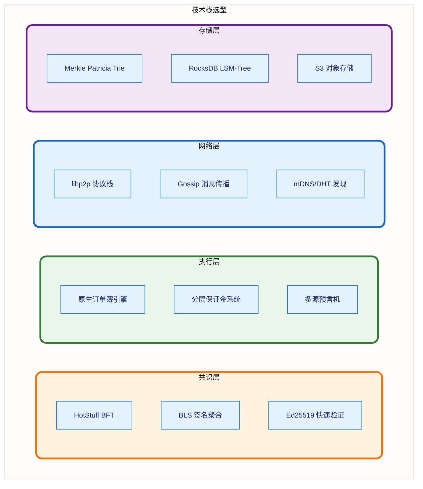

<head>
   <script type="text/javascript" async
      src="https://cdn.jsdelivr.net/npm/mathjax@3/es5/tex-mml-chtml.js">
   </script>
   <script>
      MathJax = {
        tex: {
          inlineMath: [['$', '$'], ['$`', '`$'], ['\\(', '\\)']],
          displayMath: [['```math', '```'], ['$$', '$$'], ['\\[', '\\]']]
        }
      };
   </script>
   <script type="module">
    import mermaid from 'https://cdn.jsdelivr.net/npm/mermaid@10.0.2/+esm';
    mermaid.initialize({ startOnLoad: false });
    await mermaid.run({
      querySelector: '.language-mermaid',
    });
    </script>
</head>


---


---

## 1. 系统概述

### 1.1 设计理念

HyperDEX 是一个专为高频交易设计的去中心化订单簿交易所，通过以下核心理念实现极致性能：

**核心原则**:

- ✅ **共识与执行分离**: HotStuff 负责状态共识，订单簿引擎专注交易执行
- ✅ **原生状态机**: 订单簿直接实现在状态机中，无虚拟机开销
- ✅ **确定性执行**: 相同输入保证相同输出，支持并行验证
- ✅ **内存优先**: 热数据全部常驻内存，冷数据分层存储

### 1.2 性能目标

| 性能指标             | 目标值      | 对比 Hyperliquid | 说明              |
|------------------|----------|----------------|-----------------|
| **峰值 TPS**       | 100,000+ | 200,000+       | 峰值订单处理速度        |
| **订单确认延迟 (P50)** | < 150ms  | 200-500ms      | 50% 订单确认时间      |
| **订单确认延迟 (P99)** | < 300ms  | 500-1000ms     | 99% 订单确认时间      |
| **出块时间**         | 200ms    | ~1s            | 平均区块间隔          |
| **最终性时间**        | 600ms    | 2-3s           | 3 轮 HotStuff 确认 |
| **验证者数量**        | 21-100   | 4 → 扩展中        | 初期 21，渐进去中心化    |
| **状态大小**         | < 100GB  | ~60GB          | 内存状态树大小         |
| **并发连接**         | 100,000+ | 未知             | 同时在线用户数         |

### 1.3 技术栈选型对比



